

  

## Universidad Peruana de Ciencias Aplicadas

**Ingeniería de Software**

**Ciclo:** 2025-1

**Curso:** Desarrollo de Soluciones IOT (1ASI0572)

**Sección:** 2942

**Profesor:** Marco Antonio Leon Baca

----
## Informe del Trabajo Final
### Nombre del Startup: TechZo

### Nombre del Producto: CambiaZo
#### Relación de integrantes 
| Integrante                  | Código         |
|---------------------------------|----------------|
| Huamani Mandujano, Joseph Alexis         | U20221A133     |
| Mendoza Carrion, Mathias Andre          | U202216282     |
| Pin Matallana, Augusto Jose  | U202210257     |
| Quispe Andia, Jeremy Joel      | U202216279     |
| Santisteban Palomino, Ian Haziel Donato | U202214059     |

 
<h3>Abril 2025</h3>
 

|**Versión**|**Fecha**|**Autor**|**Descripción de modificación**|
| - | - | - | - |
|1.0|20/04/25|Ian Haziel Donato Santisteban Palomino|Se agregó la estructura inicial del proyecto.|
|1.1|20/04/25|Ian Haziel Donato Santisteban Palomino|Se inició el Capítulo I: Presentación y se agregó contenido relacionado con Startup Profile|
|1.1.1|21/04/25|Joseph Alexis Huamani Mandujano|Se agregó contenido relacionado con Solution Profile|
|1.1.2|21/04/25|
Ian Haziel Donato Santisteban Palomino, Mathias Andre Mendoza Carrion, Jeremy Joel Quispe Andia, Joseph Alexis Huamani Mandujano y Pin Matallana Augusto Jose
|Se agregaron los perfiles de los integrantes y se comenzó con el proceso Lean UX Process|
|1.1.3|21/04/25|Ian Haziel Donato Santisteban Palomino, Mathias Andre Mendoza Carrion, Jeremy Joel Quispe Andia, Joseph Alexis Huamani Mandujano y Pin Matallana Augusto Jose|Se terminó de agregar el Lean UX Process y se agregó contenido relacionado con los Segmentos Objetivos|
|1.2|21/04/25|Ian Haziel Donato Santisteban Palomino, Mathias Andre Mendoza Carrion, Jeremy Joel Quispe Andia, Joseph Alexis Huamani Mandujano y Pin Matallana Augusto Jose|Se inició el Capítulo II: Needfinding y se agregó contenido relacionado a los Competidores|
|1.2.1|21/04/25|Ian Haziel Donato Santisteban Palomino, Mathias Andre Mendoza Carrion, Jeremy Joel Quispe Andia, Joseph Alexis Huamani Mandujano y Pin Matallana Augusto Jose|Se agregó contenido relacionado con las Entrevistas|
|1.2.2|22/04/25|Mathias Andre Mendoza Carrion y Jeremy Joel Quispe Andia|Se agregó contenido relacionado con el Needfinding y los artefactos correspondientes|
|1.2.3|23/04/25|Joseph Alexis Huamani Mandujano y Mathias Andre Mendoza Carrion|Se agregó contenido relacionado con los User Persona y User Task Matrix|
|1.2.4|23/04/25|Jeremy Joel Quispe Andia|Se agregó contenido relacionado con los User Journey Mapping y Empathy Mapping|
|1.2.5|24/04/25|Mathias Andre Mendoza Carrion|Se agregó contenido relacionado con el As-is Scenario Mapping|
|1.2.6|24/04/25|Joseph Alexis Huamani Mandujano|Se agregó contenido relacionado al To-be|
|1.2.7|25/04/25|Ian Haziel Donato Santisteban Palomino, Mathias Andre Mendoza Carrion, Jeremy Joel Quispe Andia, Joseph Alexis Huamani Mandujano y Pin Matallana Augusto Jose|Se agregaron los Epics, User Stories y Technical Stories|
|1.2.8|25/04/25|Joseph Alexis Huamani Mandujano|Se agregó contenido relacionado con Impact Mapping|
|1.2.9|25/04/25|Mathias Andre Mendoza Carrion|Se agregó contenido relacionado con el Product Backlog|
|1.3|26/04/25|Ian Haziel Donato Santisteban Palomino, Mathias Andre Mendoza Carrion, Jeremy Joel Quispe Andia, Joseph Alexis Huamani Mandujano y Pin Matallana Augusto Jose|Se inició el Capítulo IV: Solution Software Design. Se agregó contenido de Strategic-Level Domain-Driven Design, Tactical-Level Domain-Driven Design y sus respectivos diagramas.|
|2.3|27/04/25|Ian Haziel Donato Santisteban Palomino, Mathias Andre Mendoza Carrion, Jeremy Joel Quispe Andia, Joseph Alexis Huamani Mandujano y Pin Matallana Augusto Jose|Se agregó contenido relacionado al Student Outcome, Conclusiones y Anexo|

  

# Contenido

## Tabla de Contenidos

### [Contenido](#contenido)

### [Student Outcome](#student-outcome)

### [Capítulo I: Presentación](#capítulo-i-presentación)

- [1.1. Startup Profile](#11-startup-profile)
  - [1.1.1. Descripción de la StartUp](#111-descripción-de-la-startup)
  - [1.1.2. Perfiles de integrantes del equipo](#112-perfiles-de-integrantes-del-equipo)
- [1.2. Solution Profile](#12-solution-profile)
  - [1.2.1 Antecedentes y problemática](#121-antecedentes-y-problemática)
  - [1.2.2 Lean UX Process](#122-lean-ux-process)
    - [1.2.2.1 Lean UX Problem Statement](#1221-lean-ux-problem-statement)
    - [1.2.2.2 Lean UX Assumptions](#1222-lean-ux-assumptions)
    - [1.2.2.3 Lean UX Hypothesis Statements](#1223-lean-ux-hypothesis-statements)
    - [1.2.2.4 Lean UX Canvas](#1224-lean-ux-canvas)
- [1.3. Segmentos Objetivo](#13-segmentos-objetivo)

### [Capítulo II: Needfinding](#capítulo-ii-needfinding)

- [2.1. Competidores](#21-competidores)
  - [2.1.1. Análisis competitivo](#211-análisis-competitivo)
  - [2.1.2. Estrategias y tácticas frente a competidores](#212-estrategias-y-tácticas-frente-a-competidores)
- [2.2 Entrevistas](#22-entrevistas)
  - [2.2.1 Diseño de entrevistas](#221-diseño-de-entrevistas)
  - [2.2.2 Registro de Entrevistas](#222-registro-de-entrevistas)
  - [2.2.3. Análisis de entrevistas](#223-análisis-de-entrevistas)
- [2.3. Needfinding](#23-needfinding)
  - [2.3.1. User Personas](#231-user-personas)
  - [2.3.2 User Task Matrix](#232-user-task-matrix)
  - [2.3.3. User Journey Mapping](#233-user-journey-mapping)
  - [2.3.4. Empathy Mapping](#234-empathy-mapping)
  - [2.3.5. As-is Scenario Mapping](#235-as-is-scenario-mapping)
- [2.4. Ubiquitous Language](#24-ubiquitous-language)

### [Capítulo III: Arquitectura](#capítulo-iii-arquitectura)

- [3.1. To-Be Scenario Mapping](#31-to-be-scenario-mapping)
- [3.2. User Stories](#32-user-stories)
- [3.3. Impact Mapping](#33-impact-mapping)
- [3.4. Product Backlog](#34-product-backlog)
  
### [Capítulo IV: Solution Software Design](#capítulo-iv-solution-software-design)
- [4.1. Strategic-Level Domain-Driven Design](#41-strategic-level-domain-driven-design)
  - [4.1.1. EventStorming](#411-eventstorming)
    - [4.1.1.1. Candidate Context Discovery](#4111-candidate-context-discovery)
    - [4.1.1.2. Domain Message Flows Modeling](#4112-domain-message-flows-modeling)
    - [4.1.1.3. Bounded Context Canvases](#4113-bounded-context-canvases)
  - [4.1.2. Context Mapping](#412-context-mapping)
  - [4.1.3. Software Architecture](#413-software-architecture)
    - [4.1.3.1. Software Architecture System Landscape Diagram](#4131-software-architecture-system-landscape-diagram)
    - [4.1.3.2. Software Architecture Context Level Diagrams](#4132-software-architecture-context-level-diagrams)
    - [4.1.3.2. Software Architecture Container Level Diagrams](#4132-software-architecture-container-level-diagrams)
    - [4.1.3.3. Software Architecture Deployment Diagrams](#4133-software-architecture-deployment-diagrams)
- [4.2. Tactical-Level Domain-Driven Design](#42-tactical-level-domain-driven-design)
  - [4.2.1. Bounded Context: IAM](#421-bounded-context-iam)
    - [4.2.1.1. Domain Layer](#4211-domain-layer)
    - [4.2.1.2. Interface Layer](#4212-interface-layer)
    - [4.2.1.3. Application Layer](#4213-application-layer)
    - [4.2.1.4. Infrastructure Layer](#4214-infrastructure-layer)
    - [4.2.1.5. Bounded Context Software Architecture Component Level Diagrams](#4215-bounded-context-software-architecture-component-level-diagrams)
    - [4.2.1.6. Bounded Context Software Architecture Code Level Diagrams](#4216-bounded-context-software-architecture-code-level-diagrams)
      - [4.2.1.6.1. Bounded Context Domain Layer Class Diagrams](#42161-bounded-context-domain-layer-class-diagrams)
      - [4.2.1.6.2. Bounded Context Database Design Diagram](#42162-bounded-context-database-design-diagram)
  - [4.2.2. Bounded Context: Exchanges](#422-bounded-context-exchanges)
    - [4.2.2.1. Domain Layer](#4221-domain-layer)
    - [4.2.2.2. Interface Layer](#4222-interface-layer)
    - [4.2.2.3. Application Layer](#4223-application-layer)
    - [4.2.2.4. Infrastructure Layer](#4224-infrastructure-layer)
    - [4.2.2.5. Bounded Context Software Architecture Component Level Diagrams](#4225-bounded-context-software-architecture-component-level-diagrams)
    - [4.2.2.6. Bounded Context Software Architecture Code Level Diagrams](#4226-bounded-context-software-architecture-code-level-diagrams)
      - [4.2.2.6.1. Bounded Context Domain Layer Class Diagrams](#42261-bounded-context-domain-layer-class-diagrams)
      - [4.2.2.6.2. Bounded Context Database Design Diagram](#42262-bounded-context-database-design-diagram)
  - [4.2.3. Bounded Context: Locker](#423-bounded-context-locker)
    - [4.2.3.1. Domain Layer](#4231-domain-layer)
    - [4.2.3.2. Interface Layer](#4232-interface-layer)
    - [4.2.3.3. Application Layer](#4233-application-layer)
    - [4.2.3.4. Infrastructure Layer](#4234-infrastructure-layer)
    - [4.2.3.5. Bounded Context Software Architecture Component Level Diagrams](#4235-bounded-context-software-architecture-component-level-diagrams)
    - [4.2.3.6. Bounded Context Software Architecture Code Level Diagrams](#4236-bounded-context-software-architecture-code-level-diagrams)
      - [4.2.3.6.1. Bounded Context Domain Layer Class Diagrams](#42361-bounded-context-domain-layer-class-diagrams)
      - [4.2.3.6.2. Bounded Context Database Design Diagram](#42362-bounded-context-database-design-diagram)

### [Bibliografía](#bibliografía)

### [Anexos](#anexos)

	

# Student Outcome

El curso contribuye al cumplimiento del Student Outcome ABET:  
**ABET – EAC - Student Outcome 5**: 
La capacidad de funcionar efectivamente en un equipo cuyos miembros juntos proporcionan liderazgo, crean un entorno de colaboración e inclusivo, establecen objetivos, planifican tareas y cumplen objetivos.  

<table>
  <thead>
    <tr>
      <th colspan="3"><b>Criterio específico</b></th>
      <th colspan="3"><b>Acciones realizadas</b></th>
      <th colspan="3"><b>Conclusiones</b></th>
    </tr>
  </thead>
  <tbody>
    <tr>
	<td colspan="3">Trabaja en equipo para
proporcionar liderazgo en
forma conjunta</td>
      <td colspan="3" align="justify">
      <h3>Joseph Alexis Huamani Mandujano</h3> 
      <b>TB1</b> 
      
Para el primer hito de nuestro proyecto de IoT, me encargué de definir el Problem Statement enfocado en la automatización de riego agrícola, estableciendo una base clara para orientar las soluciones tecnológicas. Además, desarrollé Asumptions e Hypothesis orientadas a la viabilidad del uso de sensores y controladores en entornos agrícolas. Mi análisis crítico y capacidad de síntesis fueron clave para sentar las bases técnicas que guiaron nuestras decisiones de hardware y software.
 
    <h3>Mathias André Mendoza Carrión</h3>
    <b>TB1</b>
    
Durante esta fase inicial, realicé un análisis detallado de soluciones IoT agrícolas existentes, identificando brechas de mercado y oportunidades de innovación. Conduje entrevistas con agricultores tecnificados, cuyos insights nos permitieron modelar los requerimientos funcionales de nuestro sistema. Esto fortaleció mis habilidades de investigación y empatía tecnológica, asegurando que nuestra propuesta responda efectivamente a necesidades reales.

    <h3>Ian Haziel Donato Santisteban Palomino</h3>
    <b>TB1</b>
    
En este primer entregable, gestioné la documentación técnica y los requerimientos del sistema IoT, asegurando una comunicación fluida dentro del equipo y con potenciales usuarios. La coordinación efectiva de criterios técnicos permitió integrar de manera precisa sensores de humedad, controladores de riego y plataformas de monitoreo, consolidando una visión clara y colaborativa para el desarrollo del prototipo.

    <h3>Jeremy Joel Quispe Andia</h3>
    <b>TB1</b>
    
Trabajé en la estructuración de User Stories específicas para nuestro sistema de monitoreo de cultivos, priorizando funcionalidades como alertas automáticas y control remoto. También desarrollé la propuesta de valor enfocada en eficiencia hídrica y facilidad de uso, asegurando que nuestro proyecto se alineara con las demandas prácticas del sector agrícola tecnificado.

    <h3>Augusto Jose Pin Matallana</h3>
    <b>TB1</b>
    
Diseñé diagramas de arquitectura del sistema que integran hardware y software, como la comunicación entre sensores, actuadores y servidores en la nube. Esta representación clara de flujos de información y control fue clave para asegurar la interoperabilidad de los componentes y para proyectar un sistema escalable y eficiente en el contexto agrícola.

    <td colspan="3">
    <b>TB1</b>
    
Al concluir el primer hito de nuestro proyecto de IoT, nuestro equipo ha demostrado un avance sólido en la definición de soluciones tecnológicas aplicadas a la agricultura de precisión. Logramos definir claramente los problemas a resolver, realizar una investigación profunda de necesidades reales y proponer una arquitectura robusta basada en sensores y controladores. La colaboración efectiva y la comunicación fluida nos permitieron integrar diversas perspectivas técnicas, estableciendo bases firmes para el desarrollo de un prototipo funcional. Este progreso inicial ha fortalecido tanto nuestras competencias tecnológicas como nuestra cohesión como equipo, preparándonos para enfrentar exitosamente los retos de las siguientes etapas.

  </td>
    </tr>
    <tr>
      <td colspan="3">Crea un entorno colaborativo e
inclusivo, establece metas,
planifica tareas y cumple
objetivos.</td>
      <td colspan="3" align="justify">
      <h3>Joseph Alexis Huamani Mandujano</h3>
    <b>TB1</b>
    
En este primer hito, desarrollé una visión integral del problema de gestión de riego agrícola, formulando suposiciones y problemáticas claves que fundamentaron nuestras decisiones de selección de sensores y microcontroladores. Esta tarea reforzó mi capacidad de analizar entornos reales y plantear soluciones técnicas efectivas, reafirmando la importancia del aprendizaje práctico en IoT.

      <h3>Mathias André Mendoza Carrión</h3>
    <b>TB1</b>
    
El análisis de competidores y entrevistas a agricultores me permitió identificar necesidades no satisfechas en el mercado actual, lo que afianzó mi comprensión del impacto que tiene la correcta selección de tecnologías IoT en proyectos reales. Aprender a interpretar los requerimientos de usuarios y convertirlos en especificaciones técnicas ha sido una lección valiosa para mi formación.

     <h3>Ian Haziel Donato Santisteban Palomino</h3>
    <b>TB1</b>
    
Al liderar la estructuración de requerimientos y documentación técnica, consolidé habilidades fundamentales para planificar proyectos IoT que integren distintos dispositivos y plataformas. Esta experiencia práctica subraya la importancia de actualizar permanentemente mis conocimientos sobre protocolos de comunicación, seguridad de datos y gestión de dispositivos conectados.

      <h3>Jeremy Joel Quispe Andia</h3>
    <b>TB1</b>
    
La definición de funcionalidades y necesidades a partir de User Stories me permitió comprender de manera aplicada cómo traducir problemas agrícolas reales en soluciones tecnológicas. Esta práctica resalta la necesidad de formarse continuamente en nuevas plataformas, hardware emergente y mejores prácticas de desarrollo para crear soluciones IoT efectivas y sostenibles.

    <h3>Augusto Jose Pin Matallana</h3>
    <b>TB1</b>
    
Participé activamente en la definición de la arquitectura técnica del sistema IoT, considerando factores como conectividad, energía y entorno operativo. Esta experiencia fue crucial para entender la importancia de un enfoque sistémico y me impulsó a profundizar en el aprendizaje de nuevas herramientas de diseño y simulación para fortalecer futuras soluciones de ingeniería.

    </td>
      <td colspan="3">
    <b>TB1</b>
    
Al concluir este primer hito, nuestro equipo ha reafirmado la importancia de combinar conocimientos teóricos con experiencia práctica para lograr proyectos IoT exitosos. Cada integrante ha mostrado una evolución constante, aplicando aprendizajes técnicos a situaciones reales del sector agrícola. La colaboración, investigación de campo y el enfoque en necesidades del usuario nos permitieron plantear una solución sólida, adaptada a contextos exigentes. El aprendizaje continuo en sensores, plataformas de conectividad, protocolos de comunicación y desarrollo de interfaces será clave para seguir creciendo en las siguientes fases del proyecto. Esta etapa nos ha preparado mejor para enfrentar los desafíos tecnológicos futuros con una mentalidad crítica, creativa y resolutiva.

  </td>
    </tr>
  </tbody>
</table>

  

  
# Capítulo I: Presentación
## 1.1 Startup Profile
### 1.1.1 Descripción de la Startup

**Nombre:**  TechZo

**Área:**  Innovación tecnológica y Reutilización

# TechZo - Proyecto CambiaZo

TechZo es una startup dedicada a la innovación tecnológica y la optimización de recursos mediante el uso de lockers inteligentes, fundada por un grupo de estudiantes comprometidos de la Facultad de Ingeniería de la Universidad Peruana de Ciencias Aplicadas (UPC). Nuestra misión es abordar desafíos críticos relacionados con la sostenibilidad, la eficiencia logística y el consumo responsable, fomentando la transición hacia una economía circular en nuestro país.

Nuestra principal solución, **CambiaZo**, es una plataforma de intercambio de productos apoyada en lockers inteligentes. A través de CambiaZo, facilitamos el intercambio seguro y automatizado de artículos, utilizando validaciones fotográficas, códigos de seguridad y notificaciones instantáneas. Además, la aplicación permite a los usuarios donar productos a comunidades necesitadas, fortaleciendo nuestro compromiso social.

En TechZo, estamos comprometidos con la seguridad, la transparencia y la eficiencia en cada transacción. Nos esforzamos para que cada usuario tenga acceso a una experiencia confiable de intercambio, apoyada en la tecnología de lockers inteligentes, garantizando un proceso sencillo, seguro y satisfactorio. Al integrar innovación tecnológica con responsabilidad social, impulsamos un cambio positivo en la forma de consumir y reutilizar.

* **Misión:** 
La misión de TechZo es revolucionar el intercambio de bienes mediante lockers inteligentes, proporcionando a los usuarios una plataforma segura, automatizada y sostenible para intercambiar productos de forma justa y eficiente.  

* **Visión:** 
La visión de TechZo es liderar la transformación del intercambio de productos a nivel global a través de lockers inteligentes, conectando personas y comunidades para fomentar una economía circular basada en confianza, tecnología y solidaridad.  

* **Valores:**
  * **Seguridad y privacidad:** Nuestra prioridad es proteger los datos y transacciones de nuestros usuarios, implementando medidas sólidas de cifrado y control de accesos mediante códigos PIN y validaciones fotográficas en los lockers.

  * **Innovación:** Buscamos constantemente nuevas maneras de mejorar la experiencia de intercambio, utilizando tecnologías como algoritmos de localización de lockers cercanos y validaciones inteligentes.

  * **Aprendizaje Continuo:** Promovemos el crecimiento de nuestro equipo en tecnologías emergentes, logística inteligente y estrategias de sostenibilidad.

  * **Calidad:** Nos comprometemos a ofrecer una experiencia fluida en la asignación de lockers, validación de objetos y notificaciones, asegurando la máxima satisfacción de los usuarios.

  * **Compromiso con el usuario:** Escuchamos activamente las necesidades de nuestros usuarios, adaptando nuestro sistema de lockers y plataforma digital para que cada intercambio sea sencillo y seguro.

  * **Respeto a la diversidad:** Fomentamos la inclusión, la equidad y el respeto entre todos los usuarios y miembros de nuestra comunidad, promoviendo un ecosistema de intercambio basado en valores sólidos.  

 ### 1.1.2 Perfiles de integrantes del equipo

A continuación, presentaremos los perfiles de los integrantes del equipo encargado de desarrollar el proyecto. Cada uno de nuestros miembros aporta una combinación única de habilidades y perspectivas que son fundamentales para el éxito del proyecto.

| **Integrante**                         | **Perfil**                                                                                                                                                                                                                                                                                                                                                                                                                                                                                                | **Imagen**                                                                                                       |
| -------------------------------------- | --------------------------------------------------------------------------------------------------------------------------------------------------------------------------------------------------------------------------------------------------------------------------------------------------------------------------------------------------------------------------------------------------------------------------------------------------------------------------------------------------------- | ---------------------------------------------------------------------------------------------------------------- |
| **Huamani Mandujano, Joseph Alexis - u20221a133**             |Mi nombre es Joseph Huamani, soy estudiante de 6to ciclo en la carrera de Ingeniería de Software en la UPC. Apasionado por el desarrollo web y web, cuento con experiencia usando lenguajes como C++, Python, Java, C#, Javascript y Typescript. Además cuento con experiencia en desarrollo web con HTML5 y CSS3 usando frameworks para frontend como Angular, VueJs, React y Astro. En cuanto al backend frameworks  como Spring Boot, .Net y Flask. Manejo de base de datos como MySQL, MSSQL, PostgreSQL, Oracle, SQLite y MongoDB. Soy una persona que trabaja en equipo, responsable y que brinda soluciones creativas para la resolución de problemas adquiridas gracias a la programación competitiva. Espero poder seguir aprendiendo nuevas tecnologias y poder culminar este curso de manera satisfactoria.| |
| **Mendoza Carrión, Mathias André - u202216282** |Soy Mathias Andre Mendoza Carrión, un estudiante de 20 años de Ingeniería de Software en el sexto ciclo. Me caracterizo por ser organizado, trabajar bien en equipo y ser responsable. Actualmente, mi enfoque principal es el aprendizaje profundo y práctico en el desarrollo de software, con habilidades en lenguajes de programación como C++, Python, Java, C#, y JavaScript. También tengo conocimientos en frameworks como Angular y Vue, desarrollo web con HTML y CSS, así como en la gestión de bases de datos SQL y MongoDB. Aspiro a dominar nuevas tecnologías y comprender en detalle los principios fundamentales detrás del desarrollo de aplicaciones, con el objetivo de convertirme en un profesional capaz de crear soluciones innovadoras y eficientes en el campo del desarrollo de software.|  |
| **Pin Matallana, Augusto Jose - u202210257**     |Mi nombre es Augusto Jose Pin Matallana, tengo 19 años y estoy cursando el séptimo ciclo de la carrera de Ingeniería de Software. Me apasiona la resolución de problemas mediante la aplicación de conceptos y tecnologías innovadoras. Tengo experiencia en desarrollo web frontend, especialmente utilizando Vue.js, TailwindCSS y Sass, así como tecnologías base como HTML, CSS y JavaScript. Como miembro del equipo, aporto un sólido enfoque en el desarrollo frontend, siempre comprometido con la calidad visual, funcional y de experiencia de usuario. Estoy emocionado por aprender y colaborar con el equipo, y por seguir desarrollando mis habilidades técnicas en las tecnologías que utilizaremos en nuestro trabajo.    |  |
| **Quispe Andia, Jeremy Joel - u202216279** |Mi nombre es Jeremy Joel Quispe Andia, soy estudiante de 6to ciclo de la carrera de Ingeniería de Software. Tengo una gran pasión por la programación competitiva y aspiro a convertirme en desarrollador Full Stack. Me gusta emplear soluciones creativas y eficientes para abordar cualquier desafío de la mejor manera posible. Como miembro del grupo, pretendo aportar todos mis conocimientos en el desarrollo web. Además, siempre colaboro con ideas y soluciones ante cualquier dificultad que se presente durante el desarrollo. Espero aprender mucho de mis compañeros y que todos juntos podamos emplear de manera adecuada las tecnologías que iremos aprendiendo a lo largo del proyecto.|                  |
| **Santisteban Palomino, Ian Haziel Donato - u202214059**     |Mi nombre es Ian Haziel Donato Santisteban Palomino, tengo 19 años y estoy cursando el sexto ciclo de la carrera de Ingeniería de Software. Me apasiona la resolución de problemas mediante la aplicación de conceptos y tecnologías innovadoras. Tengo experiencia en desarrollo web utilizando HTML, CSS y JavaScript, y manejo frameworks como Vue y Angular. También tengo conocimientos en bases de datos con MySQL y en el uso de Figma para prototipado. Como miembro del equipo, aporto un sólido conocimiento en desarrollo de software y un compromiso constante con la excelencia en cada proyecto en el que participo. Estoy emocionado por aprender y colaborar con el equipo, así como por adquirir nuevas habilidades y conocimientos en las tecnologías que utilizaremos en nuestro trabajo.    |  |

  

## 1.2 Solution Profile

### 1.2.1 Antecedentes y problemática

# 1.2.1 Contexto y Problemática

La economía lineal actual, caracterizada por el modelo de producir, usar y desechar, está generando un aumento preocupante en la acumulación de residuos y el uso insostenible de recursos naturales. Morseletto (2023) destaca que esta estructura económica contribuye significativamente al aumento de residuos y la degradación ambiental.

Esta forma de consumo no solo incrementa los desechos sólidos, contamina océanos y provoca pérdida de biodiversidad, sino que también intensifica el cambio climático debido a las emisiones de gases de efecto invernadero asociadas a la fabricación, transporte y eliminación de productos (Madaan et al., 2024).

Según Liu y Zhong (2023), la extracción intensiva de materias primas para nuevos productos está agotando los recursos naturales rápidamente. A esto se suma el crecimiento continuo de la población mundial, que se espera aumente en 2000 millones de personas para el 2050, lo que generará aún más residuos (Kruse-Andersen, 2023).

Frente a esta problemática, **nuestra aplicación propone una solución basada en lockers inteligentes**, que permiten mantener los productos en circulación más tiempo mediante intercambios seguros y automatizados, reduciendo residuos y promoviendo la economía circular.

Para explicar más detalladamente esta situación, como grupo, usaremos la metodología de las **5W y 2H** para analizar los antecedentes y la problemática que enfrentamos:

## 5W's y 2H's

* **WHAT?** 
La acumulación diaria de residuos a nivel global impacta negativamente al medio ambiente y agota los recursos naturales. La falta de iniciativas para reutilizar o intercambiar productos contribuye al colapso de vertederos y desperdicio de materiales.  

* **WHY?** 
Muchas personas no reutilizan o intercambian objetos debido a la falta de sistemas seguros y sencillos. La falta de confianza en intercambios tradicionales frena las prácticas de reutilización, perpetuando el modelo de descarte.  

* **WHO?** 
El problema afecta a toda la población, especialmente a quienes buscan opciones responsables para reducir su impacto ambiental. CambiaZo se dirige a usuarios interesados en un modelo más seguro de intercambio de bienes.  

* **WHEN?** 
Esta problemática es continua. A pesar de un creciente interés por la sostenibilidad, aún falta infraestructura segura para facilitar intercambios responsables de bienes en el día a día.  

* **WHERE?** 
Aunque el problema es global, CambiaZo se enfocará inicialmente en Perú, priorizando regiones urbanas donde la acumulación de residuos y la falta de reutilización son más evidentes.  

* **HOW?** 
Se implementará un sistema de lockers inteligentes donde los usuarios podrán dejar sus objetos de intercambio. El sistema validará el depósito mediante fotos, asignará códigos de seguridad, y notificará a los usuarios de cada paso.  

* **HOW MUCH?** 
El presupuesto estimado para el despliegue inicial de la red de lockers inteligentes y la aplicación web oscila entre S/. 50,000 y S/. 100,000, dependiendo de la cantidad de lockers, su tecnología integrada y el desarrollo de la plataforma.  

# 1.2.2 Lean UX Process

## 1.2.2.1 Lean UX Problem Statement

**Problem Statement 1:**  
Actualmente, existe un crecimiento en la conciencia sobre la sostenibilidad y la reutilización de bienes. Sin embargo, no existe un sistema automatizado y seguro que permita intercambiar objetos de manera simple.  
La falta de confianza, la logística complicada y la inseguridad desalientan a los usuarios a dar una segunda vida a sus pertenencias.  
¿Cómo podemos implementar un modelo eficiente, seguro y automatizado de intercambio de bienes mediante lockers inteligentes, validación de objetos y códigos de seguridad?  

**Problem Statement 2:**  
Aunque existe una creciente voluntad de las personas por intercambiar bienes, actualmente no hay infraestructuras tecnológicas que organicen, validen y faciliten de forma segura estos intercambios entre particulares.  
¿Cómo podemos facilitar el proceso de intercambio entre usuarios, garantizando seguridad, eficiencia y trazabilidad a través de lockers inteligentes y validaciones automáticas?  

**Problem Statement 3:**  
Los intercambios tradicionales entre usuarios suelen carecer de seguimiento, confirmación y validación adecuada, generando desconfianza y riesgo en las transacciones.  
¿Cómo podemos diseñar un sistema de intercambio que proporcione validación visual, confirmación automática y notificaciones en tiempo real para asegurar la transparencia y satisfacción de los usuarios?  

#### 1.2.2.2 Lean UX Assumptions

# 1.2.2.2 User Assumptions & Business Outcomes

## User Assumptions

+ **¿Quién es el usuario?** 
Nuestros usuarios son personas interesadas en reutilizar sus pertenencias mediante un sistema seguro de intercambio a través de lockers inteligentes. Incluye tanto a individuos que desean intercambiar objetos como a aquellos que desean donar artículos a comunidades necesitadas.  

+ **¿Dónde encaja nuestro producto en su trabajo o en su vida?** 
El producto se integra como una solución práctica y segura para fomentar un estilo de vida sostenible, permitiendo a los usuarios intercambiar y donar artículos de manera automatizada y sin necesidad de contacto directo.  

+ **¿Cuándo y cómo se utiliza nuestro producto?** 
Nuestro sistema se utiliza cuando el usuario desea dar un nuevo uso a una pertenencia. El proceso consiste en registrar el objeto en la app, recibir un locker asignado, depositar el objeto, validar con foto automática, y completar el intercambio.  

+ **¿Qué problemas resuelve nuestro producto?** 
CambiaZo resuelve la falta de seguridad y logística en los intercambios tradicionales, ofreciendo un sistema automatizado de lockers, validación de objetos, códigos PIN y notificaciones, que asegura una experiencia confiable y sin fricciones.  

+ **¿Qué características son importantes?** 
Facilidad de uso, asignación automática de lockers cercanos, generación de códigos PIN, validación fotográfica del objeto, sistema de notificaciones, y chat privado para coordinación opcional en intercambios tradicionales.  

+ **¿Cómo debe verse y comportarse nuestro producto?** 
La plataforma debe ser intuitiva, amigable para el público en general, enfocada en lo esencial: registrar, intercambiar y validar objetos de forma rápida. Se deben evitar sobrecargas visuales y mantenerse siempre actualizada para optimizar la experiencia.  

## Business Outcomes

1. **Creo que nuestros usuarios necesitan** un medio seguro y automatizado para realizar intercambios y donaciones de forma sencilla y eficaz.

2. **Estas necesidades se pueden resolver con** una plataforma que integre lockers inteligentes, validación de objetos mediante fotos y gestión automática de PINs.

3. **Nuestros usuarios iniciales son** personas de áreas urbanas en Perú comprometidas con el consumo responsable y la economía circular.

4. **El valor #1 que un cliente quiere de nuestro servicio es que** facilite un proceso de intercambio rápido, seguro y con mínima interacción física.

5. **El usuario también puede obtener beneficios adicionales como** poder realizar intercambios sin límite, recibir un "Boost" para destacar sus objetos en búsquedas, y acceder a lockers premium de mayor conveniencia.

6. **Vamos a adquirir la mayoría de nuestros clientes a través de** campañas en Instagram, TikTok y Facebook, enfocadas en destacar el impacto positivo de la reutilización mediante lockers inteligentes.

7. **Haremos dinero a través de** planes de suscripción premium que ofrezcan ventajas exclusivas como prioridad en asignación de lockers y aumento de visibilidad de publicaciones.

8. **Nuestras competencias principales son** plataformas tradicionales de trueques en Facebook y grupos como Me Sirve, HazTruequing y Trueques.

9. **Los venceremos debido a** nuestra propuesta de intercambio seguro, validado, automatizado y basado en tecnología de lockers inteligentes, ofreciendo mayor seguridad y confianza que los métodos tradicionales.

10. **Nuestro mayor riesgo es** que los usuarios perciban dificultad para encontrar intercambios justos o convenientes.

11. **Resolveremos esto a través de** filtros de búsqueda avanzados, procesos de validación de publicaciones, y mecanismos de retroalimentación para mantener la calidad de los objetos ofrecidos.

# 1.2.2.3 Lean UX Hypothesis Statements

**Creemos que** al implementar una red de lockers inteligentes y una plataforma sólida de intercambio automatizado, los usuarios podrán contribuir significativamente a la economía circular y adoptar un estilo de vida sostenible. 
**Sabremos que es cierto** cuando el número de intercambios diarios supere los 30, confirmando la aceptación de nuestro modelo.  

**Creemos que** permitir la interacción entre usuarios mediante notificaciones y validaciones automáticas mejorará la confianza y la eficiencia de los intercambios. 
**Sabremos que lo habremos logrado** cuando más del 50% de los usuarios mencione positivamente la facilidad y seguridad del sistema de lockers y validaciones automáticas en sus comentarios.

#### 1.2.2.4 Lean UX Canvas
La aplicación **CambiaZo**  es una plataforma digital diseñada para que los usuarios puedan deshacerse de los objetos que ya no desean tener, intercambiándolos por otros artículos que desean de otros usuarios. Además, tiene como objetivo principal convertirse en la plataforma digital líder de intercambio de productos, promoviendo una vida consciente y sostenible a nivel mundial.

<table>
    <tr>
        <td valign="top">
            
 <b>Business Problem</b>
 
            
El modelo de economía lineal actual causa acumulación de residuos y un uso insostenible de recursos. Falta una solución accesible y automatizada para el intercambio de bienes mediante lockers inteligentes.  ¿Cómo podemos facilitar un sistema sencillo, seguro y eficiente para que las personas intercambien sus pertenencias usando lockers inteligentes?
 
        </td>
        <td rowspan="2" valign="top">
            
 <b>Solutions</b>
 
            <ul>
                <li>Desarrollar una aplicación web integrada con lockers inteligentes para intercambio de objetos.</li> 
                <li>Implementar validación automática de objetos mediante fotos y encendido de luces en el locker.</li> 
                <li>Incorporar búsqueda del locker más cercano utilizando el algoritmo de Dijkstra y generación de códigos PIN para acceso.</li> 
            </ul> 
        </td>
        <td valign="top">
            
 <b>Business Outcomes</b>
 
            <ul>
                <li>Obtener financiamiento para expandir la red de lockers inteligentes.</li> 
                <li>Aumentar la visibilidad y alcance mediante marketing en redes sociales.</li> 
            </ul> 
        </td>
    </tr>
    <tr>
        <td valign="top">
            
 <b>Users</b>
 
            <ul>
                <li>Personas interesadas en intercambiar bienes no deseados de manera segura.</li> 
                <li>Usuarios comprometidos con prácticas sostenibles mediante el uso de lockers inteligentes.</li> 
            </ul> 
        </td>
        <td valign="top">
            
 <b>User Outcomes & Benefits</b>
 
            <ul>
                <li>Ahorro de dinero al intercambiar productos sin costo.</li> 
                <li>Deshacerse de objetos no deseados de manera útil.</li> 
                <li>Acceso rápido y seguro a nuevos artículos mediante lockers cercanos.</li> 
            </ul> 
        </td>
    </tr>
    <tr>
        <td valign="top">
            
 <b>Hypotheses</b>
 
            
Creemos que nuestra plataforma basada en lockers inteligentes promoverá la economía circular y un estilo de vida sostenible, facilitando el intercambio de bienes.  Sabremos que esto es cierto cuando los usuarios realicen más de 30 intercambios diarios.
 
        </td>
        <td valign="top">
            
 <b>What's the most important thing we need to learn first?</b>
 
            <ul>
                <li>Comprender las necesidades y expectativas de los usuarios sobre el intercambio de bienes mediante lockers inteligentes.</li> 
                <li>Identificar las características más valoradas de la validación automática y la asignación de lockers.</li> 
                <li>Recopilar feedback sobre la experiencia de uso del PIN y notificaciones automáticas.</li> 
            </ul> 
        </td>
        <td valign="top">
            
 <b>What's the least amount of work we need to do to learn the next most important thing?</b>
 
            <ul>
                <li>Incorporar una función de comentarios dentro de la app para feedback rápido.</li> 
                <li>Realizar encuestas breves tras cada intercambio para ajustar la experiencia.</li> 
            </ul> 
        </td>
    </tr>
</table>
 

## 1.3 Segmentos Objetivo

Esta sección incluye la descripción de los segmentos asociados al dominio del problema, incluyendo características geográficas y demográficas. Por lo tanto, con el fin de desarrollar un producto que satisfaga las necesidades de nuestros clientes, TechZo se enfocará en el siguiente segmento: 

+ **Personas adultas que desean obtener nuevos artículos (Intercambiadores):** 
Estas personas buscan deshacerse de productos que ya no desean y adquirir nuevos artículos de su interés mediante intercambios.
  + **Características demográficas:** Personas entre 18 y 55 años, con artículos no deseados que están interesados en intercambiarlos por otros que necesitan. Este rango de edad fue seleccionado porque, según la distribución de la población por segmentos de edad mostrada en la [Imagen 1](#imagen-1), representa el 53.9% de la población total del país, equivalente a 18,037,900 personas (CPI Research, 2022).

    

	    <strong id="imagen-1">Imagen 1: Distribución de la población en Perú por segmentos de edad en 2022 (CPI Research, 2022)</strong>  
    
    
  

  + **Características geográficas:** Personas que residen en Perú. 
  + **Motivaciones y Comportamientos:** A menudo motivados por la necesidad de actualizar sus pertenencias o por la falta de recursos para comprar nuevos artículos. En un estudio realizado por la Universidad Nacional del Altiplano en Puno, se identificó que una de las principales razones para realizar trueques es la falta de dinero. Este rango de edad fue seleccionado porque, según la información provista en la [Imagen 2](#imagen-2), se destacan diversas razones por las cuales las personas adultas participan en intercambios de artículos. La principal razón es la "Falta de dinero", representando el 56% de las respuestas, seguida de otros motivos como "Falta de trabajo" y "Por costumbre", entre otros.

     
	
	     <strong id="imagen-2">Imagen 2: Motivos para Realizar Trueques según el Estudio de la Universidad Nacional del Altiplano</strong>  
      
	
    

  + **Preferencias de Uso:** Valoran una plataforma intuitiva que facilite la búsqueda y el intercambio de productos. Prefieren opciones que ofrezcan seguridad y transparencia en las transacciones.  

# Capítulo II: Requirements Elicitation & Analysis

## 2.1 Competidores

En esta sección se identificarán los mejores referentes para posteriormente realizar un análisis competitivo que nos ayudará a saber nuestro posicionamiento y el valor agregado que ofreceremos en el mercado. 

Según la investigación, se descubrieron aplicaciones webes y/o apps webs similares. Sin embargo, estamos considerando tres competidores directos o indirectos que se parezcan más a nuestra startup.

* **Trueques.com** 
Plataforma que ofrece una amplia gama de servicios de intercambio, incluidos intercambios de servicios y artículos de segunda mano. Los usuarios pueden buscar y publicar ofertas de intercambio, así como participar en eventos y actividades comunitarias relacionadas con el intercambio.  

* **HazTruequing** 
Plataforma en línea que permite a los usuarios intercambiar servicios y artículos de segunda mano de manera fácil y segura. Los usuarios pueden publicar lo que tienen disponible para el intercambio y buscar lo que necesitan, creando así una comunidad de intercambio activa y diversa.  

* **Me Sirve** 
Aplicación web que ofrece una forma conveniente de intercambiar y adquirir artículos de segunda mano. Los usuarios pueden publicar lo que tienen para intercambiar, buscar lo que necesitan y comunicarse directamente con otros usuarios para concretar los intercambios.  

### 2.1.1 Análisis Competitivo

En esta sección se realizará el análisis competitivo de los competidores identificados en la sección inicial con el objetivo de tener una idea más clara sobre nuestro producto frente a los competidores y aprender para mejorar nuestro producto.

<table>
<thead>
  <tr>
    <th colspan="6">Competitive Analysis Landscape </th>
  </tr>
</thead>
<tbody>
  <tr>
    <td colspan="2">¿Por qué llevar a cabo este análisis?</td>
    <td colspan="4">Este análisis se lleva a cabo para poder investigar, analizar y comparar el comportamiento de los competidores directos o indirectos en el mercado</td>
  </tr>
  <tr>
    <td colspan="2">
        
Nombre

    </td>
    <td>
		
Cambiazo 

	</td>
    <td>
		
Trueques.com

	</td>
    <td>
		
Haztruequing

	</td>
    <td>
		
Me Sirve

	</td>
  </tr>
  <tr>
    <td colspan="2">
        
Logo

    </td>
    <td>
		

		</td>
    <td>
		

		</td>
    <td>
		

		</td>
    <td>
		

		</td>
  </tr>
  <tr>
    <td rowspan="2">Perfil</td>
    <td>Overview</td>
    <td>Aplicación web que conecta a personas interesadas en darle un nuevo uso a sus pertenencias mediante intercambios, enfocándose en la sostenibilidad y la economía circular.
	</td>
    <td>Página Web para intercambio de bienes y servicios entre usuarios, fomentando la economía colaborativa y la reutilización de recursos.</td>
    <td>Plataforma para intercambiar servicios y artículos de segunda mano de manera gratuita, promoviendo un estilo de vida sostenible y consciente.</td>
    <td>App para intercambiar bienes y servicios de manera segura y eficiente, promoviendo la reutilización y la solidaridad entre usuarios.</td>
  </tr>
  <tr>
    <td>Ventaja Competitiva  ¿Qué valor ofrece a los clientes?</td>
    <td>Intercambio de productos o servicios.   </td>
    <td>Intercambio directo de bienes y servicios sin dinero, fomentando la reutilización y colaboración.</td>
    <td>Intercambio de servicios y artículos de segunda mano, promoviendo un estilo de vida sostenible.</td>
    <td>Intercambio bienes y servicios, promoviendo la reutilización y la solidaridad.
</td>
  </tr>
  <tr>
    <td rowspan="2">Perfiles de Marketing </td>
    <td>Mercado Objetivo </td>
    <td>Personas interesadas en  intercambiar o donar sus pertenencias.</td>
    <td>Personas que buscan intercambiar productos y servicios</td>
    <td>Personas interesados en intercambiar servicios y artículos de segunda mano</td>
    <td>Usuarios interesados en darle un nuevo propósito a sus pertenencias mediante intercambios.</td>
  </tr>
  <tr>
    <td>Estrategias de marketing</td>
    <td>Publicidad en Foros y Redes sociales</td>
    <td>Publicidad en redes sociales</td>
    <td>Publicidad en redes sociales</td>
    <td>Publicidad en redes sociales</td>
  </tr>
  <tr>
    <td rowspan="3">Perfil de Producto </td>
    <td>Productos &amp; Servicios</td>
    <td>Intercambiar bienes o servicios, donar a ONGs</td>
    <td>Intercambiar bienes o servicios</td>
    <td>Intercambiar bienes o servicios</td>
    <td>Intercambiar bienes o servicios</td>
  </tr>
  <tr>
    <td>Precios y Costos</td>
    <td>Free y Premium desde $2.99 por mes</td>
    <td>Free</td>
    <td>Free</td>
    <td>Free y Premium $2.99 por mes</td>
  </tr>
  <tr>
    <td>Canales de Distribución (Web y/o web)</td>
    <td>Web y web</td>
    <td>Web</td>
    <td>Web</td>
    <td>web</td>
  </tr>
  <tr>
    <td rowspan="4">Análisis SWOT</td>
    <td>Fortalezas</td>
    <td>Conexión intuitiva para intercambiar o donar objetos.  Amplia variedad de opciones para los usuarios.  Posibilidad de personalización en los intercambios.  Incorporación de automatización e innovación en la plataforma.</td>
    <td>Plataforma intuitiva para intercambiar bienes y servicios.  Amplia variedad de opciones disponibles.  Posibilidad de personalizar los intercambios.</td>
    <td>Plataforma confiable y amplia con una gran base de usuarios.  Compromiso con la sostenibilidad y la economía circular.</td>
    <td>Plataforma intuitiva y segura para intercambiar bienes y servicios.  Variedad de opciones disponibles para los usuarios.  Interfaz fácil de usar para una experiencia positiva.</td>
  </tr>
  <tr>
    <td>Debilidades</td>
    <td>Limitaciones en la disponibilidad de objetos y servicios.  Posibles dificultades técnicas en la gestión de transacciones y seguridad de datos.</td>
    <td>Posibles dificultades para garantizar la equidad en los intercambios.  Limitaciones técnicas que puedan afectar la funcionalidad.</td>
    <td>Posibles desafíos relacionados con la competencia de otras plataformas y la seguridad de las transacciones.</td>
    <td>Posibles desafíos con seguridad de transacciones y gestión de reclamos.</td>
  </tr>
  <tr>
    <td>Oportunidades</td>
    <td>Aprovechar la conciencia creciente sobre sostenibilidad y consumo responsable.  Desarrollar alianzas con ONGs para ampliar el impacto social.  Expandir la plataforma a nivel nacional e internacional.</td>
    <td>Expandir la plataforma para incluir nuevas categorías de productos y servicios.  Establecer alianzas con organizaciones benéficas para ampliar el impacto social.</td>
    <td>Expandir la plataforma a nivel nacional e internacional.</td>
    <td>Aprovechar la conciencia creciente sobre economía colaborativa y sostenibilidad.  Expandir la plataforma con más servicios y funciones para mejorar la experiencia.</td>
  </tr>
  <tr>
    <td>Amenazas</td>
    <td>Al ser una aplicación nueva, puede que no tenga la demanda esperada.  Competencia de otras plataformas. Cambios en las preferencias del usuario.</td>
    <td>Mejor organizacion del sitio web  Cambios en las preferencias del usuario.</td>
    <td>Mejor interfaz, mas amigable e intuitiva  Cambios en las preferencias del usuario.</td>
    <td>Mejorar la seguridad de datos y privacidad de usuarios.  Cambios en las preferencias del usuario.</td>
  </tr>
</tbody>
</table>

### 2.1.2 Estrategias y tácticas frente a competidores

# 1.2.3 Estrategias y Tácticas

En esta sección se analizarán las estrategias y tácticas que se usarán para aprovechar las debilidades de la competencia y afrontar sus fortalezas. De la misma forma con las amenazas y oportunidades del mercado.

Hemos empleado el análisis FODA para identificar las oportunidades y amenazas en el mercado, así como para evaluar nuestras fortalezas y debilidades internas. Este enfoque nos ha permitido concebir estrategias y tácticas adecuadas en consonancia con nuestro entorno y los recursos disponibles, basados en nuestro segmento objetivo de usuarios de lockers inteligentes para intercambio.

## Estrategia de Diferenciación

+ Para satisfacer las necesidades del **Segmento de Intercambiadores**, nos enfocamos en ofrecer una plataforma intuitiva que permita a los usuarios encontrar lockers disponibles de manera rápida y realizar intercambios seguros y validados. Incorporaremos funciones de búsqueda de lockers más cercanos, validación fotográfica automática y notificaciones en tiempo real para facilitar todo el proceso.

## Estrategia de Liderazgo en Costos

+ Para el **Segmento de Intercambiadores**, nos comprometemos a mantener los costos de uso del sistema de lockers competitivos, transparentes y accesibles, además de ofrecer promociones especiales como "Boosts gratuitos" y descuentos en planes premium para incentivar la participación activa en la plataforma.

## Estrategia de Marketing

Para nuestro segmento, implementaremos una estrategia de marketing centrada en la sensibilización y educación sobre los beneficios de intercambiar objetos mediante lockers inteligentes. Crearemos contenido informativo y atractivo que destaque las ventajas económicas, ambientales y de seguridad de participar en CambiaZo.

## Tácticas

- Creación de campañas publicitarias en redes sociales dirigidas al segmento objetivo, resaltando la facilidad, seguridad y conveniencia del intercambio mediante lockers inteligentes.
- Implementación de programas de referidos para incentivar la participación de usuarios existentes y expandir rápidamente la base de usuarios activos.
- Desarrollo de funciones adicionales en la plataforma como sistemas de valoración de intercambios y comentarios sobre la experiencia, para aumentar la confianza y transparencia entre usuarios.
- Establecimiento de alianzas con centros comerciales, universidades y espacios públicos para instalar lockers inteligentes y aumentar la visibilidad y acceso al servicio.

## 2.2 Entrevistas

En esta sección se abordará la investigación en base a la información que se obtendrá de los segmentos entrevistados con el objetivo de conocer mejor a nuestros segmentos objetivos y aprender de ellos y sus procesos.

### 2.2.1 Diseño de entrevistas

**Preguntas sobre información personal**

*	¿Cuál es su nombre completo?
*	¿Qué edad tienes?
*	¿A qué te dedicas?
*	¿Cuál es tu estado civil?
*	¿En qué ciudad resides?
*	¿Eres extrovertido o calmado?
*	¿Eres una persona que toma decisiones analizando los hechos o te dejas llevar por tus sentimientos?
*	¿Sueles usar más apps móviles o plataformas web en tu día a día? ¿Para qué casos?  

**Segmento objetivo 1:** Personas adultas que desean obtener nuevos artículos (Intercambiadores)

**Introducción:**

Buenos días/tardes/noches, mi nombre es [Nombre del entrevistador], y en esta ocasión tengo el agrado de poder entrevistar a [Nombre del entrevistado], quien es una persona que le gusta obtener nuevos objetos a través del intercambio.
Desde ya quiero agradecerle por su presencia y tiempo que me está brindando.

**Inmersión:**

1. ¿Alguna vez has intercambiado objetos con otras personas? ¿Cómo fue esa experiencia?
2. ¿Qué tipo de objetos crees que son ideales para intercambiar con otros usuarios?
3. ¿Cuál es el método que suele utilizar para contactar y acordar intercambios?

**Indagación:**

4. ¿Qué aspectos te harían sentir inseguro o con dudas al intercambiar algo por primera vez usando una aplicación web o móvil?
5.  ¿Qué características considera esenciales en una aplicación para garantizar que el intercambio sea justo y sin inconvenientes?
6. En relación al proceso de intercambio, ¿qué opina sobre la posibilidad de utilizar lockers inteligentes en lugar de encuentros presenciales para dejar y recoger los objetos?

**Verificación:**

7. ¿Cómo podría asegurarse de que el objeto depositado en el locker es el correcto antes de proceder a recogerlo?
8. ¿Qué tipo de información o asistencia adicional le gustaría recibir a través de la aplicación para sentirse completamente seguro con lo que está recibiendo?
9. ¿Qué le parecería contar con una imagen del objeto dentro del locker antes de abrirlo para garantizar que coincide con el ofrecido en la plataforma?

**Medición:**

10. ¿Qué beneficios esperas obtener al usar una app como CambiaZo para hacer intercambios?
11. ¿Con qué frecuencia cree que utilizaría una aplicación de este tipo para intercambiar productos?
12. ¿Qué sugerencias o mejoras consideraría necesarias para que una plataforma de intercambios como CambiaZo sea aún más útil y confiable para sus necesidades?

**Cierre:**

Le agradezco nuevamente por su tiempo y por compartir su experiencia con nosotros. ¡Muchas gracias y hasta pronto!
  

### 2.2.2 Registro de entrevistas

En esta sección presentamos los registros de las entrevistas que realizamos para cada segmento objetivo de nuestra aplicación movil.

### **Segmento Intercambiadores** 

<table>
<colgroup>
</colgroup>
<thead>
  <tr>
    <th colspan="2">Entrevista #1 </th>
  </tr>
</thead>
<tbody>
  <tr>
    <td>Nombre</td>
    <td>Mathias Andres</td>
  </tr>
  <tr>
    <td>Apellidos</td>
    <td>Hidalgo Torres</td>
  </tr>
  <tr>
    <td>Edad</td>
    <td>20 años</td>
  </tr>
  <tr>
    <td>Distrito</td>
    <td>La Molina</td>
  </tr>
  <tr>
    <td>Aplicaciones Usadas</td>
    <td>Zoom</td>
  </tr>
  <tr>
    <td>Motivacion</td>
    <td>Relizar intercambios seguros a través de lockers inteligentes</td>
  </tr>
  <tr>
    <td>Frustracion</td>
    <td>No obtener lo que busca al realizar intercambios a través de Facebook.</td>
  </tr>
  <tr>
    <td>Tecnologias</td>
    <td>Smartphone Android, Laptop Windows</td>
  </tr>
	<tr>
    <td>Browsers</td>
    <td>Google Chrome</td>
  </tr>
  <tr>
    <td>Entrevistador</td>
    <td>Jeremy Joel Quispe Andia</td>
  </tr>
    <tr>
    <td>Evidencia</td>
    <td>

</td>
  </tr>
  <tr>
    <td>Link</td>
    <td>
<a target="_blank"  href="https://upcedupe-my.sharepoint.com/:v:/g/personal/u202214059_upc_edu_pe/EaUcStcLdUhLhfvlUILTBFkBF8uV4MdTKowycEk30aIFkA?nav=eyJyZWZlcnJhbEluZm8iOnsicmVmZXJyYWxBcHAiOiJTdHJlYW1XZWJBcHAiLCJyZWZlcnJhbFZpZXciOiJTaGFyZURpYWxvZy1MaW5rIiwicmVmZXJyYWxBcHBQbGF0Zm9ybSI6IldlYiIsInJlZmVycmFsTW9kZSI6InZpZXcifX0%3D&e=85qOjz" title="Title">Microsoft Stream
</td>
  </tr>
  <tr>
    <td>Duracion </td>
    <td>10:45 min - 15:37 min</td>
  </tr>
  <tr>
    <td>Resumen</td>
    <td>Mathias Hidalgo, de 20 años, es un estudiante de Ingeniería de Software de Lima, soltero, calmado y analítico en sus decisiones, que usa principalmente apps móviles para redes sociales, compras y banca. Ha tenido buenas experiencias intercambiando objetos como electrónicos y ropa, contactando por WhatsApp o Facebook. Considera esencial para una app de intercambios la verificación de identidad, reseñas y fotos reales, y ve a los lockers inteligentes como una opción segura y práctica. Para mayor confianza, prefiere ver una foto del objeto antes de recogerlo y recibir asistencia clara en la app. Usaría CambiaZo 1 o 2 veces al mes para obtener seguridad, comodidad y variedad, sugiriendo mejoras como un sistema de reseñas, seguro contra fraudes y soporte rápido.
</td>
  </tr>
</tbody>
</table>

 

<table>
<colgroup>
</colgroup>
<thead>
  <tr>
    <th colspan="2">Entrevista #2 </th>
  </tr>
</thead>
<tbody>
  <tr>
    <td>Nombre</td>
    <td>Pongan nombre</td>
  </tr>
  <tr>
    <td>Apellidos</td>
    <td>Pongan apellidos</td>
  </tr>
  <tr>
    <td>Edad</td>
    <td>pongan edad</td>
  </tr>
  <tr>
    <td>Distrito</td>
    <td>pongan distrito</td>
  </tr>
  <tr>
    <td>Aplicaciones Usadas</td>
    <td>Google Chrome, Zoom</td>
  </tr>
  <tr>
    <td>Motivacion</td>
    <td>pongan motivacion</td>
  </tr>
  <tr>
    <td>Frustracion</td>
    <td>pongan frustracion</td>
  </tr>
  <tr>
    <td>Tecnologias</td>
    <td>Laptop Windows, Smartphone IOS</td>
  </tr>
	<tr>
    <td>Browsers</td>
    <td>Google Chrome</td>
  </tr>
  <tr>
    <td>Entrevistador</td>
    <td>Ian Haziel Donato Santisteban Palomino</td>
  </tr>
  <tr>
    <td>Evidencia</td>
    <td>

</td>
  </tr>
  <tr>
    <td>Link</td>
    <td>
<a target="_blank"  href="PONGAN LINK DE LA ENTREVISTA" title="Title">Microsoft Stream (PONER LINK DE ENTREVISTA)
</td>
  </tr>
  <tr>
    <td>Duracion </td>
    <td>00:00 min - 4:30 min </td>
  </tr>
  <tr>
    <td>Resumen</td>
    <td>
      Pongan resumen
    </td>
  </tr>
</tbody>
</table>

 

<table>
<colgroup>
</colgroup>
<thead>
  <tr>
    <th colspan="2">Entrevista #3 </th>
  </tr>
</thead>
<tbody>
  <tr>
    <td>Nombre</td>
    <td>Ian Joaquin</td>
  </tr>
  <tr>
    <td>Apellidos</td>
    <td>Sanchez Alva</td>
  </tr>
  <tr>
    <td>Edad</td>
    <td>20 años</td>
  </tr>
  <tr>
    <td>Distrito</td>
    <td>Los Olivos</td>
  </tr>
  <tr>
    <td>Aplicaciones Usadas</td>
    <td>Zoom</td>
  </tr>
  <tr>
    <td>Motivacion</td>
    <td>Intercambiar objetos de manera segura</td>
  </tr>
  <tr>
    <td>Frustracion</td>
    <td>Preocupación sobre posibles estafas</td>
  </tr>
  <tr>
    <td>Tecnologias</td>
    <td>Computadora Windows, Smartphone Android</td>
  </tr>
	<tr>
    <td>Browsers</td>
    <td>Google Chrome</td>
  </tr>
  <tr>
    <td>Entrevistador</td>
    <td>Joseph Alexis Huamani Mandujano</td>
  </tr>
   <tr>
    <td>Evidencia</td>
    <td>

</td>
  </tr>
  <tr>
    <td>Link</td>
    <td>
<a target="_blank"  href="PONES LINK" title="Title">Microsoft Stream (PONER LINK DE ENTREVISTA)
</td>
  </tr>
  <tr>
    <td>Duración </td>
    <td>25:37 min - 35:45 min </td>
  </tr>
  <tr>
    <td>Resumen</td>
    <td>Durante la entrevista, Ian Joaquin Sanchez Alva, estudiante de Ciencias de la computación de 21 años que reside en Lima, compartió su experiencia intercambiando libros y videojuegos, destacando que, aunque fueron positivas, la coordinación de los encuentros resultaba complicada. Considera que una app como CambiaZo facilitaría los intercambios de libros, ropa, accesorios tecnológicos y artículos deportivos. Ian resalta la importancia de contar con perfiles verificados, valoraciones, fotos reales y mensajería segura para generar confianza. Además, ve como una gran ventaja el uso de lockers inteligentes para mejorar la seguridad y flexibilidad. Finalmente, espera que CambiaZo le permita renovar objetos de forma económica y sostenible, sugiriendo también incluir seguros para objetos valiosos y promover buenas prácticas entre los usuarios.
</td>
  </tr>
</tbody>
</table>

 

<table>
<colgroup>
</colgroup>
<thead>
  <tr>
    <th colspan="2">Entrevista #4 </th>
  </tr>
</thead>
<tbody>
  <tr>
    <td>Nombre</td>
    <td>Pongan nombre</td>
  </tr>
  <tr>
    <td>Apellidos</td>
    <td>Pongan apellidos</td>
  </tr>
  <tr>
    <td>Edad</td>
    <td>pongan edad</td>
  </tr>
  <tr>
    <td>Distrito</td>
    <td>pongan distrito</td>
  </tr>
  <tr>
    <td>Aplicaciones Usadas</td>
    <td>Google Chrome, Zoom</td>
  </tr>
  <tr>
    <td>Motivacion</td>
    <td>pongan motivacion</td>
  </tr>
  <tr>
    <td>Frustracion</td>
    <td>pongan frustracion</td>
  </tr>
  <tr>
    <td>Tecnologias</td>
    <td>Laptop Windows, Smartphone IOS</td>
  </tr>
	<tr>
    <td>Browsers</td>
    <td>Google Chrome</td>
  </tr>
  <tr>
    <td>Entrevistador</td>
    <td>Mathías André Mendoza Carrión</td>
  </tr>
  <tr>
    <td>Evidencia</td>
    <td>

</td>
  </tr>
  <tr>
    <td>Link</td>
    <td>
<a target="_blank"  href="PONGAN LINK DE LA ENTREVISTA" title="Title">Microsoft Stream (PONER LINK DE ENTREVISTA)
</td>
  </tr>
  <tr>
    <td>Duracion </td>
    <td>00:00 min - 4:30 min </td>
  </tr>
  <tr>
    <td>Resumen</td>
    <td>
      Pongan resumen
    </td>
  </tr>
</tbody>
</table>

 

<table>
<colgroup>
</colgroup>
<thead>
  <tr>
    <th colspan="2">Entrevista #5 </th>
  </tr>
</thead>
<tbody>
  <tr>
    <td>Nombre</td>
    <td>Mathias Tsuneo</td>
  </tr>
  <tr>
    <td>Apellidos</td>
    <td>Kunimoto Watanabe</td>
  </tr>
  <tr>
    <td>Edad</td>
    <td>20 años</td>
  </tr>
  <tr>
    <td>Distrito</td>
    <td>Jesus Maria</td>
  </tr>
  <tr>
    <td>Aplicaciones Usadas</td>
    <td>Zoom</td>
  </tr>
  <tr>
    <td>Motivacion</td>
    <td>Seguridad y calidad en intercambios de productos</td>
  </tr>
  <tr>
    <td>Frustracion</td>
    <td>Inseguridad de que lo estafen</td>
  </tr>
  <tr>
    <td>Tecnologias</td>
    <td>Laptop Windows, Smartphone Android</td>
  </tr>
	<tr>
    <td>Browsers</td>
    <td>Google Chrome, Firefox</td>
  </tr>
  <tr>
    <td>Entrevistador</td>
    <td>Augusto Jose Pin Matallana</td>
  </tr>
  <tr>
    <td>Evidencia</td>
    <td>

</td>
  </tr>
  <tr>
    <td>Link</td>
    <td>
<a target="_blank"  href="https://upcedupe-my.sharepoint.com/:v:/g/personal/u202210257_upc_edu_pe/Ecnefubz4ApEp2BqZkx4de8BxLePMHiBR4gSE1YtjLPR6Q?e=bvxfC9&nav=eyJyZWZlcnJhbEluZm8iOnsicmVmZXJyYWxBcHAiOiJTdHJlYW1XZWJBcHAiLCJyZWZlcnJhbFZpZXciOiJTaGFyZURpYWxvZy1MaW5rIiwicmVmZXJyYWxBcHBQbGF0Zm9ybSI6IldlYiIsInJlZmVycmFsTW9kZSI6InZpZXcifX0%3D" title="Title">Microsoft Stream
</td>
  </tr>
  <tr>
    <td>Duracion </td>
    <td>4:33 min</td>
  </tr>
  <tr>
    <td>Resumen</td>
    <td>En la entrevista, Mathias comentó que ya había realizado algunos intercambios con amigos por temas de negocio. Sin embargo, mencionó que este tipo de procesos le parecían algo inseguros, ya que implicaban reunirse con desconocidos o arriesgarse a recibir productos defectuosos.
    Al conocer Cambiazo, le pareció una muy buena idea, ya que ayudaría a reducir estas incertidumbres. Le gustó especialmente el uso de lockers para entregar los productos, ya que considera que brindan mayor seguridad y evitan encuentros innecesarios. Además, sugirió que sería útil recibir notificaciones y contar con una imagen del locker que contenga el objeto para dar más confianza al usuario.
    </td>
  </tr>
</tbody>
</table>

 

### 2.2.3 Análisis de entrevistas

En esta sección presentaremos el análisis de cada entrevista realizada por cada segmento objetivo. Con el fin de tener una información concisa para el desarrollo de nuestra aplicación.

### **Segmento objetivo 1:** Personas adultas que desean obtener nuevos artículos (Intercambiadores). 

Las personas que realizan intercambios de objetos tienen edades comprendidas entre 18 y 55 años y residen mayoritariamente en Lima, Perú. Los usuarios recurren a redes sociales como WhatsApp y Facebook para llevar a cabo este tipo de intercambios, pero su experiencia ha sido, en la mayoría de los casos, negativa debido a problemas de calidad con los productos intercambiados y a la falta de seguridad en el uso de dichos métodos.

**Hallazgos Claves:**

- El 100% de los entrevistados ha tenido malas experiencias al realizar intercambios a través de redes sociales. Esto se debe principalmente a problemas con la calidad de los productos y a la falta de garantías. La falta de confianza en estos métodos resalta la necesidad urgente de una plataforma más segura y confiable para intercambiar objetos.

- La mayoría de los intercambiadores realiza intercambios de manera regular, lo cual indica una alta demanda de una plataforma que facilite el proceso de manera más organizada y segura.

- Todos los entrevistados creen que CambiaZo podría resolver sus problemas actuales. Las principales funcionalidades deseadas incluyen un sistema de calificaciones robusto, un chat seguro, y herramientas para la verificación de identidad y la calidad de los productos intercambiados.  

**Análisis por medio de herramientas estadísticas:**

	

Las respuestas de nuestros entrevistados evidencian que sería beneficioso y útil para una gran cantidad de la población, lo cual también se comprueba con un estudio realizado del año 2015 al 2017 por la Universidad Nacional del Altiplano, Puno, en el cuál se obtuvo que el motivo principal por el cual las personas realizan trueques es por la falta de dinero.

	  
      
      

El 100% de los entrevistados utiliza redes sociales para realizar intercambios. Sin embargo, todos los usuarios se sienten inseguros al utilizar estos métodos debido a malas experiencias previas, ya que el 100% ha tenido problemas al realizar intercambios a través de redes sociales. Estas malas experiencias reflejan claramente la necesidad de una plataforma más segura y confiable.

	  

La mayoría de los intercambiadores realiza trueques con regularidad. Este dato subraya la demanda existente de una plataforma que pueda gestionar estos intercambios de manera más eficiente.

      

Finalmente, todos los entrevistados expresan su disposición a usar CambiaZo como su principal medio para realizar intercambios. Este dato destaca el potencial de la plataforma para satisfacer una necesidad significativa en el mercado.  

**Estrategias para Abordar las Necesidades de los Intercambiadores:**

Para satisfacer las necesidades de los intercambiadores, CambiaZo debe enfocarse en proporcionar una plataforma segura y confiable que aborde los problemas que los usuarios han experimentado con las redes sociales. Implementar un sistema de calificaciones robusto es crucial, ya que permitirá a los usuarios evaluar y confiar en la calidad de los productos y en la reputación de los intercambiadores.

Es fundamental incorporar un chat seguro para facilitar las negociaciones y coordinar intercambios sin comprometer la privacidad. Además, ofrecer herramientas efectivas para la verificación de identidad y la calidad de los productos ayudará a minimizar el riesgo de fraudes y garantizar la integridad de los intercambios.

La plataforma debe ser intuitiva y fácil de usar, para que los intercambiadores puedan gestionar sus productos y realizar intercambios con eficiencia. El análisis muestra que la mayoría de los usuarios realiza intercambios con regularidad y que todos están dispuestos a adoptar una nueva plataforma que resuelva sus actuales problemas. Por lo tanto, CambiaZo debe diseñar una experiencia de usuario que no solo resuelva los inconvenientes actuales, sino que también se adapte a la alta demanda y expectativas del segmento.

Al implementar estas mejoras, CambiaZo estará bien posicionada para ofrecer una solución valiosa a los intercambiadores, promoviendo un entorno de intercambio seguro, eficiente y confiable.  

## 2.3 Needfinding

En CambiaZo, entendemos que para desarrollar una plataforma que realmente responda a las necesidades de nuestros usuarios, es crucial conocerlas a fondo. La sección de Needfinding refleja nuestro compromiso con este objetivo a través de una investigación detallada.

Nos dedicamos a identificar y analizar a nuestros usuarios mediante la creación de User Persona, User Task Matrix, User Journey Maps, Empathy , As-Is Scenario Mapping y To-Be Scenario Mapping. Este enfoque nos permite diseñar una experiencia de intercambio que sea tanto efectiva como alineada con las expectativas de quienes utilizan nuestra plataforma.

A continuación, exploraremos cómo estos métodos nos ayudarán a construir una solución que satisfaga y supere las demandas de nuestros usuarios.

### 2.3.1 User Personas

Después de analizar las entrevistas de nuestro segmento objetivo, nuestra tarea es definir el perfil del usuario ideal con el que estamos tratando. Hemos elaborado los perfiles de usuario teniendo en cuenta las personalidades y cualidades identificadas en cada entrevista. A continuación, se presentan las user personas resultantes de la investigación:

<b>Usuario Intercambiador</b> 

**Enlace:** [User Persona en UXPRESSIA](https://uxpressia.com/w/ODLU6/p/WUMVh)
  

### 2.3.2 User Task Matrix

Para diseñar una plataforma que responda eficazmente a las necesidades de nuestros usuarios, en CambiaZo hemos desarrollado una User Task Matrix. 

En esta sección, presentamos un análisis detallado de las tareas que los usuarios, Intercambiadores, realizan para alcanzar sus objetivos. Cada tarea se evalúa en función de su frecuencia y la importancia que los usuarios le atribuyen, permitiéndonos enfocar el diseño de nuestra aplicación en lo que realmente importa para ellos.

<b>Usuario Intercambiador</b> 

<table>
<colgroup>
</colgroup>
<thead>
  <tr>
    <th rowspan="2">
USER TASK
 </th>
    <th colspan="2">
Intercambiador  Carlos Flores 
</th>
   
  </tr>
  <tr>
    <th>Frecuencia</th>
    <th>Importancia</th>
  </tr>
</thead>
<tbody>
  <tr>
    <td>Buscar objetos para intercambiar </td>
    <td>Alta</td>
    <td>Alta</td>
  </tr>
  <tr>
    <td>Contactar Usuarios para Intercambiar </td>
    <td>Alta</td>
    <td>Alta</td>
  </tr>
  <tr>
    <td>Coordinar Condiciones del Intercambio </td>
    <td>Alta</td>
    <td>Media</td>
  </tr>
  <tr>
    <td>Confirmar Acuerdo de Intercambio </td>
    <td>Media</td>
    <td>Alta</td>
  </tr>
  <tr>
    <td>Evaluar Experiencia de Intercambio </td>
    <td>Alta</td>
    <td>Alta</td>
  </tr>
</tbody>
</table>

  

### 2.3.3 User Journey Mapping

En esta sección, se desarrollan los User Journey Maps para cada User Persona, proporcionando una visión completa del recorrido del usuario desde el inicio hasta el final. Estos mapas representan la situación actual (As-Is) de cada segmento, sin ofrecer soluciones. 

<b>Segmento Intercambiadores</b> 

Mediante este artefacto se explicará y comprenderá como los usuarios del segmento Cliente realizan sus actividades para alcanzar sus objetivos desde su perspectiva.

**Enlace:** [User Journey Mapping en UXPRESSIA](https://uxpressia.com/w/ODLU6/m/85V7e)  

### 2.3.4 Empathy Mapping

Lo siguiente a evaluar como parte del needfinding es a nuestros segmentos objetivos a través de empathy maps, con el objetivo de conocer mejor a nuestros segmentos objetivos e identificar sus necesidades profundas.

<b>Segmento Intercambiadores</b> 

**Enlace:** [Empathy Mapping en UXPRESSIA](https://uxpressia.com/w/ODLU6/p/lPmO3)

  

### 2.3.5 As-Is Scenario Mapping

En esta sección, exploraremos los escenarios actuales de los usuarios, mapeando cómo interactúan con los procesos y herramientas existentes. El As-Is Scenario Mapping nos permitirá entender las prácticas actuales y detectar áreas de mejora para optimizar la experiencia del usuario en nuestra plataforma.  

<b>Segmento Intercambiadores</b> 

**Enlace:** [As-Is Scenario Mapping en Miro](https://miro.com/welcomeonboard/QmU3aWdWM21SdGwzeFR6Tm90cUhkZG5mQW5ZZDNVMGJpTHJkSk9xaWU3U1ZvcnhLNjRJMnVJRFo4Z3J0bnNMWHwzNDU4NzY0NTU2Nzc0MzI2MzAxfDI=?share_link_id=316469654033)
  

## 2.4 Ubiquitous Language.

# Capítulo III: Requirements Specification

###  3.1. To-Be Scenario Mapping

En esta sección, visualizaremos los escenarios futuros propuestos para nuestros usuarios, ilustrando cómo deberían evolucionar los procesos y herramientas para mejorar la experiencia en nuestra plataforma. El To-Be Scenario Mapping nos ayudará a diseñar soluciones optimizadas que respondan a las necesidades identificadas y faciliten un flujo de trabajo más eficiente y satisfactorio.

<b>Segmento Intercambiadores</b> 

**Enlace:** [To-Be Scenario Mapping en Miro](https://miro.com/welcomeonboard/cndoaHZpeWJQalZSYTZ2UGVFbnFOdTVUWVZxQ2k2RGF2dkRsS2IzUkdxYlZ4bDFwWHVudVRmYXN2Sng4TzFVWHwzNDU4NzY0NTU2Nzc0MzI2MzAxfDI=?share_link_id=404223194040)
  

## 3.2. User Stories

En esta sección, profundizaremos en la definición y elaboración de las User Stories relacionadas con nuestro proyecto. Las User Stories son una herramienta fundamental en el desarrollo de software y proyectos de diseño centrados en el usuario.

### EPICS

| **EP01: Gestión de Cuenta de Usuario** | Como usuario, quiero tener el control total sobre mi cuenta para gestionarla según mis necesidades. |
| :-- | :-- |
| **User Story ID** | **Título** |
| US01, US33 | Registro de usuario |
| US02, US34 | Editar perfil del usuario |
| US03, US35 | Iniciar sesión en la aplicación |
| US04, US36 | Cambiar Contraseña |
| US05, US37 | Cerrar Sesión |
| US09, US41 | Eliminación de cuenta |
| US20, US51 | Adquirir la suscripción premium |
| US21, US52 | Cancelar una suscripción |
| US23       | Gestionar mis favoritos en la aplicación |
| US24       | Ver reseñas recibidas |
| US54      | Acceder al centro de soporte para resolver cualquier problema técnico que se presente |
| US55       | Acceder a la sección de preguntas frecuentes y comentarios |

 

| **EP02: Funcionalidades de Intercambio** | Como usuario de la aplicación, quiero acceder a una variedad de funcionalidades relacionadas con el intercambio de objetos, para facilitar la búsqueda, creación y gestión de publicaciones de intercambio. |
| :-- | :-- |
| **User Story ID** | **Título** |
| US06, US38 | Filtrado de Objetos |
| US10       | Visualización de artículos publicados para intercambio |
| US11       | Realización de una oferta de intercambio |
| US12, US44 | Crear publicación de intercambio |
| US13, US45 | Editar publicación de intercambio |
| US14, US46 | Eliminar publicación de intercambio |
| US15       | Gestión de intercambios |
| US16 | Visualización de objetos disponibles para intercambio |
| US18, US50 | Aceptar o Rechazar un Intercambio |
| US19 | Ver la información detallada de un producto publicado |

 

| **EP03: Funcionalidades de Reseñas y Procesos de Verificación de Intercambio** | Como usuario de la aplicación, quiero gestionar reseñas sobre las experiencias de intercambio y realizar procesos de verificación para garantizar la seguridad y confiabilidad en cada transacción realizada. |
| :-- | :-- |
| **User Story ID** | **Título** |
| US07, US39  | Asignación de locker para intercambio |
| US08, US40 | Brindar reseña sobre el Intercambiador |
| US17, US49 | Visualizar el perfil del usuario que publique un producto |
| US22, US54 | Recepción de PIN para apertura de locker |
| US31, US57 | Confirmación de objeto depositado en locker |
| US32, US58 | Validación final y desbloqueo del locker |

 

| **EP04: Información y Navegación de la Landing Page** | Como usuario visitante de la landing page de la aplicación web, deseo acceder a información relevante y navegar fácilmente para obtener una comprensión clara de las características y funcionalidades ofrecidas. |
| :-- | :-- |
| **User Story ID** | **Título** |
| US25 | Visualización de la Historia de la Startup |
| US26 | Visualizar las características clave de la aplicación |
| US27 | Acceder a un formulario para llenar mis datos de contacto y recibir noticias relacionadas con CambiaZo |
| US28 | Descargar la aplicación de CambiaZo / Acceder a la página principal |
| US29 | Ver los planes y precios |
| US30 | Navegación en la Landing Page |

 

| **EP05: Desarrollo de Funcionalidades de la API de CambiaZo** | Como equipo de desarrollo, queremos implementar una serie de funcionalidades en la API de la aplicación para gestionar usuarios, reseñas y suscripciones, con el fin de mejorar la experiencia del usuario y garantizar un funcionamiento eficiente de la plataforma. |
| :-- | :-- |
| **User Story ID** | **Título** |
| TS01 | API User |
| TS02 | API Review |
| TS03 | API Memberships |
| TS04 | API Object |

  

**USER STORIES**

|**Epic/User Story ID**|**Título**|**Descripción**|**Criterio de aceptación**|**Relación (EPIC ID)**|
| - | - | - | - | - |
|**US01**|Registro de usuario|Como nuevo usuario quiero completar el proceso de registro en la aplicación para establecer mi propia cuenta.|**Escenario 1: Acceso del usuario a la página de registro**  **Dado que** el usuario ha descargado la aplicación y la inicia,  **Cuando** se encuentra en la sección de "Inicio de sesión"  **Y** opta por pulsar el botón de "Registrarse",  **Entonces**, la aplicación desplegará la página de registro.  **Escenario 2: Registro exitoso del usuario**  **Dado que** el usuario esté en la página de registro,  **Cuando** introduce su información requerida  **Y** procede a pulsar el botón de "Registrarse”,  **Entonces** la aplicación llevará a cabo el registro del usuario y guardará su cuenta.  **Escenario 3: Registro del usuario con datos inválidos**  **Dado que** el usuario está en la página de registro,  **Cuando** proporciona información incompleta o no válida  **Y** luego activa el botón de "Registrarse",  **Entonces** la aplicación mostrará un mensaje de error  **Y** eliminará los datos introducidos.|**EP01**|
|**US02**|Editar perfil del usuario|Como usuario ya registrado quiero realizar modificaciones en mi perfil para asegurarme de que mi información esté siempre actualizada.|**Escenario 1: Acceso del usuario a "Mi perfil"**  **Dado que** el usuario está registrado en la aplicación,  **Cuando** acceda a su perfil,  **Entonces** el sistema presentará la página "Mi perfil".  **Escenario 2: El usuario elige editar su perfil**  **Dado que** el usuario se encuentra en la página "Mi perfil" con los datos personales visibles,  **Cuando** seleccione el botón "Editar perfil",  **Entonces**, el sistema mostrará la página de edición de perfil.  **Escenario 3: Actualización exitosa de los datos del perfil del usuario**  **Dado que** el usuario se encuentra en la página de edición de perfil con los datos personales visibles,  **Cuando** introduzca sus nuevos datos  **Y** seleccione el botón "Guardar cambios",  **Entonces** el sistema actualizará la información del perfil del usuario con los nuevos datos ingresados.  **Escenario 4: Actualización de los datos del perfil del usuario con información inválida o incompleta**  **Dado que** el usuario se encuentra en la página de edición de perfil con los datos personales visibles,  **Cuando** ingrese datos incompletos o inválidos  **Y** seleccione el botón "Actualizar",  **Entonces** la aplicación mostrará un mensaje de "Error"  **Y** borrará los datos ingresados.|**EP01**|
|**US03**|Iniciar sesión en la aplicación|Como usuario registrado quiero iniciar sesión en la aplicación para poder acceder a todas sus funcionalidades.|**Escenario 1: Acceso del usuario a la página de inicio de sesión**  **Dado que** el usuario abre la aplicación  **Y** no ha iniciado sesión previamente o se ha desconectado  **Cuando** el usuario seleccione el botón "Iniciar Sesión"  **Entonces**, la aplicación mostrará la página de inicio de sesión.  **Escenario 2: Inicio de sesión exitoso del usuario**  **Dado que** el usuario se encuentra en la página de inicio de sesión  **Cuando** ingrese sus credenciales válidas  **Y** pulse el botón "Iniciar Sesión"  **Entonces**, el usuario será autenticado  **Y** dirigido a la página principal de la aplicación.  **Escenario 3: Intento de inicio de sesión fallido**  **Dado que** el usuario está en la página de inicio de sesión  **Cuando** ingrese credenciales inválidas  **Y** pulse el botón "Iniciar Sesión"  **Entonces**, la aplicación mostrará un mensaje de error indicando que las credenciales son incorrectas.|**EP01**|
|**US04**|Cambiar Contraseña|Como usuario registrado, quiero realizar cambios en la contraseña de mi cuenta para reforzar la seguridad de mi cuenta.|**Escenario 1: Acceso del usuario a la configuración de la cuenta**  **Dado que** el usuario ha iniciado sesión en la aplicación  **Cuando** acceda a la sección de configuración de la cuenta  **Entonces** la aplicación mostrará la opción para modificar la contraseña.  **Escenario 2: Cambio exitoso de la contraseña**  **Dado que** el usuario está en la página de cambio de contraseña  **Cuando** ingrese su contraseña actual y la nueva contraseña dos veces  **Y** pulse el botón "Cambiar Contraseña"  **Entonces** la aplicación ejecutará el cambio de contraseña  **Y** mostrará un mensaje de confirmación.  **Escenario 3: Intento de cambio de contraseña fallido**  **Dado que** el usuario se encuentre en la página de cambio de contraseña  **Cuando** ingrese una contraseña actual incorrecta o incompleta, seguida de la nueva contraseña dos veces  **Y** pulse el botón "Cambiar Contraseña"  **Entonces** la aplicación mostrará un mensaje de error indicando que la contraseña actual es incorrecta.|**EP01**|
|**US05**|Cerrar Sesión|Como usuario registrado quiero cerrar sesión en la aplicación para asegurarme de que mi cuenta no quede almacenada en mi dispositivo web.|**Escenario 1: Acceso del usuario a la configuración de la cuenta**  **Dado que** el usuario ha iniciado sesión en la aplicación  **Cuando** acceda a la sección de configuración de la cuenta  **Entonces** la aplicación mostrará la opción para cerrar sesión.  **Escenario 2: Cierre de sesión exitoso por parte del usuario**  **Dado que** el usuario se encuentra en la página de cierre de sesión  **Cuando** seleccione el botón "Cerrar Sesión"  **Entonces**, la aplicación concluirá la sesión del usuario y lo redirigirá a la página de inicio de sesión.|**EP01**|
|**US06**|Filtrado de Objetos|Como usuario Intercambiador, quiero la capacidad de filtrar los objetos disponibles de intercambio para encontrar la opción que mejor se adapte a mis preferencias de intercambio.|**Escenario 1: Aplicación de Filtros**  **Dado que** el usuario intercambiador está en la sección de objetos disponibles para intercambio  **Cuando** el usuario selecciona filtros específicos, como categoría, estado del objeto y ubicación  **Y** pulsa el botón de "Aplicar Filtros"  **Entonces** la lista de objetos se ajustará automáticamente según los criterios seleccionados.  **Escenario 2:  Visualización de Resultados Filtrados**  **Dado que** el usuario ha aplicado filtros por estado a la lista de objetos disponibles  **Cuando** la aplicación muestra únicamente los objetos que cumplen con el estado seleccionado  **Entonces** el usuario puede ver y explorar los resultados filtrados según sus preferencias.  **Escenario 3: Filtrar por cantidad de Vistas**  **Dado que** el usuario está buscando objetos con la mayor cantidad de vistas para intercambiar  **Cuando** el usuario selecciona la opción de "Filtrar por Vistas"  **Y** pulsa el botón de "Aplicar Filtros"  **Entonces** la aplicación presenta los objetos más populares en la parte superior de la lista de resultados.|**EP02**|
|**US07**|Asignación de locker para intercambio |Como usuario web quiero que la plataforma me sugiera un locker cercano para poder realizar el intercambio de manera sencilla.|**Escenario 1: Selección del método de intercambio en la web**  **Dado que** el usuario ha acordado un intercambio exitoso en la plataforma web  **Cuando** selecciona la opción "Intercambiar usando locker" desde la sección de acuerdos  **Entonces** el sistema muestra un mapa interactivo con lockers disponibles, resaltando de manera automática el más cercano basado en su ubicación registrada.  **Escenario 2: Confirmación visual del locker sugerido**  **Dado que** el usuario visualiza el locker sugerido en el mapa  **Cuando** presiona el botón “Confirmar locker” dentro de la plataforma web  **Entonces** el sistema registra la selección y presenta un mensaje de confirmación en pantalla.  **Escenario 3: Cambio manual de locker desde el listado**  **Dado que** el usuario desea seleccionar un locker distinto al sugerido inicialmente  **Cuando** elige otro locker desde el listado desplegable  **Entonces** el sistema actualiza la asignación y muestra una nueva confirmación en la interfaz.|**EP03**|
|**US08**|Brindar reseña sobre el Intercambiador|Como usuario intercambiador, deseo dejar una reseña sobre mi experiencia con el intercambiador para que otros usuarios puedan leer y considerar mi opinión antes de intercambiar|**Escenario 1: Dejar una Reseña**  **Dado que** el usuario intercambiador ha completado un intercambio con otro usuario  **Cuando** visita la página de la experiencia de intercambio realizada  **Entonces** el usuario encuentra una opción para dejar una reseña sobre su experiencia con el intercambiador.  **Escenario 2: Visualización de Reseñas**  **Dado que** otros usuarios visitan la página de la experiencia de intercambio  **Cuando** exploran las reseñas dejadas por otros intercambiadores  **Entonces** pueden leer y considerar las opiniones de otros usuarios antes de realizar un intercambio con ese intercambiador.  **Escenario 3: Respuesta a Reseñas**  **Dado que** el usuario intercambiador ha dejado una reseña sobre su experiencia con otro intercambiador  **Cuando** el intercambiador revisado desea responder a la reseña  **Entonces** tiene la opción de dejar una respuesta o comentario en la reseña para interactuar con el usuario que dejó la reseña.|**EP03**|
|**US09**|Eliminación de cuenta|Como usuario, quiero tener la opción de eliminar permanentemente mi cuenta para evitar que mi información persista en caso de que ya no desee utilizar la aplicación|**Escenario 1: Acceso a la Opción de Eliminación**  **Dado que** el usuario está registrado en la aplicación,  **Cuando** desee eliminar permanentemente su cuenta,  **Entonces** la aplicación proporciona una opción claramente visible en la configuración de la cuenta para eliminar la cuenta.  **Escenario 2: Confirmación de Eliminación**  **Dado que** el usuario selecciona la opción de eliminar su cuenta,  **Cuando** confirma su elección,  **Entonces** la aplicación muestra un mensaje de confirmación solicitando al usuario que confirme su decisión antes de proceder con la eliminación.  **Escenario 3: Eliminación Exitosa de la Cuenta**  **Dado que** el usuario ha confirmado su deseo de eliminar su cuenta,  **Cuando** la confirmación es recibida por la aplicación,  **Entonces** todos los datos asociados con la cuenta del usuario son eliminados permanentemente de la base de datos y la cuenta se cierra de forma definitiva.|**EP01**|
|**US10**|Visualización de artículos publicados para intercambio | Como usuario de la aplicación de intercambio, quiero ver los artículos que he publicado, para revisar cuáles están disponibles para intercambio.|**Escenario 1: Sin artículos publicados**  **Dado que** no he publicado ningún artículo para intercambio  **Cuando** accedo a la sección "Mis Artículos"  **Entonces** no se mostrará ningún artículo y veré un mensaje que me invita a publicar uno.  **Y** habrá un botón destacado que diga “+ Publicar” para agregar nuevos artículos.  **Escenario 2: Con artículos publicados**  **Dado que** he publicado artículos para intercambio  **Cuando** accedo a la sección "Mis Artículos"  **Entonces** se mostrarán los artículos que he publicado en un formato de tarjetas, con una imagen representativa, el nombre del artículo, y el estado del mismo.  **Y** el botón “+ Publicar” seguirá disponible en la parte inferior para agregar más artículos.  **Escenario 3: Visualización de las opciones de un artículo**  **Dado que** he publicado uno o más artículos  **Cuando** presiono el botón de opciones (tres puntos) en una de las tarjetas de mis artículos  **Entonces** se desplegará un menú con las posibles acciones disponibles para ese artículo (acciones futuras).|**EP02**|
|**US11**|Realización de una oferta de intercambio | Como usuario de la aplicación de intercambio, quiero seleccionar uno de mis artículos y enviarlo como oferta de intercambio, para poder ofrecerlo a cambio de otro artículo publicado por otro usuario.|**Escenario 1: Usuario con artículos publicados para ofertar**  **Dado que** he visto un artículo que quiero intercambiar  **Cuando** presiono el botón "Ofertar"  **Entonces** se me mostrará una lista de mis artículos disponibles para intercambio.  **Y** podré seleccionar uno de mis artículos para ofrecer.  **Escenario 2: Confirmación de oferta**  **Dado que** he seleccionado un artículo para ofrecer  **Cuando** procedo a confirmar la oferta  **Entonces** se me mostrará una pantalla de confirmación con los detalles del artículo que estoy solicitando y el que estoy ofreciendo.  **Y** podré presionar "Listo" para enviar la oferta.  **Escenario 3: Oferta enviada con éxito**  **Dado que** he confirmado mi oferta  **Cuando** la oferta se haya enviado correctamente  **Entonces** veré un mensaje que dice “¡Oferta Enviada!” confirmando que mi oferta fue enviada exitosamente.  **Y** se me notificará que el otro usuario recibirá la oferta para su consideración.  **Escenario 4: Usuario sin artículos publicados**  **Dado que** no tengo artículos publicados para ofrecer  **Cuando** presiono el botón "Ofertar"  **Entonces** veré un mensaje que me indica que no tengo artículos publicados.  **Y** se me dará la opción de publicar un nuevo artículo directamente desde la pantalla de la oferta, con un botón “+ Publicar”.  **Escenario 5: Publicación de un nuevo artículo**  **Dado que** no tengo artículos y deseo publicar uno  **Cuando** presiono el botón “+ Publicar” desde el mensaje de que no tengo productos  **Entonces** seré llevado a la pantalla de publicación de un artículo, donde puedo agregar los detalles del artículo (imagen, título, categoría, etc.).  **Y** después de publicar exitosamente el artículo, veré un mensaje de confirmación de publicación exitosa.  **Y** podré continuar con el proceso de realizar una oferta usando el nuevo artículo publicado.|**EP02**|
|**US12**|Crear publicación de intercambio|Como usuario de la aplicación, quiero poder crear una nueva publicación de intercambio para ofrecer un artículo que deseo intercambiar|**Escenario 1: Creación de una nueva publicación de intercambio**  **Dado que** el usuario accede a la opción de crear una nueva publicación de intercambio desde la interfaz de la aplicación,  **Cuando** completa el formulario con los detalles del artículo que desea intercambiar, incluyendo título, descripción, categoría, condición del artículo e información relevante,  **Entonces** se le permite adjuntar imágenes del artículo.  **Escenario 2: Publicación de intercambio creada**  **Dado que** el usuario está completando el formulario de creación de la publicación de intercambio,  **Cuando** intenta enviar la publicación,  **Entonces** el sistema valida los campos del formulario  **Y** crea la publicación de intercambio.  **Escenario 3: Visualización de publicación de intercambio**  **Dado que** la publicación de intercambio ha sido creada,  **Cuando** el usuario accede a su perfil  **Y** va a la sección de mis articulos,  **Entonces** el sistema le mostrará la publicación del artículo que desea intercambiar.|**EP02**|
|**US13**|Editar publicación de intercambio|Como usuario, necesito la capacidad de editar una publicación de intercambio existente para realizar cambios en los detalles del artículo o actualizar la información relevante.|**Escenario 1: Acceso a la edición de una publicación de intercambio**  **Dado que** el usuario ha iniciado sesión en la aplicación  **Y** tiene una publicación de intercambio existente,  **Cuando** el usuario pulsa la opción de editar la publicación desde la interfaz de la aplicación,  **Entonces** el sistema redirige a un formulario prellenado con los detalles actuales de la publicación para realizar cambios  **Y** dos botones “Cancelar” y “Publicar”.  **Escenario 2: Edición de la publicación de intercambio confirmada**  **Dado que** el usuario está en el formulario de edición de la publicación de intercambio,  **Cuando** el usuario realiza cambios en los detalles del artículo que desea intercambiar, como título, descripción, categoría, condición del artículo u otra información relevante,  **Y** pulsa el botón de “Publicar”,  **Entonces** el sistema guardará los cambios realizados en la publicación.  **Y** la hará visible para todos los usuarios.  **Escenario 3: Edición de la publicación de intercambio cancelada**  **Dado que** el usuario está en el formulario de edición de la publicación de intercambio,  **Cuando** el usuario realiza cambios en los detalles del artículo que desea intercambiar, como título, descripción, categoría, condición del artículo u otra información relevante,  **Y** pulsa el botón de “Cancelar”,  **Entonces** el sistema redirige al usuario al inicio de la aplicación.|**EP02**|
|**US14**|Eliminar publicación de intercambio|Como usuario, quiero tener la opción de eliminar una publicación de intercambio que ya no deseo ofrecer para intercambiar.|**Escenario 1: Acceso a la eliminación de una publicación de intercambio**  **Dado que** el usuario ha iniciado sesión en la aplicación  **Y** tiene una publicación de intercambio existente,  **Cuando** accede a la opción de eliminar la publicación desde la interfaz de la aplicación,  **Entonces** el sistema le muestra una confirmación para confirmar si realmente desea eliminar la publicación.  **Escenario 2: Confirmación de eliminación**  **Dado que** el usuario ha seleccionado eliminar una publicación de intercambio,  **Cuando** confirma la acción de eliminación,  **Entonces** el sistema elimina la publicación de manera permanente de la plataforma y se muestra un mensaje de confirmación al usuario.  **Escenario 3: Cancelación de la eliminación**  **Dado que** el usuario ha seleccionado eliminar una publicación de intercambio,  **Cuando** decide cancelar la eliminación,  **Entonces** la publicación no se elimina y el sistema redirige al usuario al inicio de la aplicación.|**EP02**|
|**US15**|Gestión de intercambios| Como usuario de la aplicación, quiero revisar el estado de los intercambios que he enviado, recibido o aceptado, para poder ver los detalles y gestionar mis transacciones de intercambio de manera eficiente.|**Escenario 1: Revisión de intercambios enviados**  **Dado que** estoy en la pantalla de Intercambios,  **Cuando** selecciono la pestaña de Enviados,  **Entonces** se me mostrará una lista de los intercambios que he enviado, junto con los artículos involucrados y el estado de cada intercambio.  **Y** podré hacer clic en cualquiera de ellos para ver más detalles del intercambio, como los objetos que he ofrecido y el objeto que solicito.  **Escenario 2: Revisión de intercambios recibidos**  **Dado que** estoy en la pantalla de Intercambios,  **Cuando** selecciono la pestaña de Recibidos,  **Entonces** se me mostrará una lista de los intercambios que he recibido, donde se verán los objetos ofrecidos y solicitados en cada transacción, así como el estado actual de cada intercambio.  **Y** podré hacer clic en cualquiera de ellos para ver más detalles del intercambio, como los artículos ofrecidos, el valor aproximado y opciones para aceptar o rechazar la oferta.  **Escenario 3: Revisión de intercambios aceptados**  **Dado que** estoy en la pantalla de Intercambios,  **Cuando** selecciono la pestaña de Aceptados,  **Entonces** veré un resumen breve de los intercambios que ya he aceptado, junto con los artículos intercambiados.  **Y** si hago clic en uno de ellos, podré ver más detalles de ese intercambio, como los artículos implicados, la ubicación y la posibilidad de dejar una reseña sobre el intercambio. |**EP02**|
| **US16** | Visualización de objetos disponibles para intercambio | Como usuario, necesito poder ver objetos disponibles para intercambio, de manera que pueda navegar y seleccionar aquellos que me interesen. | **Escenario 1: Visualización de objetos**    **Dado que** el usuario ha iniciado sesión en la aplicación    **Y** está en la sección de Explorar en la barra de navegación del aplicativo web,    **Cuando** accede a dicha sección,    **Entonces** el sistema le mostrará una barra de búsqueda, un botón para filtros, un slide con las categorías disponibles y una lista de las publicaciones de los objetos, incluyendo una foto del objeto, su valor aproximado, nombre, ubicación y una breve descripción.    **Escenario 2: Búsqueda de objetos**    **Dado que** el usuario está en la sección de Explorar,    **Cuando** utiliza la barra de búsqueda para ingresar un término,    **Entonces** el sistema le mostrará los objetos que coinciden con el término buscado, mostrando los resultados con la misma información: foto, valor aproximado, nombre, ubicación y descripción. | **EP02** |
|**US17**|Visualizar el perfil del usuario que publique un producto|Como usuario, me gustaría tener la capacidad de visualizar el perfil de la persona que haya publicado un intercambio, para poder obtener información detallada de su confiabilidad.|**Escenario 1: Acceso al perfil del creador de la publicación.**  **Dado que** el usuario se encuentra en la publicación de su interés,  **Cuando** pulsa al recuadro que muestra el perfil del autor de la publicación,  **Entonces**, el usuario podrá visualizar su nombre completo, tiempo que lleva en la aplicación, la cantidad de intercambios exitosos realizados  **Y** valoraciones de otros usuarios.  **Escenario 2: Visualizar reseñas de otros usuarios hacia un perfil en específico.**  **Dado que** el usuario se encuentra en el perfil del autor del intercambio,  **Cuando** Se dirija a la sección llamada “Reseñas” es cuando,  **Entonces** el usuario podrá visualizar todas las reseñas que dicho autor ha recibido por todas sus publicaciones exitosas  **Y** datos relevantes sobre el creador de la publicación.  **Escenario 3: Visualizar el tipo de productos que suele intercambiar el usuario.**  **Dado que** el usuario está en el perfil del intercambiador,  **Cuando** se dirija a la sección “Preferencias” es,  **Entonces**, donde podrá visualizar la variedad de productos que suele intercambiar el usuario, así cómo también si hace match con las preferencias del usuario interesado.|**EP03**|
|**US18**|Aceptar o Rechazar un Intercambio| Como usuario que ha recibido una oferta de intercambio, quiero poder revisar los detalles de la oferta y tomar una decisión para aceptar o rechazar el intercambio, para poder gestionar mis transacciones de manera eficiente y asegurada. | **Escenario 1: Revisión de detalles de una oferta de intercambio recibida**  **Dado que** estoy en la pantalla de "Intercambios", **Cuando** selecciono una oferta de intercambio pendiente, **Entonces** se me mostrará una pantalla con los detalles del intercambio, donde podré ver el producto que el otro usuario ofrece (e.g., Zapatillas Deportivas), el producto que yo tengo y que el otro usuario solicita (e.g., Reloj Inteligente), el valor aproximado de los artículos involucrados y el estado actual de la oferta (Pendiente). **Y** podré elegir entre dos opciones: aceptar la oferta o rechazarla.  **Escenario 2: Aceptar una oferta de intercambio**  **Dado que** estoy visualizando los detalles de una oferta de intercambio, **Cuando** selecciono la opción "Aceptar", **Entonces** el sistema debe mostrar un popup de confirmación con el mensaje "¡Intercambio Aceptado! Felicidades por completar tu intercambio." **Y** el usuario podrá confirmar la finalización del proceso seleccionando el botón "Aceptar" del popup. **Y** después de aceptar, la oferta debe moverse a la lista de intercambios aceptados, donde podrá coordinar la entrega con el otro usuario.  **Escenario 3: Rechazar una oferta de intercambio**  **Dado que** estoy visualizando los detalles de una oferta de intercambio, **Cuando** selecciono la opción "Rechazar", **Entonces** se me mostrará un popup de confirmación que dice "¿Estás seguro de que deseas rechazar la oferta? Si rechazas la oferta, no podrás volver a verla." **Y** podré seleccionar entre rechazar la oferta, que confirmará la acción y eliminará la oferta de la lista de intercambios pendientes, o cancelar, que cerrará el popup y me devolverá a la pantalla de detalles del intercambio sin tomar ninguna acción.  **Escenario 4: Confirmación de rechazo de una oferta**  **Dado que** he decidido rechazar una oferta de intercambio y he seleccionado "Rechazar Oferta" en el popup de confirmación, **Cuando** confirmo la acción, **Entonces** la oferta desaparecerá de la lista de intercambios pendientes **y** no podré volver a ver ni gestionar esa oferta. | **EP02** |
|**US19**|Ver la información detallada de un producto publicado| Como usuario de la aplicación, quiero poder ver la información completa de un producto en el que estoy interesado, para poder decidir si quiero guardarlo en mis favoritos o proponer un intercambio. | **Escenario 1: Ver la información detallada del producto**  **Dado que** he seleccionado una publicación de un objeto, **Cuando** se me abre la pantalla de información del artículo, **Entonces** debo poder ver los siguientes detalles del producto: la imagen del objeto (e.g., Chocolate MrBeast Bar), el valor aproximado del objeto, el nombre del usuario que publicó el producto, la calificación del usuario que lo publicó, el título del producto, la descripción del producto, la ubicación aproximada donde se puede intercambiar el objeto, y la lista de artículos que le interesa recibir a cambio.  **Escenario 2: Ver más información del usuario que publicó el producto**  **Dado que** estoy visualizando la información del producto, **Cuando** selecciono el nombre o la imagen del usuario que lo publicó, **Entonces** se me redirigirá a una pantalla con más información sobre ese usuario, incluyendo su perfil, su calificación general y sus reseñas recibidas.  **Escenario 3: Guardar el producto en mis favoritos**  **Dado que** estoy visualizando la información del producto, **Cuando** selecciono el ícono de favoritos (corazón), **Entonces** el objeto se guardará en mi lista de favoritos, **y** el ícono de corazón cambiará para indicar que el producto ya está guardado.  **Escenario 4: Proponer un intercambio**  **Dado que** estoy visualizando la información del producto, **Cuando** selecciono el botón "Intercambiar", **Entonces** se me redirigirá a una pantalla donde podré hacer una oferta de intercambio, seleccionando el objeto que quiero ofrecer a cambio del artículo publicado. | **EP02** |
|**US20**|Adquirir la suscripción premium|Como usuario, quiero poder adquirir una suscripción premium para poder obtener beneficios adicionales que mejoren mi experiencia.|**Escenario 1: Localizar la sección para adquirir una suscripción.**  **Dado que** el usuario desea adquirir una suscripción para CambiaZo,  **Cuando** pulsa a la sección de configuración,  **Entonces**, le aparecerán varias opciones, entre las que figura “Ser premium”.  **Cuando** el usuario pulsa al botón, será redirigido a una nueva ventana que le mostrará las suscripciones disponibles.  **Escenario 2: Visualizar los beneficios de la suscripción.**  **Dado que** el usuario se encuentra en la ventana correspondiente sobre las suscripciones,  **Entonces** cuando pulsa a una en específico podrá ver el precio por mes de cada una de ellas  **Y** los beneficios que incluyen cada una de estas.  **Escenario 3: Compra de la suscripción.**  **Dado que** el usuario ha decidido una suscripción de su interés,  **Entonces**, cuando pulsa a “Suscribirse”, se le redireccionará a una pasarela de pago para que pueda introducir su método de pago  **Y** procesar el pago respectivo y adquirir los nuevos beneficios.|**EP01**|
|**US21**|Cancelar una suscripción|
Como usuario quiero poder cancelar mi suscripción en cualquier momento para no pagar mensualmente

|**Escenario 1: Acceso a la ventana de suscripciones.**  **Dado que** el usuario desea verificar la información del estado de su suscripción,  **Cuando** se dirige a la sección de configuración,  **Entonces**, observará un botón que dice “Mi suscripción”  **Y** al pulsar podrá ver los detalles de su suscripción.  **Escenario 2: Verificación de los detalles de la suscripción.**  **Dado que** el usuario se encuentra en la ventana que muestra el estado de su suscripción,  **Entonces**, podrá visualizar la fecha en la que se renueva su suscripción, los beneficios que obtiene  **Y** si es que se encuentra en un plan mensual o semianual.  **Escenario 3: Proceder a la cancelación.**  **Dado que** el usuario se encuentra en la ventana que muestra el estado de la suscripción,  **Entonces**, al tener ya la decisión de no continuar con el premium de CambiaZo,  **Y** podrá pulsar a un botón rojo que dice “Anular suscripción”  **Y** así terminaría la suscripción que no se renovará hasta su próxima fecha.|**EP01**|
|**US22**|Recepción de PIN para apertura de locker (Web)|Como usuario web quiero recibir un PIN seguro desde la plataforma para abrir el locker de forma segura.|**Escenario 1: Visualización inmediata del PIN en la web**  **Dado que** el usuario ha confirmado un locker para su intercambio  **Cuando** finaliza el proceso de asignación  **Entonces** el sistema muestra de manera segura el PIN de apertura en la página de detalles del intercambio, visible solo una vez para proteger la seguridad.  **Escenario 2: Acceso seguro al PIN desde sección “Mis Intercambios”**  **Dado que** el usuario necesita revisar su PIN posteriormente  **Cuando** ingresa a la sección “Mis intercambios” en la web y selecciona el intercambio correspondiente  **Entonces** puede visualizar nuevamente el PIN bajo un proceso de autenticación adicional si es necesario.  **Escenario 3: Solicitud de nuevo PIN en caso de expiración**  **Dado que** el PIN inicial ha expirado o se ha perdido  **Cuando** el usuario solicita un nuevo PIN mediante el botón "Generar nuevo PIN"  **Entonces** el sistema invalida el anterior y genera un nuevo PIN único para el mismo intercambio.|**EP03**|
|**US23**|Gestionar mis favoritos en la aplicación| Como usuario de la aplicación, quiero poder acceder a los objetos que he guardado como favoritos, para poder visualizarlos y eliminar los que ya no me interesen. | **Escenario 1: Ver objetos guardados como favoritos**  **Dado que** estoy en mi perfil, **Cuando** selecciono la opción "Favoritos", **Entonces** se me mostrará una lista de los objetos que he guardado como favoritos, incluyendo la imagen del objeto, el nombre del objeto, la descripción breve del objeto y el valor aproximado del objeto.  **Escenario 2: Eliminar un objeto de mis favoritos**  **Dado que** estoy visualizando la lista de favoritos, **Cuando** selecciono el botón de favoritos (ícono de corazón) de un objeto para eliminarlo, **Entonces** se mostrará un popup de confirmación con el mensaje: "¿Estás seguro de que deseas eliminar este objeto de tus favoritos?" **Y** podré seleccionar entre eliminar, que eliminará el objeto de mi lista de favoritos, o cancelar, que cerrará el popup sin realizar ninguna acción. **Y** si selecciono "Eliminar", el objeto desaparecerá de la lista de favoritos después de la confirmación. | **EP01** |
|**US24**|Ver reseñas recibidas| Como usuario de la aplicación, quiero poder ver las reseñas y calificaciones que he recibido, para tener una referencia de mi reputación en la plataforma. | **Escenario 1: Ver la calificación general y reseñas recibidas**  **Dado que** estoy en mi perfil, **cuando** selecciono la opción "Mis Reseñas", **entonces** se me mostrará mi calificación general (promedio de estrellas), el número total de reseñas recibidas y una lista de las reseñas, mostrando el nombre del usuario que dejó la reseña, su calificación (número de estrellas) y el comentario de la reseña. | **EP01** |
|**US25**|Visualización de la Historia de la Startup|
Como usuario visitante, quiero poder acceder a la historia de la startup, su misión y visión desde la landing page para estar más informado acerca de TechZo.

|**Escenario 1: Acceso a la historia de TechZo**  **Dado que** soy un visitante de la landing page  **Cuando** navegue por la página de inicio **Y** encuentre la sección titulada “Quiénes Somos”  **Entonces** podré obtener información detallada sobre la historia de la startup.  **Escenario 2: Acceso a las redes sociales de TechZo**  **Dado que** el visitante se encuentra en el landing page  **Cuando** el visitante pulsa en la etiqueta “Contáctanos” **Y** encuentre los botones con los logos de las redes sociales en las que puede encontrar la página de TechZo **Y** pulsa encima del botón con el logo de la red social que desee ver  **Entonces** el usuario será redireccionado a la red social que seleccionó previamente.  **Escenario 3: Acceso a información de contacto**  **Dado que** el visitante se encuentra en la parte inferior de la landing page  **Cuando** el visitante se acerque a la sección “Comunícate con nosotros”  **Entonces** el visitante podrá observar los métodos de contacto de la startup “(01) 5718202, 992113864, 933960189, cambiazo@TechZo.pe”.|**EP04**|
|**US26**|Visualizar las características clave de la aplicación|Como usuario visitante, quiero poder conocer sus características clave para saber qué es lo que incluye.|**Escenario 1: Conocer las secciones principales**

**Dado que** el visitante se encuentra en la landing page

**Cuando** se dirige a la sección “Puedes elegir entre…”

**Entonces** la landing page le muestra lo que puede realizar dentro de CambiaZo.

**Escenario 2: Conocer lo que puede intercambiar**

**Dado que** el visitante se encuentra en la landing page

**Cuando** se dirige a la sección “Si decides intercambiar, podrás encontrar una gran variedad de objetos”

**Entonces** la landing page muestra los diferentes tipos de artículos que puede intercambiar con CambiaZo.

**Escenario 3: Conocer las características principales**

**Dado que** el visitante se encuentra en la landing page

**Cuando** se dirige a la sección “En CambiaZo te ofrecemos…”

**Entonces** la landing page le muestra las características principales de CambiaZo.
|**EP04**|
|**US27**|Acceder a un formulario para llenar mis datos de contacto y recibir noticias relacionadas con CambiaZo.|Como usuario visitante, quiero tener la opción de llenar un formulario con mi información de contacto, a través de la landing page, para recibir noticias y actualizaciones relevantes de CambiaZo.|**Escenario 1: Información en el formulario**

**Dado que** soy un usuario interesado en CambiaZo que desea llenar el formulario de contacto

**Cuando** navegue por la Landing page

**Entonces** encontraré una sección que contendrá un formulario

**Y** en esa sección, debo colocar mi nombre, apellido y correo electrónico de contacto.

**Escenario 2: Envío de formulario con datos completos**

**Dado que** me encuentro en la sección del formulario de la Landing page

**Cuando**  termine de completar mi información de contacto

**Entonces** debo darle click al botón de “ENVIAR”

**Y** si he llenado todos los campos correspondientes, me saldrá un mensaje de registro exitoso.

**Escenario 3: Envío de formulario con datos incompletos**

**Dado que** me encuentro en la sección del formulario de la Landing page

**Cuando**  desee enviar el formulario con casillas en blanco

**Entonces** me saldrá un mensaje indicando que hay casillas que faltan completar.
|**EP04**|
|**US28**|Descargar la aplicación de CambiaZo|
Como usuario visitante, quiero encontrar botones o enlaces claramente visibles en la landing page que me dirijan a la descarga de la aplicación de CambiaZo, para poder registrarme, intercambiar artículos directamente desde mi dispositivo web.

|
**Escenario 1: Identificación de botones o enlaces para descargar la app**

**Dado que** el usuario está en la landing page de CambiaZo,  **Cuando** busque descargar la aplicación,  **Entonces** encontrará botones o enlaces fácilmente identificables que lo dirijan a la descarga de la aplicación.

**Escenario 2: Descarga rápida y sin problemas**

**Dado que** el usuario se dirige a un botón o enlace de descarga,  **Cuando** el usuario le dé clic al botón,  **Entonces** la aplicación de CambiaZo se descargará de manera rápida   **Y** sin problemas en su dispositivo web.

|**EP04**|
|**US29**|Ver los planes y precios|Como usuario visitante, quiero tener acceso a una sección que detalle los planes ofrecidos por la plataforma, para poder evaluar las opciones disponibles antes de descargar la aplicación.|
**Escenario 1: Acceso a la sección de planes y servicios**

**Dado que** el usuario visita la landing page de Cambiazo,

**Cuando** busque información sobre los planes y servicios ofrecidos por la plataforma,

**Entonces** encontrará una sección dedicada que detalle estos aspectos.

**Escenario 2: Comparación de planes**

**Dado que** el usuario revisa la información sobre los planes ofrecidos,

**Cuando** busque tomar una decisión informada,

**Entonces** encontrará que puede comparar fácilmente los diferentes planes para evaluar cuál se ajusta mejor a sus necesidades.
|**EP04**|
|**US30**|Navegación en la Landing Page|Como usuario visitante, quiero contar con un menú de navegación visible y funcional para que me permita desplazarme fácilmente por las diferentes secciones del sitio web.|
**Escenario 1: Acceder a la información acerca de la startup**

**Dado que** el usuario se encuentra en la Landing Page

**Cuando** quiera acceder a la información acerca del equipo

**Entonces** podré darle click a la etiqueta “¿Quiénes somos?” de la barra navegadora

**Y** me redireccionará rápidamente a la parte de la Landing Page en la que se encuentra la información correspondiente.

**Escenario 2: Buscar la sección de Contacto**

**Dado que** el usuario se encuentra en la Landing Page

**Cuando** quiera acceder a la sección para contactarme con la startup

**Entonces** le daré click a la etiqueta “Contáctanos” de la barra navegadora

**Y** me redireccionará rápidamente a la parte de la Landing Page en la que se encuentra el formulario para recibir notificaciones de CambiaZo y el pié de página en el cuál se encuentran los datos de contacto.

**Escenario 3: Llegar al inicio de la Landing Page rápidamente**

**Dado que** el usuario se encuentra en la Landing Page

**Cuando** quiera acceder rápidamente al inicio de esta

**Entonces** podré darle click a la etiqueta “Inicio” de la barra navegadora

**Y** me redireccionará inmediatamente a la parte superior de la Landing Page.
|**EP04**|
|**US31**|Confirmación de objeto depositado en locker|Como usuario web quiero visualizar la imagen del objeto depositado para verificar que esté correctamente colocado.|**Escenario 1: Captura automática del objeto tras cierre**  **Dado que** el usuario ha cerrado el locker después de depositar su objeto  **Cuando** el sistema detecta el cierre exitoso  **Entonces** automáticamente captura una fotografía del interior del locker y la adjunta al registro del intercambio en la web.  **Escenario 2: Notificación de imagen disponible por correo electrónico**  **Dado que** la fotografía ha sido tomada y procesada  **Cuando** el sistema completa el procesamiento  **Entonces** envía un correo electrónico al usuario notificándole que puede revisar la imagen en la sección “Mis intercambios”.  **Escenario 3: Visualización manual de la imagen**  **Dado que** el usuario quiere comprobar el estado de su depósito  **Cuando** accede a la página del intercambio y selecciona “Ver imagen del objeto”  **Entonces** puede visualizar la foto como evidencia de la entrega en la plataforma.|**EP03**|
|**US32**|Validación final y desbloqueo del locker |Como usuario web quiero validar el objeto depositado antes de generar el PIN final para su retiro y asegurar mi intercambio.|**Escenario 1: Confirmación manual del objeto**  **Dado que** el usuario ha recibido la fotografía del objeto depositado  **Cuando** confirma manualmente que el objeto corresponde al acordado  **Entonces** el sistema genera y despliega el PIN de retiro en la plataforma para que proceda a recogerlo.  **Escenario 2: Reporte de objeto incorrecto desde la plataforma**  **Dado que** el objeto capturado en la fotografía no coincide con el acordado  **Cuando** el usuario presiona la opción “Reportar problema”  **Entonces** el sistema bloquea el locker y alerta al equipo de soporte para iniciar el protocolo de resolución.  **Escenario 3: Recordatorio de validación por correo**  **Dado que** el usuario no ha realizado la validación después de un tiempo razonable  **Cuando** el sistema detecta la inactividad  **Entonces** envía un recordatorio vía correo electrónico solicitando que confirme o reporte el estado del objeto antes de una expiración automática.|**EP03**|
|**US-33**|Registro de usuario|
Como nuevo usuario quiero completar el proceso de registro en la aplicación para establecer mi propia cuenta.

|
**Escenario 1:** Acceso del usuario a la página de registro

Dado que el  usuario ha descargado la aplicación y la inicia,

Cuando se encuentra en la sección de "Inicio de sesión"

Y opta por hacer clic en el botón de "Registrarse",

Entonces, la aplicación desplegará la página de registro.

**Escenario 2:** Registro exitoso del usuario

Dado que el usuario esté en la página de registro,

Cuando introduce su información requerida

Y procede a hacer clic en el botón de "Registrarse”,

Entonces la aplicación llevará a cabo el registro del usuario y guardará su cuenta.

**Escenario 3**: Registro del usuario con datos inválidos

Considerando que el usuario está en la página de registro,

Cuando proporciona información incompleta o no válida

Y luego activa el botón de "Registrarse",

Entonces la aplicación mostrará un mensaje de error

Y eliminará los datos introducidos.

|**EP01**|
|**US-34**|
Editar perfil del usuario

|Como usuario ya registrado realizar modificaciones en mi perfil para asegurarme de que mi información esté siempre actualizada.|
**Escenario 1:** Acceso del usuario a "Mi perfil"

Dado que el usuario está registrado en la aplicación,

Cuando acceda a su perfil,

Entonces el sistema presentará la página "Mi perfil".

**Escenario 2:** El usuario elige editar su perfil

Dado que el usuario se encuentra en la página "Mi perfil" con los datos personales visibles,

Cuando seleccione el botón "Editar perfil",

Entonces, el sistema mostrará la página de edición de perfil.

**Escenario 3:** Actualización exitosa de los datos del perfil del usuario

Dado que el usuario se encuentra en la página de edición de perfil con los datos personales visibles,

Cuando introduzca sus nuevos datos

Y seleccione el botón "Guardar cambios",

Entonces el sistema actualizará la información del perfil del usuario con los nuevos datos ingresados.

**Escenario 4:** Actualización de los datos del perfil del usuario con información inválida o incompleta

Dado que el usuario se encuentra en la página de edición de perfil con los datos personales visibles,

Cuando ingrese datos incompletos o inválidos

Y seleccione el botón "Actualizar",

Entonces la aplicación mostrará un mensaje de "Error"

Y borrará los datos ingresados.

|**EP01**|
|**US-35**|Iniciar sesión en la aplicación|Como usuario registrado quiero iniciar sesión en la aplicación para poder acceder a todas sus funcionalidades.|
**Escenario 1:** Acceso del usuario a la página de inicio de sesión

Dado que el usuario abre la aplicación

Y no ha iniciado sesión previamente o se ha desconectado

Cuando el usuario seleccione el botón "Iniciar Sesión"

Entonces, la aplicación mostrará la página de inicio de sesión.

**Escenario 2:** Inicio de sesión exitoso del usuario

Dado que el usuario se encuentra en la página de inicio de sesión

Cuando ingrese sus credenciales válidas

Y haga clic en el botón "Iniciar Sesión"

Entonces, el usuario será autenticado

Y dirigido a la página principal de la aplicación.

**Escenario 3:** Intento de inicio de sesión fallido

Dado que el usuario está en la página de inicio de sesión

Cuando ingrese credenciales inválidas

Y haga clic en el botón "Iniciar Sesión"

Entonces, la aplicación mostrará un mensaje de error indicando que las credenciales son incorrectas.

|**EP01**|
|**US-36**|Cambiar Contraseña|
Como usuario registrado, quiero realizar cambios en la contraseña de mi cuenta para reforzar la seguridad de mi cuenta.

|
**Escenario 1:** Acceso del usuario a la configuración de la cuenta

Dado que el usuario ha iniciado sesión en la aplicación

Cuando acceda a la sección de configuración de la cuenta

Entonces la aplicación mostrará la opción para modificar la contraseña.

**Escenario 2:** Cambio exitoso de la contraseña

Dado que el usuario está en la página de cambio de contraseña

Cuando ingrese su contraseña actual y la nueva contraseña dos veces

Y haga clic en el botón "Cambiar Contraseña"

Entonces la aplicación ejecutará el cambio de contraseña

Y mostrará un mensaje de confirmación.

**Escenario 3:** Intento de cambio de contraseña fallido

Dado que el usuario se encuentre en la página de cambio de contraseña

Cuando ingrese una contraseña actual incorrecta o incompleta, seguida de la nueva contraseña dos veces

Y seleccione el botón "Cambiar Contraseña"

Entonces la aplicación mostrará un mensaje de error indicando que la contraseña actual es incorrecta.

|**EP01**|
|**US37**|
Cerrar Sesión

|
Como usuario registrado quiero cerrar sesión en la aplicación para asegurarme de que mi cuenta no quede almacenada en mi dispositivo móvil.

|
**Escenario 1:** Acceso del usuario a la configuración de la cuenta

Dado que el usuario ha iniciado sesión en la aplicación

Cuando acceda a la sección de configuración de la cuenta

Entonces la aplicación mostrará la opción para cerrar sesión.

**Escenario 2:** Cierre de sesión exitoso por parte del usuario

Dado que el usuario se encuentra en la página de cierre de sesión

Cuando seleccione el botón "Cerrar Sesión"

Entonces, la aplicación concluirá la sesión del usuario y lo redirigirá a la página de inicio de sesión.

|**EP01**|
|**US38**|Filtrado de Objetos|Como usuario Intercambiador, quiero la capacidad de filtrar los objetos disponibles de intercambio para encontrar la opción que mejor se adapte a mis preferencias de intercambio.|
**Escenario 1:** Aplicación de Filtros

Dado que el usuario intercambiador está en la sección de objetos disponibles para intercambio

Cuando el usuario selecciona filtros específicos, como categoría, estado del objeto y ubicación  Y presiona el botón de "Aplicar Filtros"

Entonces la lista de objetos se ajustará automáticamente según los criterios seleccionados.

**Escenario 2:**  Visualización de Resultados Filtrados

 Dado que el usuario ha aplicado filtros por estado a la lista de objetos disponibles

Cuando la aplicación muestra únicamente los objetos que cumplen con el estado seleccionado

Entonces el usuario puede ver y explorar los resultados filtrados según sus preferencias.

**Escenario 3:** Filtrar por cantidad de Vistas  Dado que el usuario está buscando objetos con la mayot cantidad de vistas para intercambiar

Cuando el usuario selecciona la opción de "Filtrar por Vistas"

Y presiona el botón de "Aplicar Filtros"

Entonces la aplicación presenta los objetos más populares en la parte superior de la lista de resultados.
|**EP02**|
|**US39**|Asignación de locker para intercambio |Como usuario móvil quiero que la app me sugiera un locker cercano para facilitar el intercambio rápidamente.|**Escenario 1: Asignación automática de locker en app**  **Dado que** el usuario ha confirmado un intercambio desde la app  **Cuando** selecciona “Intercambio en locker” dentro del flujo del intercambio  **Entonces** la app muestra directamente en pantalla el locker más cercano usando GPS del dispositivo móvil.  **Escenario 2: Visualización en lista de lockers cercanos**  **Dado que** el usuario desea ver más opciones  **Cuando** desliza hacia arriba en la sección de lockers  **Entonces** la app despliega una lista ordenada por distancia, permitiendo seleccionar otro locker manualmente.  **Escenario 3: Confirmación inmediata del locker**  **Dado que** el usuario ha elegido el locker deseado  **Cuando** presiona “Confirmar” dentro de la app  **Entonces** la selección queda registrada y la app muestra un mensaje de éxito.|**EP03**|
|**US40**|Brindar reseña sobre el Intercambiador|Como usuario intercambiador, deseo dejar una reseña sobre mi experiencia con el intercambiador para que otros usuarios puedan leer y considerar mi opinión antes de intercambiar|
**Escenario 1:** Dejar una Reseña

Dado que el usuario intercambiador ha completado un intercambio con otro usuario,

Cuando visita la página de la experiencia de intercambio realizada,

Entonces el usuario encuentra una opción para dejar una reseña sobre su experiencia con el intercambiador.

**Escenario 2:** Visualización de Reseñas

Dado que otros usuarios visitan la página de la experiencia de intercambio,

Cuando exploran las reseñas dejadas por otros intercambiadores,

Entonces pueden leer y considerar las opiniones de otros usuarios antes de realizar un intercambio con ese intercambiador.

**Escenario 3:** Respuesta a Reseñas

Dado que el usuario intercambiador ha dejado una reseña sobre su experiencia con otro intercambiador,

Cuando el intercambiador revisado desea responder a la reseña,

Entonces tiene la opción de dejar una respuesta o comentario en la reseña para interactuar con el usuario que dejó la reseña.
|**EP02**|
|**US41**|Eliminación de cuenta|Como usuario, quiero tener la opción de eliminar permanentemente mi cuenta para evitar que mi información persista en caso de que ya no desee utilizar la aplicación|
**Escenario 1:** Acceso a la Opción de Eliminación

Dado que el usuario está registrado en la aplicación

Cuando desea eliminar permanentemente su cuenta

Entonces la aplicación proporciona una opción claramente visible en la configuración de la cuenta para eliminar la cuenta.

**Escenario 2:** Confirmación de Eliminación

Dado que el usuario selecciona la opción de eliminar su cuenta

Cuando confirma su elección

Entonces la aplicación muestra un mensaje de confirmación solicitando al usuario que confirme su decisión antes de proceder con la eliminación.

**Escenario 3:** Eliminación Exitosa de la Cuenta

Dado que el usuario ha confirmado su deseo de eliminar su cuenta

Cuando la confirmación es recibida por la aplicación

Entonces todos los datos asociados con la cuenta del usuario son eliminados permanentemente de la base de datos y la cuenta se cierra de forma definitiva.
|**EP01**|
|**US42**|Actualización de Correo Electrónico|Como usuario, quiero actualizar mi dirección de correo electrónico en mi perfil para asegurarme de que recibo notificaciones e información relevante|
**Escenario 1:** Acceso a la Configuración de Perfil

Dado que el usuario está autenticado en la aplicación,

Cuando desea actualizar su dirección de correo electrónico,

Entonces accede a la sección de configuración de perfil.

**Escenario 2:** Edición de la Dirección de Correo Electrónico

Dado que el usuario está en la sección de configuración de perfil,

Cuando selecciona la opción para editar su dirección de correo electrónico,

Entonces la aplicación le permite ingresar la nueva dirección de correo electrónico.

**Escenario 3:** Verificación del Nuevo Correo Electrónico

Dado que el usuario ha ingresado la nueva dirección de correo electrónico,

Cuando confirma la actualización de su dirección de correo electrónico,

Entonces la aplicación envía un correo electrónico de verificación a la nueva dirección proporcionada.

**Escenario 4:** Confirmación de Verificación

Dado que el usuario ha recibido el correo electrónico de verificación,

Cuando hace clic en el enlace de verificación dentro del correo electrónico,

Entonces la aplicación verifica la nueva dirección de correo electrónico

Y confirma la actualización en el perfil del usuario.
|**EP01**|
|**US43**|Configuración de notificaciones|Como usuario , quiero tener control sobre las notificaciones que recibo para personalizar mi experiencia en la web.|
**Escenario 1:** Configuración de Notificaciones

Dado que el usuario ha iniciado sesión en la aplicación,

Cuando desea personalizar sus notificaciones desde su perfil,

Entonces la aplicación le ofrece una página de configuración de notificaciones donde puede elegir las categorías de notificaciones que desea recibir.

**Escenario 2:** Personalización de Notificaciones

Dado que el usuario se encuentra en la sección de configuración de notificaciones,

Cuando selecciona las categorías específicas de notificaciones que le interesan,

Entonces la aplicación ajusta sus notificaciones según las preferencias del usuario, enviando únicamente las alertas seleccionadas.

**Escenario 3:** Desactivación de Notificaciones

Dado que el usuario desea dejar de recibir ciertas notificaciones,

Cuando accede a la configuración de notificaciones,desmarcar las categorías de notificaciones no deseadas,

Entonces la aplicación adapta sus alertas según las preferencias del usuario.
|**EP01**|
|**US44**|Crear publicación de intercambio|Como usuario de la aplicación, quiero poder crear una nueva publicación de intercambio para ofrecer un artículo que deseo intercambiar|
**Escenario 1: Creación de una nueva publicación de intercambio**

Dado que el usuario accede a la opción de crear una nueva publicación de intercambio desde la interfaz de la aplicación,

Cuando completa el formulario con los detalles del artículo que desea intercambiar, incluyendo título, descripción, categoría, condición del artículo e información relevante,

Entonces se le permite adjuntar imágenes del artículo.

**Escenario 2: Publicación de intercambio creada**

Dado que el usuario está completando el formulario de creación de la publicación de intercambio,

Cuando intenta enviar la publicación,

Entonces el sistema valida los campos del formulario

Y crea la publicación de intercambio.

**Escenario 3: Visualización de publicación de intercambio**

Dado que la publicación de intercambio ha sido creada,

Cuando el usuario acceda a su perfil

Y vaya a la sección de mis publicaciones

Entonces el sistema le mostrará la publicación del artículo que desea intercambiar.
|**EP02**|
|**US45**|Editar publicación de intercambio|Como usuario, necesito la capacidad de editar una publicación de intercambio existente para realizar cambios en los detalles del artículo o actualizar la información relevante.|
**Escenario 1: Acceso a la edición de una publicación de intercambio**

Dado que el usuario ha iniciado sesión en la aplicación

Y tiene una publicación de intercambio existente,

Cuando el usuario hace click a la opción de editar la publicación desde la interfaz de la aplicación,

Entonces el sistema redirige a un formulario prellenado con los detalles actuales de la publicación para realizar cambios Y dos botones “Cancelar” y “Publicar”

**Escenario 2: Edición de la publicación de intercambio confirmada**

Dado que el usuario está en el formulario de edición de la publicación de intercambio,

Cuando el usuario realiza cambios en los detalles del artículo que desea intercambiar, como título, descripción, categoría, condición del artículo u otra información relevante,

Y le da al botón de “Publicar

Entonces el sistema guardará los cambios realizados en la publicación.

Y la hará visible para todos los usuarios.

**Escenario 3: Edición de la publicación de intercambio cancelada**

Dado que el usuario está en el formulario de edición de la publicación de intercambio,

Cuando el usuario realiza cambios en los detalles del artículo que desea intercambiar, como título, descripción, categoría, condición del artículo u otra información relevante,

Y le da al botón de “Cancelar”

Entonces el sistema redirige al usuario al inicio de la aplicación.

 
|**EP02**|
|**US46**|Eliminar publicación de intercambio|Como usuario, quiero tener la opción de eliminar una publicación de intercambio que ya no deseo ofrecer para intercambiar.|
**Escenario 1: Acceso a la eliminación de una publicación de intercambio**

Dado que el usuario ha iniciado sesión en la aplicación

Y tiene una publicación de intercambio existente,

Cuando accede a la opción de eliminar la publicación desde la interfaz de la aplicación,

Entonces el sistema le muestra una confirmación para confirmar si realmente desea eliminar la publicación.

**Escenario 2: Confirmación de eliminación**

Dado que el usuario ha seleccionado eliminar una publicación de intercambio,

Cuando confirma la acción de eliminación,

Entonces el sistema elimina la publicación de manera permanente de la plataforma y se muestra un mensaje de confirmación al usuario.

**Escenario 3: Cancelación de la eliminación**

Dado que el usuario ha seleccionado eliminar una publicación de intercambio,

Cuando decide cancelar la eliminación,

Entonces la publicación no se elimina

Y el sistema redirige al usuario al inicio de la aplicación.

|**EP02**|
|**US47**|Destacar publicación de intercambio|Como usuario, me gustaría poder resaltar una publicación de intercambio para aumentar su visibilidad entre otros usuarios.|
**Escenario 1: Acceso a la opción de destacar una publicación de intercambio**

Dado que el usuario ha iniciado sesión en la aplicación

Y tiene una publicación de intercambio existente,

Cuando accede a la opción de destacar la publicación desde la interfaz de la aplicación,

Entonces el sistema le presenta la opción de resaltar la publicación mediante una función identificada como "Destacar" o "Boost",

Y indica que esta función está disponible para usuarios premium o mediante la compra de un servicio adicional.

**Escenario 2: Confirmación de destacar la publicación con membresía premium**

Dado que el usuario ha seleccionado destacar una publicación de intercambio

Y tiene una membresía premium activa,

Cuando confirma la acción de destacar,

Entonces el sistema resalta la publicación

Y le da mayor visibilidad dentro de la plataforma.

**Escenario 3: Confirmación de destacar la publicación con compra de boost**

Dado que el usuario ha seleccionado destacar una publicación de intercambio

Y no tiene membresía premium,

Cuando decide comprar un boost para destacar la publicación,

Entonces el sistema resalta la publicación temporalmente

Y le da mayor visibilidad dentro de la plataforma durante el período de tiempo especificado por el boost adquirido.
|**EP02**|
|**US48**|Ampliar slots de publicación de intercambio|Como usuario, necesito la capacidad de aumentar el número de publicaciones de intercambio que puedo tener activas simultáneamente.|
**Escenario 1: Acceso a la opción de ampliar slots de publicación**

Dado que el usuario ha iniciado sesión en la aplicación

Y desea aumentar el número de publicaciones de intercambio activas,

Cuando accede a la sección de configuración de la cuenta para ampliar los slots de publicación desde la interfaz de la aplicación,

Entonces el sistema le presenta la opción de aumentar el número de slots disponibles.

**Escenario 2: Confirmación de ampliar slots de publicación**

Dado que el usuario ha seleccionado la opción de ampliar los slots de publicación,

Cuando confirma la acción

Y realiza el pago correspondiente

Entonces el sistema incrementa el número de slots disponibles del usuario

Y el usuario puede tener más publicaciones de intercambio activas simultáneamente.

**Escenario 3: Visualización de slots de publicación disponibles**

Dado que el usuario ha ampliado los slots de publicación,

Cuando accede a la sección de creación de publicaciones de intercambio,

Entonces puede ver el nuevo número de slots disponibles para realizar más publicaciones simultáneas.

**Escenario 4: Cancelación de ampliar slots de publicación**

Dado que el usuario ha accedido a la opción de ampliar slots de publicación  Y decide no continuar con la acción,

Cuando cancela la operación,

Entonces el número de slots de publicación permanece sin cambios  Y se mantiene igual al estado anterior.
|**EP02**|
|**US49**|Visualizar el perfil del usuario que publique un intercambio|Como usuario, me gustaría tener la capacidad de visualizar el perfil de la persona que haya publicado un intercambio, para poder obtener información detallada de su confiabilidad.|
**Escenario 1:** **Acceso al perfil del creador de la publicación.**

Dado que el usuario se encuentra en la publicación de su interés

Cuando le de click al recuadro que muestran el perfil del autor de la publicación

Entonces, el usuario podrá visualizar su nombre completo, tiempo que lleva en la aplicación, la cantidad de intercambios exitosos realizado

Y valoraciones de otros usuarios

**Escenario 2: Visualizar reseñas de otros usuarios hacia un perfil en específico.**

Dado que el usuario se encuentra en el perfil del autor del intercambio

Cuando Se dirija a la sección llamada “Reseñas” es cuando

Entonces el usuario podrá visualizar todas las reseñas que dicho autor ha recibido por todas sus publicaciones exitosas

Y datos relevantes sobre el creador de la publicación.

**Escenario 3: Visualizar el tipo de productos que suele intercambiar el usuario.**

Dado que el usuario está en el perfil del intercambiador

Cuando se dirija a la sección “Preferencias” es

Entonces, donde podrá visualizar la variedad de productos que suele intercambiar el usuario, así cómo también si hace match con las preferencias del usuario interesado.
|**EP02**|
|**US50**|Ponerse en contacto para pactar el intercambio|Como usuario, quiero tener la posibilidad de contactar directamente con el creador de una publicación de intercambio, para poder tener una comunicación más directa.|
**Escenario 1: Contactar con el vendedor por un chat de WhatsApp o Telegram.**

Dado que el usuario se encuentra en la publicación de su interés

Cuando le de click al botón de WhatsApp o Telegram que aparecerá en la parte lateral de la publicación

Entonces, se le redireccionará a una pestaña de WhatsApp y/o Telegram con un mensaje predeterminado para enviar

Y ponerse en contacto de manera directa con el intercambiador.

**Escenario 2: Verificar la información del vendedor en caso de no contar con un número de contacto registrado.**

Dado que el usuario se encuentra en la publicación de su interés

Y no logré encontrar algún botón para ser redireccionado a un chat privado con el intercambiador

Entonces, podrá verificar su información personal en los detalles de la publicación

Y así poder saber su correo electrónico y/o redes sociales.

**Escenario 3: Escribir un comentario en la publicación para poder obtener información adicional pertinente.**

Dado que el usuario se encuentra en la publicación de su interés

Y no logre poder contactar por ningún medio al autor de la publicación

Entonces, podrá dirigirse a la sección de comentarios, para poder escribir directamente de la página al usuario sobre ciertos detalles o métodos de contacto.
|**EP02**|
|**US51**|Adquirir la suscripción premium|Como usuario, quiero poder adquirir una suscripción premium para poder obtener beneficios adicionales que mejoren mi experiencia.|
**Escenario 1: Localizar la sección para adquirir una suscripción.**

Dado que el usuario desea adquirir una suscripción para CambiaZo

Cuando le de click a la sección de configuración

Entonces, le aparecerán varias opciones, entre las que figura “Ser premium”

Cuando el usuario le de click al botón,

será redirigido a una nueva ventana que le mostrará las suscripciones disponibles.

**Escenario 2: Visualizar los beneficios de la suscripción.**

Dado que el usuario se encuentra en la ventana correspondiente sobre las suscripciones,

Entonces cuando le de click a una en específico podrá ver el precio por mes de cada una de ellas

Y los beneficios que incluyen cada una de estas.

**Escenario 3: Compra de la suscripción.**

Dado que el usuario ha decidido una suscripción de su interés,

Entonces, cuando le de click a “Suscribirse”, se le redireccionará a una pasarela de pago para que pueda introducir su método de pago

Y procesar el pago respectivo y adquirir los nuevos beneficios.
|**EP04**|
|**US52**|Cancelar una suscripción|
Como usuario quiero poder cancelar mi suscripción en cualquier momento para poder enfocarme más en las clases de la universidad

|
**Escenario 1: Acceso a la ventana de suscripciones.**

Dado que el usuario desea verificar la información del estado de su suscripción,

Cuando se dirija a la sección de configuración

Entonces, observará un botón que diga “Mi suscripción”

Y al darle click podrá ver los detalles de su suscripción.

**Escenario 2: Verificación de los detalles de la suscripción.**

Dado que el usuario se encuentra en la ventana que muestra el estado de su suscripción

Entonces, podrá visualizar la fecha en la que se renueva su suscripción, los beneficios que obtiene

Y si es que se encuentra en un plan mensual o semianual.

**Escenario 3: Proceder a la cancelación.**

Dado que el usuario se encuentra en la ventana que muestra el estado de la suscripción

Entonces, al tener ya la decisión de no continuar con el premium de CambiaZo

Y podrá darle click a un botón rojo que dice “Anular suscripción”

Y así terminaría la suscripción que no se renovará hasta su próxima fecha.
|**EP04**|
|**US53**|Recepción de PIN para apertura de locker |Como usuario móvil quiero recibir un PIN en la app para abrir el locker de manera segura.|**Escenario 1: PIN mostrado justo al confirmar locker**  **Dado que** el usuario ha confirmado el locker desde la app  **Cuando** finaliza la asignación  **Entonces** se muestra automáticamente un PIN temporal en la pantalla, visible solo por tiempo limitado.  **Escenario 2: Reconsulta de PIN en sección de intercambio**  **Dado que** el usuario no anotó el PIN  **Cuando** ingresa nuevamente a la app en “Mis intercambios”  **Entonces** puede ver el PIN tras pasar una verificación biométrica o de PIN de la app.  **Escenario 3: Solicitud de regeneración de PIN**  **Dado que** el PIN expiró o fue perdido  **Cuando** solicita un nuevo PIN presionando “Generar nuevo PIN”  **Entonces** el sistema bloquea el PIN anterior y genera uno nuevo inmediatamente visible en la app.|**EP03**|
|**US54**|Acceder al centro de soporte para resolver cualquier problema técnico que se presente.|**Como** usuario de CambiaZo, **quiero** tener la opción de acceder a un centro de soporte **para** reportar y resolver mis problemas técnicos.|
**Escenario 1:** Acceso a configuración

**Dado que** soy un usuario en el aplicativo móvil

**Cuando** le de click a la sección de configuración

**Entonces** se mostrará el apartado con los botones de configuración.

**Escenario 2:** Ingresar al **“**Centro de ayuda”

**Dado que** me encuentro en la sección de configuración

**Cuando** esté en la nueva ventana, podré escoger la opción que desee: “Problemas técnicos” o “Chatear con soporte”

**Entonces** podré** escoger la opción que desee

**Escenario 3:** Problemas técnicos

**Dado que** me encuentro en la sección de “Centro de Ayuda”

**Cuando** de click en “Problemas técnicos”

**Entonces** se mostrará una lista con los problemas técnicos más frecuentes con sus soluciones**.**

**Escenario 4:** Chatear con soporte

**Dado que** me encuentro en la sección de Centro de Ayuda

**Cuando** de click en “Chatear con soporte”

**Entonces** se mostrará un formulario en el cual podemos enviar nuestro problema para chatear con soporte
|**EP05**|
|**US55**|Acceder dentro de la aplicación a la sección de preguntas frecuentes y comentarios|**Como** usuario de Cambiazo, **quiero** ver las preguntas frecuentes que tienen los demás usuarios y su opinión al usar la aplicación **para** poder ver si tienen mis mismas dudas y ver qué opinan de la aplicación.|
**Escenario 1:** Acceso a configuración

**Dado que** me encuentro en la pantalla principal de la aplicación

**Cuando** le de click a la sección de configuración

**Entonces** se mostrará el apartado con los botones de configuración.

**Escenario 2:** Preguntas frecuentes

**Dado que** me encuentro en la sección de configuración de la aplicación

**Cuando** de click en la sección de “Preguntas frecuentes”

**Entonces** se mostrará un apartado con las preguntas más frecuentes realizadas por los usuarios de la aplicación y sus respectivas respuestas.

**Escenario 2:** Comentarios de CambiaZo

**Dado que** me encuentro en la sección de configuración de la aplicación

**Cuando** de click en la sección de “Comentarios de CambiaZo”

**Entonces** se mostrará un apartado con los comentarios realizados por los usuarios de la aplicación, enseñando los comentarios más recientes.
|**EP05**|
|**US56**|Confirmación de objeto depositado en locker |Como usuario móvil quiero recibir una foto del objeto que dejé en el locker para asegurar que se almacenó correctamente.|**Escenario 1: Recepción de foto al cerrar locker**  **Dado que** el usuario ha cerrado el locker luego de depositar su objeto  **Cuando** la app detecta el cierre exitoso  **Entonces** recibe una notificación automática con la foto del interior del locker.  **Escenario 2: Visualización de imagen desde notificación**  **Dado que** el usuario recibe la notificación  **Cuando** toca la notificación  **Entonces** la app lo redirige directamente a la sección donde puede visualizar la foto de su objeto depositado.  **Escenario 3: Acceso manual a la foto desde historial**  **Dado que** el usuario quiere revisar la foto después  **Cuando** ingresa a “Historial de intercambios” y selecciona el intercambio  **Entonces** puede visualizar la fotografía almacenada en el registro del intercambio.|**EP03**|
|**US57**|Validación final y desbloqueo del locker |Como usuario móvil quiero validar el objeto depositado antes de poder desbloquear el locker para asegurarme que el intercambio está correcto.|**Escenario 1: Confirmación rápida desde notificación**  **Dado que** el usuario recibe una notificación de depósito  **Cuando** abre la notificación  **Entonces** la app le muestra directamente la foto para validar y un botón para confirmar si está correcto.  **Escenario 2: Reporte de problema inmediato en app**  **Dado que** el objeto no coincide  **Cuando** presiona el botón “Reportar problema” en la misma pantalla  **Entonces** la app bloquea el locker temporalmente y notifica al soporte.  **Escenario 3: Generación automática de PIN de retiro tras validación**  **Dado que** el usuario confirmó que el objeto es correcto  **Cuando** presiona “Confirmar objeto”  **Entonces** el sistema genera el PIN de desbloqueo y lo muestra en la app listo para ser usado.|**EP03**|

  

**Technical User Stories**

|**Technical story ID**|**Título**|**Descripción**|**Criterios de Aceptación**|**Relación (EPIC ID)**|
| :- | :- | :- | :- | :- |
|**TS01**|API User|Como usuario desarrollador que configura la plataforma quiero tener una API que facilite la gestión de usuarios en nuestra aplicación para administrar eficazmente la información de los usuarios.|**Escenario 1: Diseño de la API User**  **Dado que** el usuario developer configura la plataforma  **Cuando** diseñe la API para gestionar usuarios en nuestra aplicación movil,  **Entonces** definirá los endpoints y rutas necesarias para manejar operaciones como registro de usuarios, inicio de sesión, actualización de datos de usuario, y recuperación de contraseñas y establecerá los requisitos de autenticación y seguridad necesarios para proteger la información de los usuarios.  **Escenario 2: Selección de la tecnología para la API**  **Dado que** el usuario developer está diseñando la API para gestionar usuarios en nuestra aplicación movil,  **Cuando** elija la tecnología para implementar la API REST,  **Entonces** considerará los requisitos de la aplicación y las preferencias del equipo de desarrollo para tomar una decisión informada.  **Escenario 3: Obtener información del usuario**  **Dado que** el endpoint "/usuarios" está disponible,  **Cuando** se envía una solicitud GET con el identificador del usuario,  **Entonces** se recibe una respuesta con estado 200,  **Y** se obtienen los datos del usuario solicitado.  **Escenario 4: Obtener usuario no disponible**  **Dado que** el endpoint "/usuarios" está disponible,  **Cuando** se envía una solicitud GET con un identificador de usuario que no existe,  **Entonces** se recibe una respuesta con estado 404,  **Y** se muestra un mensaje que indica "No existe un usuario con este identificador".  **Escenario 5: Registro de un nuevo usuario**  **Dado que** el endpoint "/usuarios" está disponible,  **Cuando** se envía una solicitud POST con los detalles del usuario,  **Entonces** se recibe una respuesta con estado 201,  **Y** se incluye un usuario con un nuevo ID y los detalles registrados.  **Escenario 6: Registro de un usuario ya existente**  **Dado que** el endpoint "/usuarios" está disponible,  **Cuando** se envía una solicitud POST con los datos del usuario,  **Y** ya existe un usuario registrado con esos datos,  **Entonces** se recibe una respuesta con estado 400,  **Y** se muestra un mensaje que indica "Un usuario con estos datos ya existe".  **Escenario 7: Actualizar un usuario existente**  **Dado que** el endpoint "/usuarios" está disponible,  **Cuando** se envía una solicitud PUT con el id de un usuario,  **Y** ya existe un usuario registrado con ese id,  **Entonces** se recibe una respuesta con estado 202,  **Y** se muestra un mensaje que indica "Los datos del usuario han sido actualizados satisfactoriamente".  **Escenario 8: Actualizar un usuario no existente**  **Dado que** el endpoint "/usuarios" está disponible,  **Cuando** se envía una solicitud PUT con el id de un usuario,  **Y** no existe un usuario registrado con ese id,  **Entonces** se recibe una respuesta con estado 400,  **Y** se muestra un mensaje que indica "No existe ese usuario".  **Escenario 9: Eliminar un usuario existente**  **Dado que** el endpoint "/usuarios" está disponible,  **Cuando** se envía una solicitud DELETE con el id de un usuario,  **Y** ya existe un usuario registrado con ese id,  **Entonces** se recibe una respuesta con estado 202,  **Y** se muestra un mensaje que indica "Se borró al usuario satisfactoriamente".  **Escenario 10: Eliminar un usuario no existente**  **Dado que** el endpoint "/usuarios" está disponible,  **Cuando** se envía una solicitud DELETE con el id de un usuario,  **Y** no existe un usuario registrado con ese id,  **Entonces** se recibe una respuesta con estado 400,  **Y** se muestra un mensaje que indica "No existe ese usuario".|**EP05**|
|**TS02**|API Review|Como usuario developer que configura la plataforma quiero implementar una API que permita a los usuarios dejar reseñas a otros usuarios para mejorar la interacción entre usuarios y la plataforma.|**Escenario 1: Diseño de la API Review**  **Dado que** el usuario developer está configurando la plataforma,  **Cuando** diseña la API para permitir a los usuarios dejar reseñas en nuestra aplicación,  **Entonces** se definen los endpoints y rutas necesarias para que los usuarios puedan crear, leer, actualizar y eliminar reseñas y establecen los requisitos de autenticación y seguridad para proteger la privacidad.  **Escenario 2: Selección de la tecnología para la API**  **Dado que** el usuario developer está diseñando la API de reseñas en nuestra aplicación,  **Cuando** elige la tecnología para implementar la API REST,  **Entonces** se consideran los requisitos de la aplicación, incluyendo la escalabilidad, el rendimiento y la facilidad de mantenimiento.  **Escenario 3: Obtener información de la reseña**  **Dado que** el endpoint "/reseñas" está disponible,  **Cuando** se envía una solicitud GET con el identificador de la reseña,  **Entonces** se recibe una respuesta con estado 200,  **Y** se obtienen los datos de la reseña solicitada.  **Escenario 4: Obtener reseña no disponible**  **Dado que** el endpoint "/reseñas" está disponible,  **Cuando** se envía una solicitud GET con un identificador de reseña que no existe,  **Entonces** se recibe una respuesta con estado 404,  **Y** se muestra un mensaje que indica "No existe una reseña con este identificador".  **Escenario 5: Agregar una nueva reseña**  **Dado que** el endpoint "/reseñas" está disponible,  **Cuando** se envía una solicitud POST con los valores de la reseña,  **Entonces** se recibe una respuesta con estado 201,  **Y** se incluye una reseña con un nuevo ID y los valores registrados.  **Escenario 6: Agregar una reseña ya existente**  **Dado que** el endpoint "/reseñas" está disponible,  **Cuando** se envía una solicitud POST con los datos de la reseña,  **Y** ya existe una reseña registrada con esos datos,  **Entonces** se recibe una respuesta con estado 400,  **Y** se muestra un mensaje que dice "Una reseña con estos datos ya existe".|**EP05**|
|**TS03**|API Memberships|Como usuario developer que configura la plataforma quiero diseñar una API que facilite la gestión de membresías de usuarios para ofrecer beneficios al usuario.|**Escenario 1: Diseño de la API de Membresías**  **Dado que** el usuario developer está configurando la plataforma,  **Cuando** diseña la API de Membresías para gestionar las membresías de los usuarios,  **Entonces** define los endpoints y rutas necesarias para manejar las operaciones de membresías de usuarios y establece los requisitos de autenticación y seguridad necesarios para proteger la información de los usuarios.  **Escenario 2: Selección de la tecnología para la API**  **Dado que** el usuario developer está diseñando la API de Membresías en nuestra aplicación,  **Cuando** elige la tecnología para implementar la API REST,  **Entonces** considera los requisitos de la aplicación y las preferencias del equipo de desarrollo para tomar una decisión informada.  **Escenario 3: Obtener información de membresía del usuario**  **Dado que** el endpoint "/membresías" está disponible,  **Cuando** se envía una solicitud GET con el identificador de la membresía,  **Entonces** se recibe una respuesta con estado 200,  **Y** se obtienen los datos de la membresía solicitada.  **Escenario 4: Obtener membresía no disponible**  **Dado que** el endpoint "/membresías" está disponible,  **Cuando** se envía una solicitud GET con un identificador de membresía que no existe,  **Entonces** se recibe una respuesta con estado 404,  **Y** se muestra un mensaje que indica "No existe una membresía con este identificador".  **Escenario 5: Agregar una nueva membresía**  **Dado que** el endpoint "/membresías" está disponible,  **Cuando** se envía una solicitud POST con los valores de la membresía,  **Entonces** se recibe una respuesta con estado 201,  **Y** se incluye una membresía con un nuevo ID y los valores registrados.  **Escenario 6: Agregar una membresía ya existente**  **Dado que** el endpoint "/membresías" está disponible,  **Cuando** se envía una solicitud POST con los datos de la membresía,  **Y** ya existe una membresía registrada con esos datos,  **Entonces** se recibe una respuesta con estado 400,  **Y** se muestra un mensaje que dice "Una membresía con estos datos ya existe".|**EP05**|
|**TS04**|API Object|Como usuario developer que configura la plataforma quiero diseñar una API que facilite la gestión de objetos para que los usuarios puedan subir sus objetos que ya no utilizan.|**Escenario 1: Diseño de la API de Objetos**  **Dado que** el usuario developer está configurando la plataforma,  **Cuando** diseña la API de Objetos para gestionar los objetos que suben los usuarios,  **Entonces** define los endpoints y rutas necesarios para permitir a los usuarios subir sus objetos que ya no usan, cancelar la subida y obtener información sobre sus objetos, y establece los requisitos de requerimiento y tipo de archivo.  **Escenario 2: Obtener información de un objeto**  **Dado que** el endpoint "/objects" está disponible,  **Cuando** se envía una solicitud GET con el identificador del objeto,  **Entonces** se recibe una respuesta con estado 200,  **Y** se obtienen los detalles del objeto solicitado.  **Escenario 3: Objeto no encontrado**  **Dado que** el endpoint "/objects" está disponible,  **Cuando** se envía una solicitud GET con un identificador de un objeto que no existe,  **Entonces** se recibe una respuesta con estado 404,  **Y** se muestra un mensaje que indica "No se encontró el objeto solicitado".  **Escenario 4: Creación de un nuevo objeto**  **Dado que** el endpoint "/objects" está disponible,  **Cuando** se envía una solicitud POST con los detalles del objeto y el usuario asociado,  **Entonces** se recibe una respuesta con estado 201,  **Y** se registra el objeto con un nuevo ID y los detalles registrados.  **Escenario 5: Crear un objeto ya existente**  **Dado que** el endpoint "/objects" está disponible,  **Cuando** se intenta crear un nuevo objeto para un usuario que ya registró este objeto,  **Entonces** se recibe una respuesta con estado 400,  **Y** se muestra un mensaje que indica "El usuario ya registró este objeto".  **Escenario 6: Eliminar un objeto**  **Dado que** el endpoint "/objects" está disponible,  **Cuando** se envía una solicitud DELETE con los detalles del objeto y el usuario asociado,  **Entonces** se recibe una respuesta con estado 200,  **Y** se elimina el objeto con su ID y los detalles registrados.  **Escenario 7: Editar un objeto**  **Dado que** el endpoint "/objects" está disponible,  **Cuando** se envía una solicitud PUT con los detalles del objeto y el usuario asociado,  **Entonces** se recibe una respuesta con estado 200,  **Y** se editarán los detalles previamente registrados del objeto.|**EP05**|

## 3.3. Impact Mapping
En esta sección, presentaremos el Impact Mapping, una herramienta esencial para alinear nuestras iniciativas con los objetivos estratégicos del proyecto. El Impact Mapping nos permitirá identificar y conectar los impactos esperados de nuestras soluciones con los resultados deseados, asegurando que cada acción y decisión contribuyan a alcanzar los objetivos clave y maximizar el valor para nuestros usuarios.

<b>Segmento Intercambiadores</b> 

**Enlace:** [Impact Mappping en UXPRESSIA]()

## 3.3. Product Backlog
En el Product Backlog presentamos una lista priorizada de nuestras user stories según el nivel de prioridad que acordamos en el equipo, esencial para el *enfoque ágil*. Para analizar el nivel de dificultad de las tareas, utilizamos la secuencia de Fibonacci (1,2,3,5,8).  
Tomamos como historia de usuario base la historia de usuario **US12 / US42**: *Como usuario de la aplicación, quiero poder crear una nueva publicación de intercambio para ofrecer un artículo que deseo intercambiar*.

<table>
  <tr>
    <th># Orden</th>
    <th>User Story Id</th>
    <th>Título</th>
    <th>Descripción</th>
    <th>Story Points (1 / 2 / 3 / 5 / 8)</th>
    <th>EPIC ID</th>
  </tr>
  
  <!-- EPIC ID: EP01 -->
  <tr>
    <td>1</td>
    <td><strong>US20 / US51</strong></td>
    <td>Adquirir la suscripción premium</td>
    <td>Como usuario, quiero poder adquirir una suscripción premium para poder obtener beneficios adicionales que mejoren mi experiencia.</td>
    <td>8</td>
    <td rowspan="12"><strong>EP01</strong></td>
  </tr>
  <tr>
    <td>2</td>
    <td><strong>US09 / US41</strong></td>
    <td>Eliminación de cuenta</td>
    <td>Como usuario, quiero tener la opción de eliminar permanentemente mi cuenta para evitar que mi información persista en caso de que ya no desee utilizar la aplicación.</td>
    <td>3</td>
    
  </tr>
  <tr>
    <td>3</td>
    <td><strong>US23</strong></td>
    <td>Gestionar mis favoritos en la aplicación</td>
    <td>Como usuario de la aplicación, quiero poder acceder a los objetos que he guardado como favoritos, para poder visualizarlos y eliminar los que ya no me interesen.</td>
    <td>3</td>
  </tr>
  <tr>
    <td>4</td>
    <td><strong>US24</strong></td>
    <td>Ver reseñas recibidas</td>
    <td>Como usuario de la aplicación, quiero poder ver las reseñas y calificaciones que he recibido, para tener una referencia de mi reputación en la plataforma..</td>
    <td>3</td>
  </tr>
  <tr>
    <td>5</td>
    <td><strong>US01 / US33</strong></td>
    <td>Registro de usuario</td>
    <td>Como nuevo usuario quiero completar el proceso de registro en la aplicación para establecer mi propia cuenta.</td>
    <td>3</td>
  </tr>
  <tr>
    <td>6</td>
    <td><strong>US21 / US52</strong></td>
    <td>Cancelar una suscripción</td>
    <td>Como usuario quiero poder cancelar mi suscripción en cualquier momento para no pagar mensualmente</td>
    <td>3</td>
  </tr>
  <tr>
    <td>7</td>
    <td><strong>US02 / US34</strong></td>
    <td>Editar perfil del usuario</td>
    <td>Como usuario ya registrado quiero realizar modificaciones en mi perfil para asegurarme de que mi información esté siempre actualizada.</td>
    <td>2</td>
  </tr>
  <tr>
    <td>8</td>
    <td><strong>US04 / US36</strong></td>
    <td>Cambiar Contraseña</td>
    <td>Como usuario registrado, quiero realizar cambios en la contraseña de mi cuenta para reforzar la seguridad de mi cuenta.</td>
    <td>2</td>
  </tr>
  <tr>
    <td>9</td>
    <td><strong>US03 / US35</strong></td>
    <td>Iniciar sesión en la aplicación</td>
    <td>Como usuario registrado quiero iniciar sesión en la aplicación para poder acceder a todas sus funcionalidades.</td>
    <td>1</td>
  </tr>
  <tr>
    <td>10</td>
    <td><strong>US05 / US37</strong></td>
    <td>Cerrar Sesión</td>
    <td>Como usuario registrado quiero cerrar sesión en la aplicación para asegurarme de que mi cuenta no quede almacenada en mi dispositivo web.</td>
    <td>1</td>
  </tr>
  <tr>
    <td>11</td>
    <td><strong>US23</strong></td>
    <td>Gestionar mis favoritos en la aplicación</td>
    <td>Como usuario de CambiaZo, quiero tener la opción de acceder a un centro de soporte para reportar y resolver mis problemas técnicos.</td>
    <td>1</td>
  </tr>
  <tr>
    <td>12</td>
    <td><strong>US55</strong></td>
    <td>Acceder a la sección de preguntas frecuentes y comentarios</td>
    <td>Como usuario de CambiaZo, quiero tener la opción de acceder a un centro de soporte para reportar y resolver mis problemas técnicos.</td>
    <td>1</td>
  </tr>

  <!-- EPIC ID: EP02 -->
  <tr>
    <td>13</td>
    <td><strong>US06 / US38</strong></td>
    <td>Filtrado de Objetos</td>
    <td>Como usuario Intercambiador, quiero la capacidad de filtrar los objetos disponibles de intercambio para encontrar la opción que mejor se adapte a mis preferencias de intercambio.</td>
    <td>5</td>
    <td rowspan="10"><strong>EP02</strong></td>
  </tr>
  <tr>
  <tr>
    <td>14</td>
    <td><strong>US12 / US44</strong></td>
    <td>Crear publicación de intercambio</td>
    <td>Como usuario de la aplicación, quiero poder crear una nueva publicación de intercambio para ofrecer un artículo que deseo intercambiar</td>
    <td>5</td>
  </tr>
  <tr>
    <td>15</td>
    <td><strong>US16</strong></td>
    <td>Visualización de objetos disponibles para intercambio</td>
    <td>Como usuario, necesito poder ver objetos disponibles para intercambio, de manera que pueda navegar y seleccionar aquellos que me interesen.</td>
    <td>5</td>
  </tr>
  <tr>
    <td>16</td>
    <td><strong>US19</strong></td>
    <td>Ver la información detallada de un producto publicado</td>
    <td>Como usuario de la aplicación, quiero poder ver la información completa de un producto en el que estoy interesado, para poder decidir si quiero guardarlo en mis favoritos o proponer un intercambio.</td>
    <td>5</td>
  </tr>
  <tr>
    <td>17</td>
    <td><strong>US11</strong></td>
    <td>Realización de una oferta de intercambio</td>
    <td>Como usuario de la aplicación de intercambio, quiero seleccionar uno de mis artículos y enviarlo como oferta de intercambio, para poder ofrecerlo a cambio de otro artículo publicado por otro usuario.</td>
    <td>3</td>
  </tr>
  <tr>
    <td>18</td>
    <td><strong>US13 / US45</strong></td>
    <td>Editar publicación de intercambio</td>
    <td>Como usuario, necesito la capacidad de editar una publicación de intercambio existente para realizar cambios en los detalles del artículo o actualizar la información relevante.</td>
    <td>3</td>
  </tr>
  <tr>
    <td>19</td>
    <td><strong>US15</strong></td>
    <td>Gestión de intercambios</td>
    <td>Como usuario de la aplicación, quiero revisar el estado de los intercambios que he enviado, recibido o aceptado, para poder ver los detalles y gestionar mis transacciones de intercambio de manera eficiente.</td>
    <td>3</td>
  </tr>
  <tr>
    <td>20</td>
    <td><strong>US18 / US50</strong></td>
    <td>Aceptar o Rechazar un Intercambio</td>
    <td>Como usuario que ha recibido una oferta de intercambio, quiero poder revisar los detalles de la oferta y tomar una decisión para aceptar o rechazar el intercambio, para poder gestionar mis transacciones de manera eficiente y asegurada.</td>
    <td>3</td>
  </tr>
  <tr>
    <td>21</td>
    <td><strong>US10</strong></td>
    <td>Visualización de artículos publicados para intercambio</td>
    <td>Como usuario de la aplicación de intercambio, quiero ver los artículos que he publicado, para revisar cuáles están disponibles para intercambio.</td>
    <td>2</td>
  </tr>
   <tr>
    <td>22</td>
    <td><strong>US14 / US46</strong></td>
    <td>Eliminar publicación de intercambio</td>
    <td>Como usuario, quiero tener la opción de eliminar una publicación de intercambio que ya no deseo ofrecer para intercambiar.</td>
    <td>2</td>
  </tr>
   
  <!-- EPIC ID: EP03 -->
  <tr>
    <td>23</td>
    <td><strong>US07 / US39</strong></td>
    <td>Asignación de locker para intercambio</td>
    <td>Como usuario quiero que la plataforma me sugiera un locker cercano para poder realizar el intercambio de manera sencilla.</td>
    <td>5</td>
      <td rowspan="6"><strong>EP03</strong></td>
  </tr>
  <tr>
    <td>24</td>
    <td><strong>US08 / US40</strong></td>
    <td>Brindar reseña sobre el Intercambiador</td>
    <td>Como usuario intercambiador, deseo dejar una reseña sobre mi experiencia con el intercambiador para que otros usuarios puedan leer y considerar mi opinión antes de intercambiar</td>
    <td>3</td>
  </tr>
  <tr>
    <td>25</td>
    <td><strong>US17 / US49</strong></td>
    <td>Visualizar el perfil del usuario que publique un producto</td>
    <td>Como usuario, me gustaría tener la capacidad de visualizar el perfil de la persona que haya publicado un intercambio, para poder obtener información detallada de su confiabilidad.</td>
    <td>3</td>
  </tr>
  <tr>
    <td>26</td>
    <td><strong>US22 / US53</strong></td>
    <td>Recepción de PIN para apertura de locker</td>
    <td>Como usuario quiero recibir un PIN seguro desde la plataforma para abrir el locker de forma segura.</td>
    <td>5</td>
  </tr>
  <tr>
    <td>27</td>
    <td><strong>US31 / US56</strong></td>
    <td>Confirmación de objeto depositado en locker</td>
    <td>Como usuario quiero visualizar la imagen del objeto depositado para verificar que esté correctamente colocado.</td>
    <td>5</td>
  </tr>
  <tr>
    <td>28</td>
    <td><strong>US32 / US57</strong></td>
    <td>Validación final y desbloqueo del locker</td>
    <td>Como usuario quiero validar el objeto depositado antes de generar el PIN final para su retiro y asegurar mi intercambio.</td>
    <td>5</td>
  </tr>
  
  <!-- EPIC ID: EP04 -->
  <tr>
    <td>29</td>
    <td><strong>US27</strong></td>
    <td>Acceder a un formulario para llenar mis datos de contacto y recibir noticias relacionadas con CambiaZo.</td>
    <td>Como usuario visitante, quiero tener la opción de llenar un formulario con mi información de contacto, a través de la landing page, para recibir noticias y actualizaciones relevantes de CambiaZo.</td>
    <td>5</td>
    <td rowspan="6"><strong>EP04</strong></td>
  </tr>
  <tr>
    <td>30</td>
    <td><strong>US30</strong></td>
    <td>Navegación en la Landing Page</td>
    <td>Como usuario visitante, deseo contar con un menú de navegación visible y funcional para que me permita desplazarme fácilmente por las diferentes secciones del sitio web.</td>
    <td>3</td>
  </tr>
  <tr>
    <td>31</td>
    <td><strong>US29</strong></td>
    <td>Ver los planes y precios</td>
    <td>Como usuario visitante, quiero tener acceso a una sección que detalle los planes ofrecidos por la plataforma, para poder evaluar las opciones disponibles antes de descargar la aplicación.</td>
    <td>3</td>
  </tr>
  <tr>
    <td>32</td>
    <td><strong>US26</strong></td>
    <td>Visualizar las características clave de la aplicación</td>
    <td>Como usuario visitante, quiero poder conocer sus características clave para saber qué es lo que incluye.</td>
    <td>2</td>
  </tr>
  <tr>
    <td>33</td>
    <td><strong>US28</strong></td>
    <td>Acceder a la página principal de CambiaZo</td>
    <td>Como usuario visitante, quiero encontrar botones o enlaces claramente visibles en la landing page que me dirijan a la descarga de la aplicación de CambiaZo, para poder registrarme, intercambiar artículos directamente desde mi dispositivo web.</td>
    <td>2</td>
  </tr>
  <tr>
    <td>34</td>
    <td><strong>US25</strong></td>
    <td>Visualización de la Historia de la Startup</td>
    <td>Como usuario visitante, quiero poder acceder a la historia de la startup, su misión y visión desde la landing page para estar más informado acerca de TechZo.</td>
    <td>1</td>
  </tr>

  <!-- EPIC ID: EP05 -->
  <tr>
    <td>35</td>
    <td><strong>TS01</strong></td>
    <td>API User</td>
    <td>Como usuario desarrollador que configura la plataforma quiero tener una API que facilite la gestión de usuarios en nuestra aplicación para administrar eficazmente la información de los usuarios.</td>
    <td>5</td>
    <td rowspan="4"><strong>EP05</strong></td>
  </tr>
  <tr>
    <td>36</td>
    <td><strong>TS02</strong></td>
    <td>API Review</td>
    <td>Como usuario developer que configura la plataforma quiero implementar una API que permita a los usuarios dejar reseñas a otros usuarios para mejorar la interacción entre usuarios y la plataforma.</td>
    <td>5</td>
  </tr>
  <tr>
    <td>37</td>
    <td><strong>TS03</strong></td>
    <td>API Memberships</td>
    <td>Como usuario developer que configura la plataforma quiero diseñar una API que facilite la gestión de membresías de usuarios para ofrecer beneficios al usuario.</td>
    <td>5</td>
  </tr>
  <tr>
    <td>38</td>
    <td><strong>TS04</strong></td>
    <td>API Object</td>
    <td>Como usuario developer que configura la plataforma quiero diseñar una API que facilite la gestión de objetos para que los usuarios puedan subir sus objetos que ya no utilizan.</td>
    <td>5</td>
  </tr>
</table>
 

A continuación se presenta una representación gráfica del mismo en la plataforma Pivotal Tracker:

**Enlace:** [Product Backlog en PivotalTracker](https://www.pivotaltracker.com/n/projects/2699481)  

# Capítulo IV: Solution Software Design

## 4.1 Strategic-Level Domain-Driven Design

### 4.1.1 EventStorming

Nuestro proceso de Event Storming se llevó a cabo utilizando la herramienta MIRO, donde desarrollamos de forma colaborativa todo el flujo visual. Iniciamos con la fase de Exploración No Estructurada, en la cual analizamos y compartimos diferentes perspectivas sobre los eventos del dominio, siguiendo las recomendaciones metodológicas correspondientes. Para la selección de los eventos, consideramos criterios clave como su relevancia, frecuencia y temporalidad, asegurando así una representación coherente del comportamiento del sistema.

	  

**Evidencia del desarrollo del flujo de autenticación**

Como parte del proceso de modelado de dominio, representamos mediante MIRO el flujo de autenticación de usuarios en CambiaZo, permitiendo visualizar de forma clara las decisiones clave involucradas.

El diagrama describe el recorrido que realiza un usuario desde su registro en la plataforma, pasando por el inicio de sesión, hasta la verificación de sus credenciales. A partir de este punto, el sistema evalúa si el usuario está correctamente autenticado, lo cual determina si se le concede el acceso a la plataforma o si se genera un error de autenticación. Esta representación nos permitió identificar los puntos de validación críticos y las condiciones necesarias para garantizar la seguridad del ingreso a la aplicación.

	  

Este diagrama inicia con una decisión del usuario respecto a si desea intercambiar o donar un artículo. En caso de seleccionar la opción de intercambio, el usuario procede a elegir un artículo disponible para ese propósito. A continuación, el sistema evalúa la disponibilidad del artículo en tiempo real. Si el artículo está disponible, se procede a iniciar el intercambio; de lo contrario, el sistema notifica automáticamente al usuario, garantizando una experiencia clara y eficiente. Este flujo nos permitió mapear las decisiones clave y validar la lógica condicional detrás de los intercambios dentro del ecosistema de CambiaZo.

	  

Este diagrama muestra el proceso que sigue un usuario al solicitar un intercambio en CambiaZo. Si el usuario B acepta la solicitud, se procede a asignar un locker mutuo para el intercambio. Luego, el sistema verifica que ambos productos hayan sido depositados correctamente para completar la operación. En caso contrario, el intercambio no se realiza.

	  

#### 4.1.1.1 Candidate Context Discovery

Para hallar a nuestros Candidate Contexts, continuamos con el paso 3: Pain Points, donde analizamos eventos del flujo que podrían ser cuellos de botella o pasos manuales que requieren automatización.

En este timeline, un pain point es la falta de validación automática sobre el resultado del intercambio. Si bien se confirma el intercambio, no se verifica con sensores o confirmaciones externas si este fue realmente exitoso. Esto puede provocar errores de calificación o reclamos mal gestionados.

	  

 

En este timeline, un pain point es el momento en que el sistema debe identificar si el usuario es nuevo o no. Esta validación puede requerir pasos manuales o generar duplicidad de datos si no se implementa correctamente. También puede generar fricción si el flujo de configuración del perfil es obligatorio incluso para usuarios recurrentes.

	  

En este timeline, el pain point se encuentra en la verificación de disponibilidad del artículo durante la búsqueda. Este paso puede generar frustración si no se actualiza en tiempo real o si no hay una forma clara de sugerir automáticamente otros artículos. Además, el flujo de búsqueda puede resultar repetitivo para el usuario si debe reiniciar la búsqueda manualmente.

	  

Evidencia del desarrollo del Event Storming:

	  

****Enlace:**** [Event Storming [Miro]](https://miro.com/app/board/uXjVI-wOQLQ=/?share_link_id=989495558742)

#### 4.1.1.2 Domain Message Flows Modeling

En esta seccion, se identificaron y priorizaron los flujos de mensajería más relevantes para el funcionamiento de la plataforma, en especial aquellos relacionados con la gestión de lockers inteligentes y los permisos de los usuarios. Estos flujos son fundamentales para garantizar la seguridad, trazabilidad y control de acceso durante los procesos de intercambio y donación de productos.

**1. Inicio de sesión del usuario-cliente** 

	  

**2. Registro del usuario-cliente** 

	  

**3. Intercambios con lockers inteligentes** 

	  

****Enlace:**** [Domain Message Flows Modeling [Miro]](https://miro.com/app/board/uXjVI-wOQLQ=/?share_link_id=989495558742)

#### 4.1.1.3 Bounded Context Canvases

De acuerdo con los bounded contexts definidos previamente, se desarrollaron sus respectivos Context Canvases, con el fin de profundizar en sus responsabilidades, relaciones, mensajes clave y decisiones estratégicas dentro del dominio de CambiaZo.

**1. Bounded Context: IAM (Identidad y Acceso)** 

	  

**2. Bounded Context: Intercambios (Exchanges)** 

	  

**3. Bounded Context: Lockers Management**

	  

****Enlace:**** [Bounded Context Canvases [Miro]](https://miro.com/app/board/uXjVI-wOQLQ=/?share_link_id=989495558742)

### 4.1.2 Context Mapping

En esta sección explicamos y evidenciamos el proceso de elaboración de un conjunto de mapas de contexto aplicados a nuestro proyecto CambiaZo, los cuales representan visualmente las relaciones estructurales entre los bounded contexts identificados. Para ello, analizamos detalladamente la información recolectada a lo largo del diseño del sistema, proponiendo y refinando diseños candidatos que ilustran cómo interactúan los contextos de Intercambios, Gestión de Lockers e Identidad de Usuario. Este análisis nos permitió alinear estratégicamente las responsabilidades y colaboraciones entre contextos, garantizando así una arquitectura coherente con los objetivos operativos y sociales de CambiaZo.

**Identity and Access Management Context**

	  

**Exchanges Context**

	  

**Locker Management**

	  

**Context Mapping**

**Identity and Access Management Context ↔ Exchanges Context**
Relación clave:
El Exchanges Context requiere del IAM Context para verificar la validez de los usuarios involucrados en un intercambio. Esto asegura que tanto el solicitante como el receptor del intercambio cuenten con sesiones activas y permisos válidos antes de proceder con acciones como aceptar el intercambio o realizar depósitos en lockers mutuos. Esta dependencia refuerza la seguridad en las transacciones entre usuarios.

**Donations Context ↔ Exchanges Context**
Relación clave:
Aunque se enfocan en funcionalidades distintas, ambos contextos comparten elementos operativos como el uso de lockers inteligentes y la gestión de artículos. El Exchanges Context puede reutilizar reglas de disponibilidad de lockers y validaciones logísticas definidas en el Donations Context, lo que permite mantener una experiencia de usuario coherente y optimizar el uso del sistema físico compartido.

	  

**Enlace:** [Mejor visualización [Miro]](https://miro.com/app/board/uXjVI-wOQLQ=/?share_link_id=989495558742)

### 4.1.3 Software Architecture

En esta sección emplearemos el modelo C4 para crear la arquitectura de software, considerando aspectos como el contexto, los recipientes, los elementos y la implementación. Este enfoque permite una comprensión sencilla de la arquitectura, tanto para los miembros del equipo como para las partes interesadas externas.

#### 4.1.3.1. Software Architecture System Landscape Diagram.

El Landscape Diagram ofrece una visión global de la arquitectura de CambiaZo, integrando todos los componentes clave y sus interacciones. A continuación, se presenta el diagrama que ilustra cómo el sistema se estructura para facilitar el intercambio de objetos mediante lockers inteligentes, destacando el rol del Gateway y el servidor central en la gestión de datos y comunicaciones.

	  

#### 4.1.3.2 Software Architecture Context Level Diagrams.

El Diagrama de Contexto define el alcance de CambiaZo y sus relaciones con actores y sistemas externos. En la siguiente imagen, se detallan las interacciones entre usuarios, administradores, servicios de autenticación, pagos y correo electrónico, estableciendo los fundamentos de la arquitectura del sistema.

	  

#### 4.1.3.3 Software Architecture Container Level Diagrams.

El Diagrama de Contenedores descompone CambiaZo en sus unidades tecnológicas principales. A continuación, se muestra cómo la aplicación web, móvil, API RESTful y bases de datos colaboran para entregar funcionalidades completas, incluyendo módulos especializados como IoT y Edge Application para lockers inteligentes.

	  

#### 4.1.3.4 Software Architecture Deployment Diagrams.

El Diagrama de Despliegue describe la configuración física de CambiaZo en un entorno de desarrollo. En la siguiente imagen, se visualiza la distribución de componentes entre dispositivos cliente, servidores y nodos, asegurando una implementación eficiente y escalable del sistema.

	  

## 4.2 Tactical-Level Domain-Driven Design

En este capítulo exponemos y detallamos nuestra propuesta para la perspectiva táctica del diseño de la solución de software.

### 4.2.1 Bounded Context: IAM

El Bounded Context de Identity and Access Management (IAM) en el sistema CambiaZo se encarga de gestionar de manera segura la autenticación, autorización y administración de usuarios. Este contexto define claramente los límites de responsabilidad relacionados con el acceso al sistema, asegurando que solo usuarios autorizados puedan interactuar con las funcionalidades ofrecidas. Para lograrlo, IAM se estructura en varias capas —Dominio, Aplicación, Infraestructura e Interfaces—, cada una cumpliendo un rol fundamental en la organización del código y en la separación de preocupaciones.
Asimismo, se presentan los componentes arquitectónicos, diagramas de clases y diseño de base de datos que sustentan la correcta implementación de este contexto, garantizando la integridad, seguridad y escalabilidad del proceso de gestión de usuarios y roles dentro del ecosistema de la aplicación.

#### 4.2.1.1 Domain Layer

En esta capa, se gestionan las reglas de negocio y las entidades clave relacionadas con la gestión de usuarios y roles en el Bounded Context de IAM. Esta capa incluye entidades como User y Role, además de objetos de valor como RoleType, los cuales permiten definir las características y permisos de los usuarios. A través de agregados y servicios de dominio, como el UserRepository, se asegura la persistencia y gestión adecuada de los datos, facilitando la creación, actualización y eliminación de usuarios, así como la asignación y gestión de sus roles y permisos.

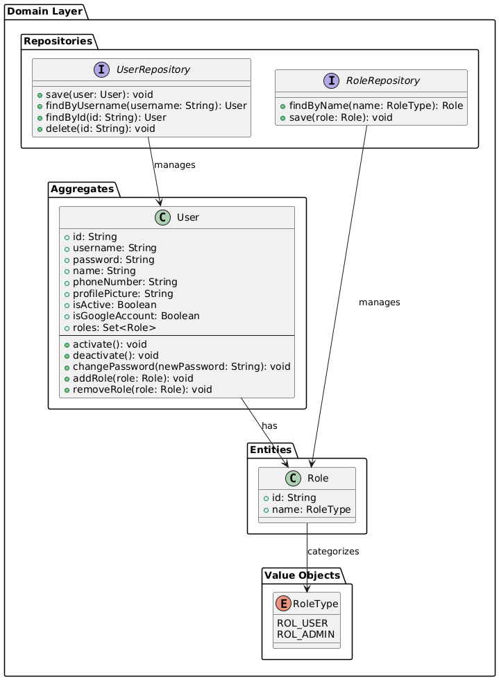  

#### 4.2.1.2 Interface Layer

En esta capa, se gestionan las interacciones entre los usuarios y el sistema dentro del Bounded Context de IAM. Aquí, los controladores como AuthenticationController y UsersController son responsables de manejar las solicitudes relacionadas con el inicio de sesión, registro y la gestión de usuarios. Estos controladores procesan los datos proporcionados por los usuarios a través de recursos como SignInResource y UserResource, asegurando que la comunicación entre el sistema y los usuarios sea eficiente y segura.

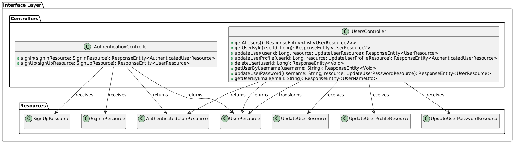  

#### 4.2.1.3 Application Layer

En la Capa de Aplicación del Bounded Context de IAM, se gestionan los flujos de procesos de negocio relacionados con la autenticación, el registro y la actualización de usuarios. A través de Command Handlers como SignInCommandHandler, SignUpCommandHandler y UpdateProfileUserCommandHandler, se coordinan las acciones de escritura y se gestionan los comandos para la creación, actualización y autenticación de usuarios. Estos handlers facilitan la validación de datos y la manipulación de la información, trabajando de la mano con las entidades y servicios de la capa de dominio para garantizar la correcta gestión de usuarios en el sistema.

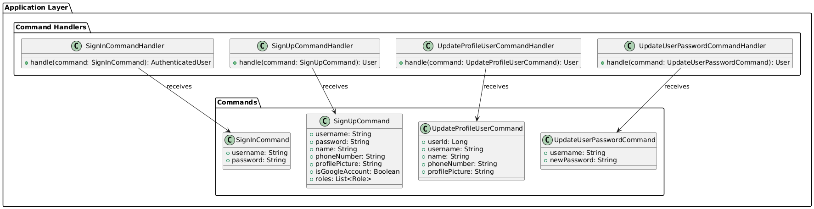  

#### 4.2.1.4 Infrastructure Layer

En esta capa, se gestionan los componentes que permiten la interacción con servicios externos en el Bounded Context de IAM. Esta capa implementa los repositorios definidos en la capa de dominio, como UserRepositoryImpl, para manejar la persistencia de usuarios en bases de datos. Además, gestiona servicios como MessageBrokerServiceImpl y EmailServiceImpl, encargados de la comunicación con sistemas de mensajería y el envío de correos electrónicos. La Capa de Infraestructura actúa como puente entre las capas superiores y los servicios externos, garantizando que las operaciones de datos y mensajes se ejecuten correctamente.

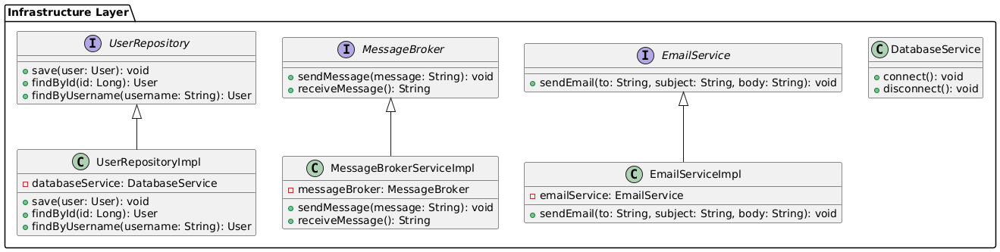  

#### 4.2.1.5 Bounded Context Software Architecture Component Level Diagrams

El contexto de IAM se encarga de gestionar la autenticación y autorización de los usuarios en el sistema CambiaZo. Este bounded context está compuesto por varios componentes que trabajan conjuntamente para garantizar un proceso de inicio de sesión seguro, la gestión de cuentas de usuario y la verificación mediante autenticaciones externas (como Firebase Auth). Los componentes dentro de este contexto interactúan directamente con la base de datos de usuarios y con los servicios externos de correo electrónico (para el envío de correos de verificación).

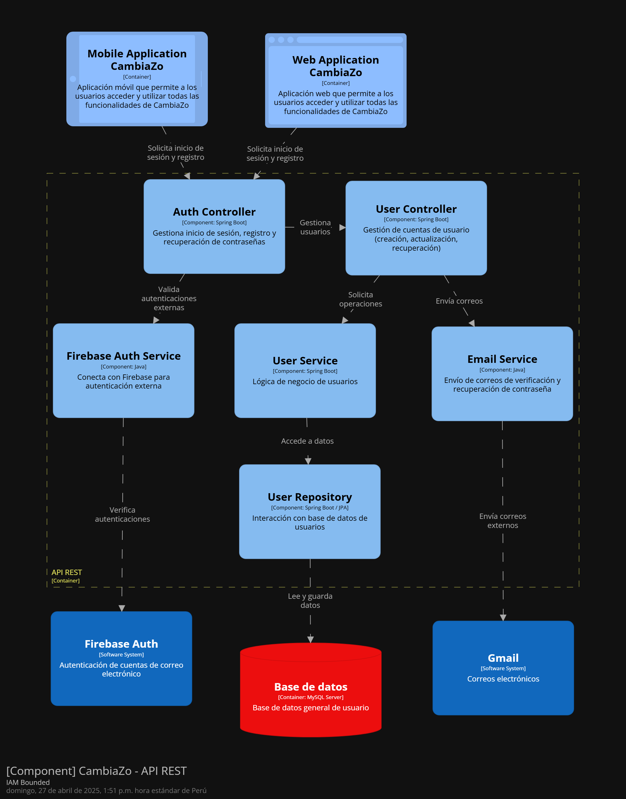  

#### 4.2.1.6 Bounded Context Software Architecture Code Level Diagrams

##### 4.2.1.6.1 Bounded Context Domain Layer Class Diagrams

Este diagrama presenta las clases clave para la gestión de usuarios en el Bounded Context de IAM. La clase User incluye atributos como ID, nombre, contraseña y roles, y ofrece métodos para activar, desactivar usuarios y gestionar roles. Los roles se definen en la clase Role y se categorizan mediante la enumeración RoleType (que incluye los valores ROL_USER y ROL_ADMIN). UserRepository gestiona la persistencia de los usuarios, mientras que RoleRepository se encarga de los roles. UserService coordina las operaciones de negocio, como el registro de usuarios, cambio de contraseñas y la gestión de roles, interactuando con los repositorios correspondientes para asegurar la correcta administración de usuarios y roles.

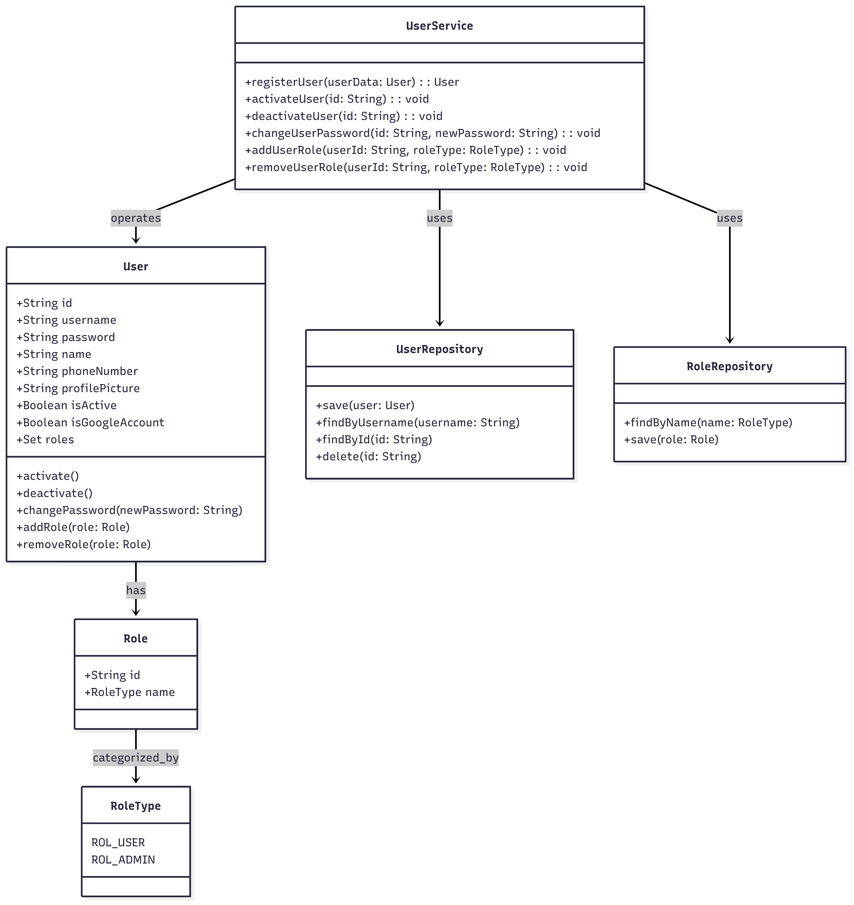  

##### 4.2.1.6.2 Bounded Context Database Design Diagram

En esta capa, se presenta el Diagrama de Base de Datos del Bounded Context de IAM, que describe las tablas esenciales para la persistencia de datos de usuarios y roles. La tabla USER almacena información clave como el nombre, la contraseña y el estado de los usuarios, mientras que ROLE almacena los roles disponibles. USER_ROLE vincula usuarios con roles mediante claves foráneas, y ROLETYPE categoriza los roles. Las relaciones entre estas tablas aseguran la integridad de los datos y permiten una gestión eficiente de los roles asignados a cada usuario.

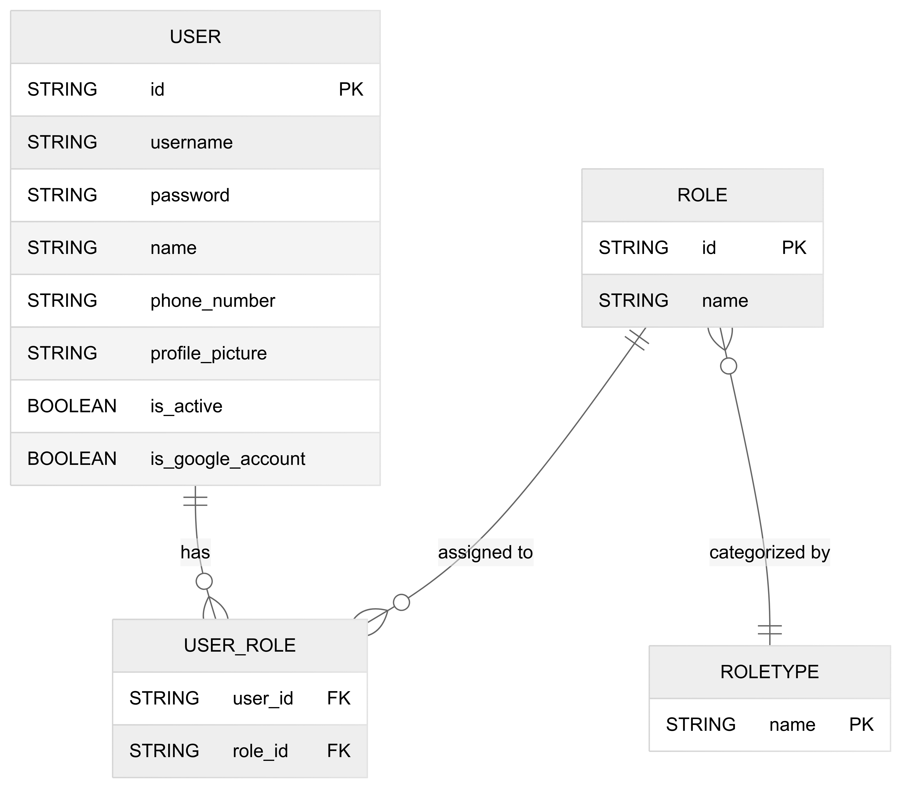  

### 4.2.2 Bounded Context: Exchanges

#### 4.2.2.1 Domain Layer

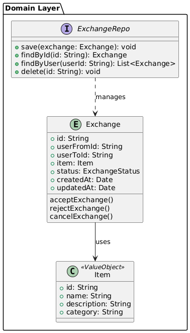

#### 4.2.2.2 Interface Layer

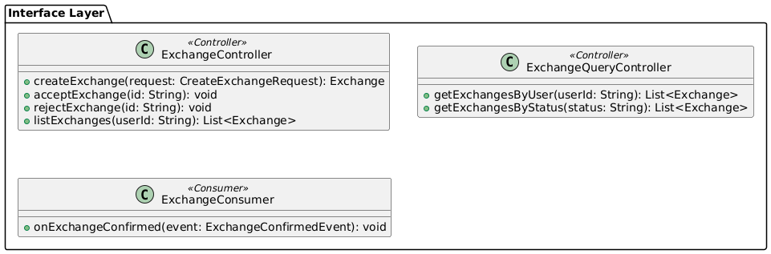

#### 4.2.2.3 Application Layer

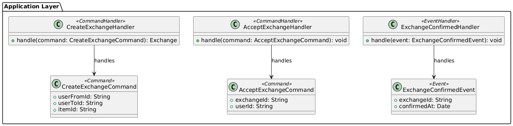

#### 4.2.2.4 Infrastructure Layer

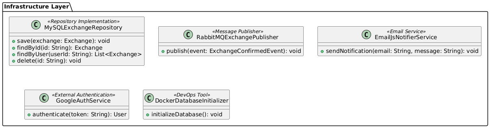

#### 4.2.2.5 Bounded Context Software Architecture Component Level Diagrams
El contexto ExchangeManagement es responsable de gestionar las solicitudes de intercambio de productos entre los usuarios. Incluye la creación y aceptación de ofertas, así como la consulta de productos disponibles. Este contexto se encarga de facilitar las interacciones de intercambio de manera segura y fluida entre los usuarios a través de la plataforma.

#### 4.2.2.6 Bounded Context Software Architecture Code Level Diagrams

##### 4.2.2.6.1 Bounded Context Domain Layer Class Diagrams
En esta sección se presenta el Diagrama de Clases del Domain Layer del Bounded Context de Exchange, donde se muestran las principales clases, interfaces, enumeraciones y sus relaciones. El diagrama refleja cómo se estructuran los objetos de dominio, incluyendo sus métodos públicos y las asociaciones entre ellos, permitiendo visualizar la organización y el comportamiento general del sistema.

##### 4.2.2.6.2 Bounded Context Database Design Diagram
El Diagrama de Base de Datos del Bounded Context de Exchange presenta las tablas necesarias para gestionar productos, ofertas de intercambio, usuarios, categorías, estados y eventos. Incluye tablas como Product, ExchangeOffer, User, Category, ExchangeStatus y ProductStatus, cada una con sus correspondientes columnas y claves foráneas. Las relaciones entre estas tablas permiten gestionar interacciones como la propiedad de productos por parte de usuarios, las ofertas de intercambio, y el seguimiento de su estado. Además, los repositorios ProductRepository, ExchangeOfferRepository y CategoryRepository facilitan la persistencia y recuperación de los datos necesarios para las operaciones dentro de este contexto.

### 4.2.3 Bounded Context: Locker

#### 4.2.3.1 Domain Layer

En el dominio de Locker Management, se encuentran entidades clave que permiten gestionar los casilleros inteligentes y sus componentes. Estas entidades son fundamentales para el proceso de administración de los casilleros, incluyendo el bloqueo y desbloqueo, el monitoreo de sensores, el control de la cámara y la iluminación, y la gestión del estado de los casilleros.

#### 4.2.3.2 Interface Layer

La Capa de Interfaz en Locker Management está encargada de proporcionar puntos de entrada para las interacciones entre los usuarios y el sistema. Esta capa incluye los controladores responsables de gestionar las operaciones relacionadas con los casilleros, sensores, cámaras y luces. Cada controlador maneja solicitudes y respuestas de los usuarios, permitiendo la interacción con las funcionalidades del sistema.

#### 4.2.3.3 Application Layer

La Capa de Aplicación actúa como intermediaria entre la lógica de negocio y la infraestructura, gestionando el flujo de datos y las interacciones. En este contexto, se incluyen Command Handlers y Event Handlers que coordinan acciones de escritura y eventos del sistema relacionados con los casilleros, como la actualización de estados o la activación de sensores.

#### 4.2.3.4 Infrastructure Layer

La Capa de Infraestructura es responsable de proporcionar los componentes técnicos necesarios para la persistencia y la interacción con sistemas externos. En este caso, se incluye la implementación del repositorio LockerRepository, que maneja la persistencia de los casilleros en la base de datos. Este repositorio se encarga de operaciones como guardar, buscar, encontrar casilleros disponibles y eliminar casilleros, interactuando con la base de datos para asegurar que la información esté correctamente almacenada y accesible.

#### 4.2.3.5 Bounded Context Software Architecture Component Level Diagrams

#### 4.2.3.6 Bounded Context Software Architecture Code Level Diagrams
El contexto de LockerManagement se ocupa de la gestión de lockers inteligentes, permitiendo a los usuarios almacenar y recuperar productos de manera segura. Este contexto incluye componentes encargados de controlar las interacciones físicas con los lockers, como los sensores, las cámaras y las luces, y la gestión de las notificaciones relacionadas con el estado de los lockers.

##### 4.2.3.6.1 Bounded Context Domain Layer Class Diagrams
En esta sección, se presenta el diagrama de clases en el contexto de Locker Management. Este diagrama incluye las clases, interfaces, enumeraciones y sus relaciones, proporcionando detalles sobre los atributos, métodos y sus alcances (private, public, protected). Las relaciones entre las clases están claramente indicadas, con la calificación de los nombres, la dirección cuando aplica y la multiplicidad. Este diagrama es fundamental para modelar la estructura y las interacciones dentro del dominio de gestión de casilleros.

##### 4.2.3.6.2 Bounded Context Database Design Diagram
En esta sección, se presenta el diagrama de base de datos que detalla los objetos de base de datos necesarios para la persistencia de información dentro del contexto del Locker Management. Este diagrama refleja las entidades y relaciones que permiten almacenar y gestionar la información relacionada con los casilleros, sensores, cámaras, luces, eventos y notificaciones.

## Conclusiones

La investigación inicial confirmó con datos cualitativos que el modelo de economía lineal está generando niveles crecientes de residuos y desconfianza en los intercambios informales. Las más de siete entrevistas realizadas mostraron que el 100 % de los usuarios ha tenido experiencias negativas al intentar trueques a través de redes sociales tradicionales, lo que evidencia una oportunidad clara para una solución segura y automatizada como CambiaZo.

A través de la aplicación de metodologías Lean UX—definición de problem statements, canvas y validación de hipótesis—junto con la construcción de User Personas, Journey Maps y Empathy Maps, se lograron identificar con precisión los flujos de interacción, puntos de dolor y expectativas de los intercambiadores. Estos hallazgos permitieron priorizar funcionalidades esenciales como la asignación de lockers cercanos, la validación fotográfica de depósitos, la generación de PINs seguros y un sistema de calificaciones que fomente la confianza.

La arquitectura propuesta, basada en EventStorming y Domain-Driven Design, establece una separación clara de responsabilidades mediante contextos acotados (Cuenta, Intercambios, Locker). Esta estrategia facilita la mantenibilidad del sistema y soporta tanto la capa web/móvil como los dispositivos IoT de los lockers inteligentes. Además, el uso de contenedores y bases de datos edge garantiza que el servicio permanezca operativo incluso ante interrupciones temporales de conectividad, sincronizándose luego de manera eficiente con CosmosDB en la nube.

El conjunto de epics, user stories y technical stories definido cubre exhaustivamente todos los escenarios críticos: desde la gestión de cuentas y la publicación de intercambios, hasta la aceptación de ofertas, el manejo de suscripciones y la atención al usuario. Este backlog estructurado sienta las bases de un roadmap de desarrollo ágil que facilite la entrega temprana de valor y permita ajustar el producto de manera iterativa según el feedback real de los usuarios.

Finalmente, CambiaZo refuerza el compromiso de TechZo con la economía circular y la sostenibilidad. Más allá de optimizar los procesos de trueque, la plataforma propone un modelo socialmente responsable que incluye donaciones a comunidades vulnerables y promueve hábitos de consumo consciente. De este modo, se alinea con la misión de impulsar un cambio positivo en la reducción de residuos y en la adopción de prácticas de reutilización a través de la tecnología.

# Bibliografía
 

+ Al-Fuqaha, A., Guizani, M., Mohammadi, M., Aledhari, M., & Ayyash, M. (2015). Internet of Things: A Survey on Enabling Technologies, Protocols, and Applications. IEEE Communications Surveys & Tutorials, 17(4), 2347–2376. https://doi.org/10.1109/COMST.2015.2444095   

+ Uckelmann, D., Harrison, M., & Michahelles, F. (2011). Architecting the Internet of Things. Springer. https://link.springer.com/book/10.1007/978-3-642-19157-2   

+ Hanes, D., Salgueiro, G., Grossetete, P., Barton, R., & Henry, J. (2017). IoT Fundamentals: Networking Technologies, Protocols, and Use Cases for the Internet of Things. Cisco Press. https://www.ciscopress.com/store/iot-fundamentals-networking-technologies-protocols-and-9781587144561   

+ Rowland, C., Goodman, E., Charlier, M., Taylor, A., & Wilkie, A. (2015). Designing Connected Products: UX for the Consumer Internet of Things. O'Reilly Media. https://www.oreilly.com/library/view/designing-connected-products/9781449338179/   

+ Minerva, R., Biru, A., & Rotondi, D. (2015). Towards a Definition of the Internet of Things (IoT). IEEE Internet Initiative. https://iot.ieee.org/images/files/pdf/IEEE_IoT_Towards_Definition_Internet_of_Things_Revision1_27MAY15.pdf   

+ Ashton, K. (2009). That 'Internet of Things' Thing. RFID Journal. https://www.rfidjournal.com/that-internet-of-things-thing   

+ Bandyopadhyay, D., & Sen, J. (2011). Internet of Things: Applications and Challenges in Technology and Standardization. Wireless Personal Communications, 58, 49–69. https://doi.org/10.1007/s11277-011-0288-5   

+ Gubbi, J., Buyya, R., Marusic, S., & Palaniswami, M. (2013). Internet of Things (IoT): A vision, architectural elements, and future directions. Future Generation Computer Systems, 29(7), 1645–1660. https://doi.org/10.1016/j.future.2013.01.010   

+ Madakam, S., Ramaswamy, R., & Tripathi, S. (2015). Internet of Things (IoT): A Literature Review. Journal of Computer and Communications, 3(5), 164–173. https://doi.org/10.4236/jcc.2015.35021   

+ Zanella, A., Bui, N., Castellani, A., Vangelista, L., & Zorzi, M. (2014). Internet of Things for Smart Cities. IEEE Internet of Things Journal, 1(1), 22–32. https://doi.org/10.1109/JIOT.2014.2306328   

+ Vermesan, O., & Friess, P. (Eds.). (2014). Internet of Things: From Research and Innovation to Market Deployment. River Publishers. https://www.riverpublishers.com/research_details.php?book_id=151   

+ Rayes, A., & Salam, S. (2017). Internet of Things From Hype to Reality: The Road to Digitization. Springer. https://link.springer.com/book/10.1007/978-3-319-46005-3   

+ Holler, J., Tsiatsis, V., Mulligan, C., Karnouskos, S., Avesand, S., & Boyle, D. (2014). From Machine-to-Machine to the Internet of Things: Introduction to a New Age of Intelligence. Academic Press. https://www.sciencedirect.com/book/9780124076846/from-machine-to-machine-to-the-internet-of-things   

+ Rose, K., Eldridge, S., & Chapin, L. (2015). The Internet of Things: An Overview. The Internet Society. https://www.internetsociety.org/resources/doc/2015/iot-overview   

+ Lin, J., Yu, W., Zhang, N., Yang, X., Zhang, H., & Zhao, W. (2017). A Survey on Internet of Things: Architecture, Enabling Technologies, Security and Privacy, and Applications. IEEE Internet of Things Journal, 4(5), 1125–1142. https://doi.org/10.1109/JIOT.2017.2683200   

+ Perera, C., Liu, C. H., & Jayawardena, S. (2015). The Emerging Internet of Things Marketplace from an Industrial Perspective: A Survey. IEEE Transactions on Emerging Topics in Computing, 3(4), 585–598. https://doi.org/10.1109/TETC.2015.2390034   

# Anexos

+ Repositorio GitHub de la Organización:[Ver Organización](https://github.com/TechZo-1ASI0572-2942)  

## Exposure video TB1

  

    
 

Enlace: [Exposure video Tb1](https://upcedupe-my.sharepoint.com/:v:/g/personal/u202214059_upc_edu_pe/EZvQGeU0vgJAhIno6pVhZHIB4BGs4RR-_R3uBf4w7RxB_Q?nav=eyJyZWZlcnJhbEluZm8iOnsicmVmZXJyYWxBcHAiOiJTdHJlYW1XZWJBcHAiLCJyZWZlcnJhbFZpZXciOiJTaGFyZURpYWxvZy1MaW5rIiwicmVmZXJyYWxBcHBQbGF0Zm9ybSI6IldlYiIsInJlZmVycmFsTW9kZSI6InZpZXcifX0%3D&e=DJYLPh)

