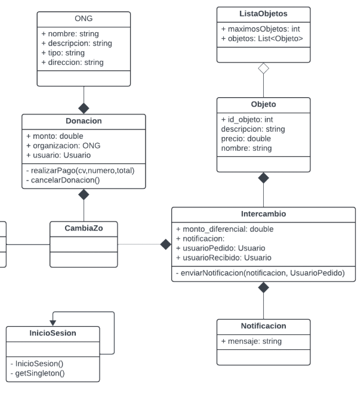
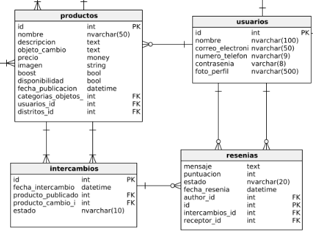

  

## Universidad Peruana de Ciencias Aplicadas

**Ingeniería de Software**

**Ciclo:** 2025-1

**Curso:** Desarrollo de Soluciones IOT (1ASI0572)

**Sección:** 2942

**Profesor:** Marco Antonio Leon Baca

----
## Informe del Trabajo Final
### Nombre del Startup: TechZo

### Nombre del Producto: CambiaZo
#### Relación de integrantes 
| Integrante                  | Código         |
|---------------------------------|----------------|
| Huamani Mandujano, Joseph Alexis         | U20221A133     |
| Mendoza Carrion, Mathias Andre          | U202216282     |
| Quispe Andia, Jeremy Joel      | U202216279     |
| Santisteban Palomino, Ian Haziel Donato | U202214059     |
| Pin Matallana, Augusto Jose  | U202210257     |

 
<h3>Abril 2025</h3>
 

# Registro de Versiones
 

|**Versión**|**Fecha**|**Autor**|**Descripción de modificación**|
| - | - | - | - |
|1\.0|15/08/24|Ian Haziel Donato Santisteban Palomino|Se agregó la estructura inicial del proyecto.|
|1\.1|15/08/24|Ian Haziel Donato Santisteban Palomino|Se inició el Capítulo I: Presentación y se agregó contenido relacionado con Startup Profile|
|1\.1.1|19/08/24|Joseph Alexis Huamani Mandujano|Se agregó contenido relacionado con Solution Profile|
|1\.1.2|19/08/24|
Ian Haziel Donato Santisteban Palomino, Mathias Andre Mendoza Carrion, Jeremy Joel Quispe Andia y Joseph Alexis Huamani Mandujano 

 
|Se agregaron los perfiles de los integrantes y se comenzó con el proceso Lean UX Process|
|1\.1.3|19/08/24|Ian Haziel Donato Santisteban Palomino, Mathias Andre Mendoza Carrion, Jeremy Joel Quispe Andia y Joseph Alexis Huamani Mandujano |Se terminó de agregar el Lean UX Process y se agregó contenido relacionado con los Segmentos Objetivos|
|1\.2|19/08/24|Ian Haziel Donato Santisteban Palomino, Mathias Andre Mendoza Carrion, Jeremy Joel Quispe Andia y Joseph Alexis Huamani Mandujano |Se inició el Capítulo II: Needfinding y se agregó contenido relacionado a los Competidores|
|1\.2.1|19/08/24|Ian Haziel Donato Santisteban Palomino, Mathias Andre Mendoza Carrion, Jeremy Joel Quispe Andia y Joseph Alexis Huamani Mandujano |Se agregó contenido relacionado con las Entrevistas|
|1\.2.2|
21/08/24

 
|Mathias Andre Mendoza Carrion y Jeremy Joel Quispe Andia |Se agregó contenido relacionado con el Needfinding y los artefactos correspondientes|
|1\.2.3|22/08/24|Joseph Alexis Huamani Mandujano y Mathias Andre Mendoza Carrion|Se agregó contenido relacionado con los User Persona y User Task Matrix|
|1\.2.4|22/08/24|Jeremy Joel Quispe Andia |Se agregó contenido relacionado con los User Journey Mapping y Empathy Mapping|
|1\.2.5|24/08/24|Mathias Andre Mendoza Carrion|Se agregó contenido relacionado con el As-is Scenario Mapping|
|1\.2.6|24/08/24|Joseph Alexis Huamani Mandujano|Se agregó contenido relacionado al To-be|
|1\.2.7|25/04/24|Ian Haziel Donato Santisteban Palomino, Mathias Andre Mendoza Carrion, Jeremy Joel Quispe Andia y Joseph Alexis Huamani Mandujano |Se agregaron los Epics, User Stories y Technical Stories|
|1\.2.8|25/04/24|Joseph Alexis Huamani Mandujano|Se agregó contenido relacionado con Impact Mapping|
|1\.2.9|25/04/24|
Mathias Andre Mendoza Carrion
|Se agregó contenido relacionado con el Product Backlog|
|2\.3|15/09/24|Ian Haziel Donato Santisteban Palomino, Mathias Andre Mendoza Carrion, Jeremy Joel Quispe Andia y Joseph Alexis Huamani Mandujano |Se agrego contenido relacionado al Student Outcome, Conclusiones y Anexo|

  

# Contenido

## Tabla de Contenidos

### [Contenido](#contenido)

### [Student Outcome](#student-outcome)

### [Objetivos SMART](#objetivos-smart)

### [Capítulo I: Presentación](#capítulo-i-presentación)

- [1.1. Startup Profile](#11-startup-profile)
  - [1.1.1. Descripción de la StartUp](#111-descripción-de-la-startup)
  - [1.1.2. Perfiles de integrantes del equipo](#112-perfiles-de-integrantes-del-equipo)
- [1.2. Solution Profile](#12-solution-profile)
  - [1.2.1 Antecedentes y problemática](#121-antecedentes-y-problemática)
  - [1.2.2 Lean UX Process](#122-lean-ux-process)
    - [1.2.2.1 Lean UX Problem Statement](#1221-lean-ux-problem-statement)
    - [1.2.2.2 Lean UX Assumptions](#1222-lean-ux-assumptions)
    - [1.2.2.3 Lean UX Hypothesis Statements](#1223-lean-ux-hypothesis-statements)
    - [1.2.2.4 Lean UX Canvas](#1224-lean-ux-canvas)
- [1.3. Segmentos Objetivo](#13-segmentos-objetivo)

### [Capítulo II: Needfinding](#capítulo-ii-needfinding)

- [2.1. Competidores](#21-competidores)
  - [2.1.1. Análisis competitivo](#211-análisis-competitivo)
  - [2.1.2. Estrategias y tácticas frente a competidores](#212-estrategias-y-tácticas-frente-a-competidores)
- [2.2 Entrevistas](#22-entrevistas)
  - [2.2.1 Diseño de entrevistas](#221-diseño-de-entrevistas)
  - [2.2.2 Registro de Entrevistas](#222-registro-de-entrevistas)
  - [2.2.3. Análisis de entrevistas](#223-análisis-de-entrevistas)
- [2.3. Needfinding](#23-needfinding)
  - [2.3.1. User Personas](#231-user-personas)
  - [2.3.2 User Task Matrix](#232-user-task-matrix)
  - [2.3.3. User Journey Mapping](#233-user-journey-mapping)
  - [2.3.4. Empathy Mapping](#234-empathy-mapping)
  - [2.3.5. As-is Scenario Mapping](#235-as-is-scenario-mapping)
- [2.4. Ubiquitous Language](#24-ubiquitous-language)

### [Capítulo III: Arquitectura](#capítulo-iii-arquitectura)

- [3.1. To-Be Scenario Mapping](#31-to-be-scenario-mapping)
- [3.2. User Stories](#32-user-stories)
- [3.3. Impact Mapping](#33-impact-mapping)
- [3.4. Product Backlog](#34-product-backlog)
  
### [Capítulo IV: Solution Software Design](#capítulo-iv-solution-software-design)
- [4.1. Strategic-Level Domain-Driven Design](#41-strategic-level-domain-driven-design)
  - [4.1.1. EventStorming](#411-eventstorming)
    - [4.1.1.1. Candidate Context Discovery](#4111-candidate-context-discovery)
    - [4.1.1.2. Domain Message Flows Modeling](#4112-domain-message-flows-modeling)
    - [4.1.1.3. Bounded Context Canvases](#4113-bounded-context-canvases)
  - [4.1.2. Context Mapping](#412-context-mapping)
  - [4.1.3. Software Architecture](#413-software-architecture)
    - [4.1.3.1. Software Architecture System Landscape Diagram](#4131-software-architecture-system-landscape-diagram)
    - [4.1.3.2. Software Architecture Context Level Diagrams](#4132-software-architecture-context-level-diagrams)
    - [4.1.3.2. Software Architecture Container Level Diagrams](#4132-software-architecture-container-level-diagrams)
    - [4.1.3.3. Software Architecture Deployment Diagrams](#4133-software-architecture-deployment-diagrams)
- [4.2. Tactical-Level Domain-Driven Design](#42-tactical-level-domain-driven-design)
  - [4.2.1. Bounded Context:](#421-bounded-context)
    - [4.2.1.1. Domain Layer](#4211-domain-layer)
    - [4.2.1.2. Interface Layer](#4212-interface-layer)
    - [4.2.1.3. Application Layer](#4213-application-layer)
    - [4.2.1.4. Infrastructure Layer](#4214-infrastructure-layer)
    - [4.2.1.5. Bounded Context Software Architecture Component Level Diagrams](#4215-bounded-context-software-architecture-component-level-diagrams)
    - [4.2.1.6. Bounded Context Software Architecture Code Level Diagrams](#4216-bounded-context-software-architecture-code-level-diagrams)
      - [4.2.1.6.1. Bounded Context Domain Layer Class Diagrams](#42161-bounded-context-domain-layer-class-diagrams)
      - [4.2.1.6.2. Bounded Context Database Design Diagram](#42162-bounded-context-database-design-diagram)
  - [4.2.2. Bounded Context: Exchanges](#422-bounded-context-exchanges)
    - [4.2.2.1. Domain Layer](#4221-domain-layer)
    - [4.2.2.2. Interface Layer](#4222-interface-layer)
    - [4.2.2.3. Application Layer](#4223-application-layer)
    - [4.2.2.4. Infrastructure Layer](#4224-infrastructure-layer)
    - [4.2.2.5. Bounded Context Software Architecture Component Level Diagrams](#4225-bounded-context-software-architecture-component-level-diagrams)
    - [4.2.2.6. Bounded Context Software Architecture Code Level Diagrams](#4226-bounded-context-software-architecture-code-level-diagrams)
      - [4.2.2.6.1. Bounded Context Domain Layer Class Diagrams](#42261-bounded-context-domain-layer-class-diagrams)
      - [4.2.2.6.2. Bounded Context Database Design Diagram](#42262-bounded-context-database-design-diagram)

### [Bibliografía](#bibliografía)

### [Anexos](#anexos)

	

# Student Outcome

El curso contribuye al cumplimiento del Student Outcome ABET:  
**ABET – EAC - Student Outcome 7** 
**Criterio:** La capacidad de adquirir y aplicar nuevos conocimientos según sea
necesario, utilizando estrategias deaprendizaje apropiadas.  
En el siguiente cuadro se describen las acciones realizadas y las conclusiones enunciadas por el grupo, que permiten sustentar el logro del ABET – EAC - Student Outcome 7.  

<table>
  <thead>
    <tr>
      <th colspan="3"><b>Criterio específico</b></th>
      <th colspan="3"><b>Acciones realizadas</b></th>
      <th colspan="3"><b>Conclusiones</b></th>
    </tr>
  </thead>
  <tbody>
    <tr>
	<td colspan="3">Trabaja en equipo para
proporcionar liderazgo en
forma conjunta</td>
      <td colspan="3" align = "justify">
      <h3>Joseph Alexis Huamani Mandujano</h3> 
      <b>TB1</b> 
      
Para el primer hito de nuestro proyecto, me encargué de definir claramente el Problem Statement, lo que me permitió delinear los contornos exactos de nuestro desafío de diseño. Esta definición fue crucial para enmarcar todo el desarrollo posterior del proyecto. Además, elaboré Asumptions y Hypothesis Statements detallados, permitiéndome establecer una base sólida para nuestras investigaciones y decisiones de diseño futuras. Mi capacidad para analizar críticamente y sintetizar información compleja fue esencial para este proceso, asegurando que nuestro proyecto se construyera sobre premisas bien fundamentadas.
 
    <h3>Mathias André Mendoza Carrión</h3>
    <b>TB1</b>
    
Durante esta fase inicial, realicé una investigación exhaustiva de los competidores en el sector seleccionado, identificando sus fortalezas y debilidades. Este análisis me permitió entender mejor el mercado y ajustar nuestra propuesta de valor para que fuera realmente innovadora. Adicionalmente, diseñé y realicé entrevistas con varios grupos de usuarios, analizando las respuestas para determinar nuestras Personas Principales y Secundarias. Este ejercicio no solo mejoró mi habilidad para comunicarme de manera efectiva, sino que también profundizó mi comprensión de las necesidades del usuario, reflejándose directamente en la relevancia de nuestras soluciones propuestas.

    <h3>Ian Haziel Donato Santisteban Palomino</h3>
    <b>TB1</b>
    
En este primer entregable, demostré habilidades de comunicación oral y escrita al interactuar eficazmente con mi equipo y al documentar adecuadamente todo el proceso de trabajo. La comunicación constante con el equipo y los stakeholders del proyecto aseguró que las ideas y feedback fueran integrados de manera efectiva, mejorando así nuestro enfoque y resultados. Mi capacidad para facilitar y mantener una comunicación fluida contribuyó significativamente al establecimiento de una base sólida para la colaboración continua y el éxito del proyecto.

    <h3>Jeremy Joel Quispe Andia</h3>
    <b>TB1</b>
    
He trabajado intensamente en la definición de User Stories claras y efectivas que reflejan las necesidades identificadas de nuestros usuarios, garantizando que todos los requisitos del usuario estén adecuadamente representados en nuestro desarrollo de producto. Esta actividad fue complementada por la creación de una propuesta de valor diferenciada, que establece claramente el alcance y los objetivos de nuestro proyecto. Estos elementos no solo demuestran mi habilidad para pensar innovadoramente, sino que también aseguran que nuestro producto final sea tanto funcional como disruptivo en el mercado.

    <h3>Augusto Jose Pin Matallana</h3>
    <b>TB1</b>
    
He dedicado un esfuerzo considerable a elaborar diagramas precisos y alineadas con las necesidades reales de nuestros usuarios, asegurando que cada requerimiento esté contemplado en el desarrollo del producto. Este trabajo se complementó con la definición de una propuesta de valor única, que delimita con claridad el propósito y los objetivos del proyecto. Ambas acciones reflejan no solo mi capacidad para generar ideas innovadoras, sino también mi compromiso con la creación de soluciones funcionales y con alto potencial de impacto en el mercado.

    <td colspan="3">
    <b>TB1</b>
    
Al concluir el primer hito de nuestro proyecto, nuestro equipo ha demostrado un crecimiento significativo en el ámbito de soluciones de software, fundamental para nuestro desarrollo profesional continuo. Hemos completado con éxito la definición del problema, realizado una investigación exhaustiva de competidores y llevado a cabo entrevistas detalladas que han enriquecido considerablemente nuestra comprensión del mercado y las necesidades de los usuarios. Estas actividades nos han permitido formular una propuesta de valor innovadora y diferenciada, reflejada en User Stories bien definidas y un diseño de producto adaptado a las demandas actuales. La comunicación efectiva y la colaboración dentro del equipo han sido claves para integrar diversas perspectivas y habilidades, fortaleciendo nuestro enfoque y asegurando que todos los aspectos del proyecto estén alineados y optimizados para las siguientes etapas del desarrollo. Este progreso inicial no solo ha mejorado nuestras capacidades técnicas, sino que también ha solidificado nuestra cohesión como equipo, preparándonos para enfrentar con confianza los desafíos futuros del proyecto.

  </td>
    </tr>
    <tr>
      <td colspan="3">Crea un entorno colaborativo e
inclusivo, establece metas,
planifica tareas y cumple
objetivos.</td>
      <td colspan="3" align = "justify">
      <h3>Joseph Alexis Huamani Mandujano</h3>
    <b>TB1</b>
    
En este primer hito, he logrado una comprensión más profunda de la definición de problemas y la formulación de suposiciones, elementos cruciales en el desarrollo de proyectos de software. Al delinear claramente el Problem Statement y establecer Asumptions fundamentados, he reforzado mi capacidad para abordar problemas complejos de manera sistemática. Esta tarea ha reafirmado mi convicción sobre la importancia del aprendizaje continuo en la adaptación y aplicación de conocimientos técnicos a situaciones reales, lo cual es indispensable para mi desarrollo profesional.

      <h3>Mathias André Mendoza Carrión</h3>
    <b>TB1</b>
    
Durante la realización de una investigación exhaustiva de competidores y la conducción de entrevistas dirigidas, he reconocido la necesidad de mantenerme actualizado sobre las tendencias del mercado y las tecnologías emergentes. Este proceso no solo ha enriquecido mi entendimiento del entorno competitivo sino que también ha mejorado mis habilidades de comunicación y análisis crítico. Aprender de manera continua sobre nuevas metodologías y prácticas del sector me ha permitido formular preguntas más incisivas y recopilar datos más relevantes, fundamentales para el éxito del proyecto.

     <h3>Ian Haziel Donato Santisteban Palomino</h3>
    <b>TB1</b>
    
Como líder del equipo, definí una propuesta de valor innovadora y al identificar User Stories detalladas, he aplicado efectivamente mi aprendizaje en diseño de soluciones a las necesidades específicas del usuario final. Este proceso ha demostrado la importancia de actualizar continuamente mis habilidades en la creación de soluciones efectivas y centradas en el usuario. A través de la práctica constante y la evaluación crítica, he mejorado mi capacidad para desarrollar productos que no solo cumplen sino que superan las expectativas del mercado.

      <h3>Jeremy Joel Quispe Andia</h3>
    <b>TB1</b>
    
La tarea de analizar respuestas de entrevistas y construir fichas de Personas me ha permitido aplicar teorías de comportamiento del usuario y psicología de consumo de manera práctica. Este ejercicio ha reforzado la necesidad de un aprendizaje permanente en áreas interdisciplinarias que complementan el desarrollo de software. Entender profundamente a los usuarios y adaptar nuestras soluciones a sus necesidades es un recordatorio constante de cómo el aprendizaje continuo puede influir directamente en la relevancia y el impacto de nuestros proyectos.

    <h3>Augusto Jose Pin Matallana</h3>
    <b>TB1</b>
    
Durante este primer hito, participé activamente en diversas etapas clave del desarrollo del proyecto. Desde la definición clara del problema y la formulación de suposiciones bien fundamentadas, hasta la elaboración de User Stories alineadas con las verdaderas necesidades del usuario, contribuí a construir una base sólida para nuestro producto. Asimismo, me involucré en la investigación de mercado, análisis de competidores y entrevistas con usuarios, lo que me permitió enriquecer mi perspectiva sobre el entorno competitivo y afinar mis habilidades de observación y análisis. Todo ello ha reforzado mi convicción sobre la importancia del aprendizaje continuo para adaptar conocimientos técnicos a contextos reales y colaborar efectivamente en equipos multidisciplinarios.

    </td>
      <td colspan="3">
    <b>TB1</b>
    
Al concluir este primer hito, nuestro equipo ha consolidado la importancia del aprendizaje continuo como piedra angular de nuestro desarrollo profesional y éxito en proyectos de soluciones de software. Cada miembro ha demostrado un compromiso ejemplar con la actualización y aplicación de conocimientos en diversas áreas, desde la definición precisa de problemas hasta el análisis profundo del comportamiento del usuario. Hemos reconocido que mantenerse al día con las últimas tendencias y tecnologías no solo enriquece nuestras propuestas de valor, sino que también refina nuestras habilidades comunicativas y de análisis. Este enfoque proactivo hacia el aprendizaje nos ha permitido crear soluciones innovadoras y efectivas que responden con precisión a las necesidades de nuestros usuarios. La experiencia acumulada en este hito subraya nuestra convicción de que el aprendizaje permanente es fundamental para adaptarse a los desafíos emergentes y para liderar en el dinámico campo del desarrollo de software.

  </td>
    </tr>
  </tbody>
</table>

  

  
# Capítulo I: Presentación
## 1.1 Startup Profile
### 1.1.1 Descripción de la Startup

**Nombre:**  TechZo

**Área:**  Innovación tecnológica y Reutilización

# TechZo - Proyecto CambiaZo

TechZo es una startup dedicada a la innovación tecnológica y la optimización de recursos mediante el uso de lockers inteligentes, fundada por un grupo de estudiantes comprometidos de la Facultad de Ingeniería de la Universidad Peruana de Ciencias Aplicadas (UPC). Nuestra misión es abordar desafíos críticos relacionados con la sostenibilidad, la eficiencia logística y el consumo responsable, fomentando la transición hacia una economía circular en nuestro país.

Nuestra principal solución, **CambiaZo**, es una plataforma de intercambio de productos apoyada en lockers inteligentes. A través de CambiaZo, facilitamos el intercambio seguro y automatizado de artículos, utilizando validaciones fotográficas, códigos de seguridad y notificaciones instantáneas. Además, la aplicación permite a los usuarios donar productos a comunidades necesitadas, fortaleciendo nuestro compromiso social.

En TechZo, estamos comprometidos con la seguridad, la transparencia y la eficiencia en cada transacción. Nos esforzamos para que cada usuario tenga acceso a una experiencia confiable de intercambio, apoyada en la tecnología de lockers inteligentes, garantizando un proceso sencillo, seguro y satisfactorio. Al integrar innovación tecnológica con responsabilidad social, impulsamos un cambio positivo en la forma de consumir y reutilizar.

* **Misión:** 
La misión de TechZo es revolucionar el intercambio de bienes mediante lockers inteligentes, proporcionando a los usuarios una plataforma segura, automatizada y sostenible para intercambiar productos de forma justa y eficiente.  

* **Visión:** 
La visión de TechZo es liderar la transformación del intercambio de productos a nivel global a través de lockers inteligentes, conectando personas y comunidades para fomentar una economía circular basada en confianza, tecnología y solidaridad.  

* **Valores:**
  * **Seguridad y privacidad:** Nuestra prioridad es proteger los datos y transacciones de nuestros usuarios, implementando medidas sólidas de cifrado y control de accesos mediante códigos PIN y validaciones fotográficas en los lockers.

  * **Innovación:** Buscamos constantemente nuevas maneras de mejorar la experiencia de intercambio, utilizando tecnologías como algoritmos de localización de lockers cercanos y validaciones inteligentes.

  * **Aprendizaje Continuo:** Promovemos el crecimiento de nuestro equipo en tecnologías emergentes, logística inteligente y estrategias de sostenibilidad.

  * **Calidad:** Nos comprometemos a ofrecer una experiencia fluida en la asignación de lockers, validación de objetos y notificaciones, asegurando la máxima satisfacción de los usuarios.

  * **Compromiso con el usuario:** Escuchamos activamente las necesidades de nuestros usuarios, adaptando nuestro sistema de lockers y plataforma digital para que cada intercambio sea sencillo y seguro.

  * **Respeto a la diversidad:** Fomentamos la inclusión, la equidad y el respeto entre todos los usuarios y miembros de nuestra comunidad, promoviendo un ecosistema de intercambio basado en valores sólidos.  

 ### 1.1.2 Perfiles de integrantes del equipo

A continuación, presentaremos los perfiles de los integrantes del equipo encargado de desarrollar el proyecto. Cada uno de nuestros miembros aporta una combinación única de habilidades y perspectivas que son fundamentales para el éxito del proyecto.

| **Integrante**                         | **Perfil**                                                                                                                                                                                                                                                                                                                                                                                                                                                                                                | **Imagen**                                                                                                       |
| -------------------------------------- | --------------------------------------------------------------------------------------------------------------------------------------------------------------------------------------------------------------------------------------------------------------------------------------------------------------------------------------------------------------------------------------------------------------------------------------------------------------------------------------------------------- | ---------------------------------------------------------------------------------------------------------------- |
| **Huamani Mandujano, Joseph Alexis - u20221a133**             |Mi nombre es Joseph Huamani, soy estudiante de 6to ciclo en la carrera de Ingeniería de Software en la UPC. Apasionado por el desarrollo web y web, cuento con experiencia usando lenguajes como C++, Python, Java, C#, Javascript y Typescript. Además cuento con experiencia en desarrollo web con HTML5 y CSS3 usando frameworks para frontend como Angular, VueJs, React y Astro. En cuanto al backend frameworks  como Spring Boot, .Net y Flask. Manejo de base de datos como MySQL, MSSQL, PostgreSQL, Oracle, SQLite y MongoDB. Soy una persona que trabaja en equipo, responsable y que brinda soluciones creativas para la resolución de problemas adquiridas gracias a la programación competitiva. Espero poder seguir aprendiendo nuevas tecnologias y poder culminar este curso de manera satisfactoria.| |
| **Mendoza Carrión, Mathias André - u202216282** |Soy Mathias Andre Mendoza Carrión, un estudiante de 20 años de Ingeniería de Software en el sexto ciclo. Me caracterizo por ser organizado, trabajar bien en equipo y ser responsable. Actualmente, mi enfoque principal es el aprendizaje profundo y práctico en el desarrollo de software, con habilidades en lenguajes de programación como C++, Python, Java, C#, y JavaScript. También tengo conocimientos en frameworks como Angular y Vue, desarrollo web con HTML y CSS, así como en la gestión de bases de datos SQL y MongoDB. Aspiro a dominar nuevas tecnologías y comprender en detalle los principios fundamentales detrás del desarrollo de aplicaciones, con el objetivo de convertirme en un profesional capaz de crear soluciones innovadoras y eficientes en el campo del desarrollo de software.|  |
| **Quispe Andia, Jeremy Joel - u202216279** |Mi nombre es Jeremy Joel Quispe Andia, soy estudiante de 6to ciclo de la carrera de Ingeniería de Software. Tengo una gran pasión por la programación competitiva y aspiro a convertirme en desarrollador Full Stack. Me gusta emplear soluciones creativas y eficientes para abordar cualquier desafío de la mejor manera posible. Como miembro del grupo, pretendo aportar todos mis conocimientos en el desarrollo web. Además, siempre colaboro con ideas y soluciones ante cualquier dificultad que se presente durante el desarrollo. Espero aprender mucho de mis compañeros y que todos juntos podamos emplear de manera adecuada las tecnologías que iremos aprendiendo a lo largo del proyecto.|                  |
| **Santisteban Palomino, Ian Haziel Donato - u202214059**     |Mi nombre es Ian Haziel Donato Santisteban Palomino, tengo 19 años y estoy cursando el sexto ciclo de la carrera de Ingeniería de Software. Me apasiona la resolución de problemas mediante la aplicación de conceptos y tecnologías innovadoras. Tengo experiencia en desarrollo web utilizando HTML, CSS y JavaScript, y manejo frameworks como Vue y Angular. También tengo conocimientos en bases de datos con MySQL y en el uso de Figma para prototipado. Como miembro del equipo, aporto un sólido conocimiento en desarrollo de software y un compromiso constante con la excelencia en cada proyecto en el que participo. Estoy emocionado por aprender y colaborar con el equipo, así como por adquirir nuevas habilidades y conocimientos en las tecnologías que utilizaremos en nuestro trabajo.    |  |
| **Pin Matallana, Augusto Jose - u202210257**     |Mi nombre es Augusto Jose Pin Matallana, tengo 19 años y estoy cursando el séptimo ciclo de la carrera de Ingeniería de Software. Me apasiona la resolución de problemas mediante la aplicación de conceptos y tecnologías innovadoras. Tengo experiencia en desarrollo web frontend, especialmente utilizando Vue.js, TailwindCSS y Sass, así como tecnologías base como HTML, CSS y JavaScript. Como miembro del equipo, aporto un sólido enfoque en el desarrollo frontend, siempre comprometido con la calidad visual, funcional y de experiencia de usuario. Estoy emocionado por aprender y colaborar con el equipo, y por seguir desarrollando mis habilidades técnicas en las tecnologías que utilizaremos en nuestro trabajo.    |  |

  

## 1.2 Solution Profile

### 1.2.1 Antecedentes y problemática

# 1.2.1 Contexto y Problemática

La economía lineal actual, caracterizada por el modelo de producir, usar y desechar, está generando un aumento preocupante en la acumulación de residuos y el uso insostenible de recursos naturales. Morseletto (2023) destaca que esta estructura económica contribuye significativamente al aumento de residuos y la degradación ambiental.

Esta forma de consumo no solo incrementa los desechos sólidos, contamina océanos y provoca pérdida de biodiversidad, sino que también intensifica el cambio climático debido a las emisiones de gases de efecto invernadero asociadas a la fabricación, transporte y eliminación de productos (Madaan et al., 2024).

Según Liu y Zhong (2023), la extracción intensiva de materias primas para nuevos productos está agotando los recursos naturales rápidamente. A esto se suma el crecimiento continuo de la población mundial, que se espera aumente en 2000 millones de personas para el 2050, lo que generará aún más residuos (Kruse-Andersen, 2023).

Frente a esta problemática, **nuestra aplicación propone una solución basada en lockers inteligentes**, que permiten mantener los productos en circulación más tiempo mediante intercambios seguros y automatizados, reduciendo residuos y promoviendo la economía circular.

Para explicar más detalladamente esta situación, como grupo, usaremos la metodología de las **5W y 2H** para analizar los antecedentes y la problemática que enfrentamos:

## 5W's y 2H's

* **WHAT?** 
La acumulación diaria de residuos a nivel global impacta negativamente al medio ambiente y agota los recursos naturales. La falta de iniciativas para reutilizar o intercambiar productos contribuye al colapso de vertederos y desperdicio de materiales.  

* **WHY?** 
Muchas personas no reutilizan o intercambian objetos debido a la falta de sistemas seguros y sencillos. La falta de confianza en intercambios tradicionales frena las prácticas de reutilización, perpetuando el modelo de descarte.  

* **WHO?** 
El problema afecta a toda la población, especialmente a quienes buscan opciones responsables para reducir su impacto ambiental. CambiaZo se dirige a usuarios interesados en un modelo más seguro de intercambio de bienes.  

* **WHEN?** 
Esta problemática es continua. A pesar de un creciente interés por la sostenibilidad, aún falta infraestructura segura para facilitar intercambios responsables de bienes en el día a día.  

* **WHERE?** 
Aunque el problema es global, CambiaZo se enfocará inicialmente en Perú, priorizando regiones urbanas donde la acumulación de residuos y la falta de reutilización son más evidentes.  

* **HOW?** 
Se implementará un sistema de lockers inteligentes donde los usuarios podrán dejar sus objetos de intercambio. El sistema validará el depósito mediante fotos, asignará códigos de seguridad, y notificará a los usuarios de cada paso.  

* **HOW MUCH?** 
El presupuesto estimado para el despliegue inicial de la red de lockers inteligentes y la aplicación web oscila entre S/. 50,000 y S/. 100,000, dependiendo de la cantidad de lockers, su tecnología integrada y el desarrollo de la plataforma.  

# 1.2.2 Lean UX Process

## 1.2.2.1 Lean UX Problem Statement

**Problem Statement 1:**  
Actualmente, existe un crecimiento en la conciencia sobre la sostenibilidad y la reutilización de bienes. Sin embargo, no existe un sistema automatizado y seguro que permita intercambiar objetos de manera simple.  
La falta de confianza, la logística complicada y la inseguridad desalientan a los usuarios a dar una segunda vida a sus pertenencias.  
¿Cómo podemos implementar un modelo eficiente, seguro y automatizado de intercambio de bienes mediante lockers inteligentes, validación de objetos y códigos de seguridad?  

**Problem Statement 2:**  
Aunque existe una creciente voluntad de las personas por intercambiar bienes, actualmente no hay infraestructuras tecnológicas que organicen, validen y faciliten de forma segura estos intercambios entre particulares.  
¿Cómo podemos facilitar el proceso de intercambio entre usuarios, garantizando seguridad, eficiencia y trazabilidad a través de lockers inteligentes y validaciones automáticas?  

**Problem Statement 3:**  
Los intercambios tradicionales entre usuarios suelen carecer de seguimiento, confirmación y validación adecuada, generando desconfianza y riesgo en las transacciones.  
¿Cómo podemos diseñar un sistema de intercambio que proporcione validación visual, confirmación automática y notificaciones en tiempo real para asegurar la transparencia y satisfacción de los usuarios?  

#### 1.2.2.2 Lean UX Assumptions

# 1.2.2.2 User Assumptions & Business Outcomes

## User Assumptions

+ **¿Quién es el usuario?** 
Nuestros usuarios son personas interesadas en reutilizar sus pertenencias mediante un sistema seguro de intercambio a través de lockers inteligentes. Incluye tanto a individuos que desean intercambiar objetos como a aquellos que desean donar artículos a comunidades necesitadas.  

+ **¿Dónde encaja nuestro producto en su trabajo o en su vida?** 
El producto se integra como una solución práctica y segura para fomentar un estilo de vida sostenible, permitiendo a los usuarios intercambiar y donar artículos de manera automatizada y sin necesidad de contacto directo.  

+ **¿Cuándo y cómo se utiliza nuestro producto?** 
Nuestro sistema se utiliza cuando el usuario desea dar un nuevo uso a una pertenencia. El proceso consiste en registrar el objeto en la app, recibir un locker asignado, depositar el objeto, validar con foto automática, y completar el intercambio.  

+ **¿Qué problemas resuelve nuestro producto?** 
CambiaZo resuelve la falta de seguridad y logística en los intercambios tradicionales, ofreciendo un sistema automatizado de lockers, validación de objetos, códigos PIN y notificaciones, que asegura una experiencia confiable y sin fricciones.  

+ **¿Qué características son importantes?** 
Facilidad de uso, asignación automática de lockers cercanos, generación de códigos PIN, validación fotográfica del objeto, sistema de notificaciones, y chat privado para coordinación opcional en intercambios tradicionales.  

+ **¿Cómo debe verse y comportarse nuestro producto?** 
La plataforma debe ser intuitiva, amigable para el público en general, enfocada en lo esencial: registrar, intercambiar y validar objetos de forma rápida. Se deben evitar sobrecargas visuales y mantenerse siempre actualizada para optimizar la experiencia.  

## Business Outcomes

1. **Creo que nuestros usuarios necesitan** un medio seguro y automatizado para realizar intercambios y donaciones de forma sencilla y eficaz.

2. **Estas necesidades se pueden resolver con** una plataforma que integre lockers inteligentes, validación de objetos mediante fotos y gestión automática de PINs.

3. **Nuestros usuarios iniciales son** personas de áreas urbanas en Perú comprometidas con el consumo responsable y la economía circular.

4. **El valor #1 que un cliente quiere de nuestro servicio es que** facilite un proceso de intercambio rápido, seguro y con mínima interacción física.

5. **El usuario también puede obtener beneficios adicionales como** poder realizar intercambios sin límite, recibir un "Boost" para destacar sus objetos en búsquedas, y acceder a lockers premium de mayor conveniencia.

6. **Vamos a adquirir la mayoría de nuestros clientes a través de** campañas en Instagram, TikTok y Facebook, enfocadas en destacar el impacto positivo de la reutilización mediante lockers inteligentes.

7. **Haremos dinero a través de** planes de suscripción premium que ofrezcan ventajas exclusivas como prioridad en asignación de lockers y aumento de visibilidad de publicaciones.

8. **Nuestras competencias principales son** plataformas tradicionales de trueques en Facebook y grupos como Me Sirve, HazTruequing y Trueques.

9. **Los venceremos debido a** nuestra propuesta de intercambio seguro, validado, automatizado y basado en tecnología de lockers inteligentes, ofreciendo mayor seguridad y confianza que los métodos tradicionales.

10. **Nuestro mayor riesgo es** que los usuarios perciban dificultad para encontrar intercambios justos o convenientes.

11. **Resolveremos esto a través de** filtros de búsqueda avanzados, procesos de validación de publicaciones, y mecanismos de retroalimentación para mantener la calidad de los objetos ofrecidos.

# 1.2.2.3 Lean UX Hypothesis Statements

**Creemos que** al implementar una red de lockers inteligentes y una plataforma sólida de intercambio automatizado, los usuarios podrán contribuir significativamente a la economía circular y adoptar un estilo de vida sostenible. 
**Sabremos que es cierto** cuando el número de intercambios diarios supere los 30, confirmando la aceptación de nuestro modelo.  

**Creemos que** permitir la interacción entre usuarios mediante notificaciones y validaciones automáticas mejorará la confianza y la eficiencia de los intercambios. 
**Sabremos que lo habremos logrado** cuando más del 50% de los usuarios mencione positivamente la facilidad y seguridad del sistema de lockers y validaciones automáticas en sus comentarios.

#### 1.2.2.4 Lean UX Canvas
La aplicación **CambiaZo**  es una plataforma digital diseñada para que los usuarios puedan deshacerse de los objetos que ya no desean tener, intercambiándolos por otros artículos que desean de otros usuarios. Además, tiene como objetivo principal convertirse en la plataforma digital líder de intercambio de productos, promoviendo una vida consciente y sostenible a nivel mundial.

<table>
    <tr>
        <td valign="top">
            
 <b>Business Problem</b>
 
            
El modelo de economía lineal actual causa acumulación de residuos y un uso insostenible de recursos. Falta una solución accesible y automatizada para el intercambio de bienes mediante lockers inteligentes.  ¿Cómo podemos facilitar un sistema sencillo, seguro y eficiente para que las personas intercambien sus pertenencias usando lockers inteligentes?
 
        </td>
        <td rowspan="2" valign="top">
            
 <b>Solutions</b>
 
            <ul>
                <li>Desarrollar una aplicación web integrada con lockers inteligentes para intercambio de objetos.</li> 
                <li>Implementar validación automática de objetos mediante fotos y encendido de luces en el locker.</li> 
                <li>Incorporar búsqueda del locker más cercano utilizando el algoritmo de Dijkstra y generación de códigos PIN para acceso.</li> 
            </ul> 
        </td>
        <td valign="top">
            
 <b>Business Outcomes</b>
 
            <ul>
                <li>Obtener financiamiento para expandir la red de lockers inteligentes.</li> 
                <li>Aumentar la visibilidad y alcance mediante marketing en redes sociales.</li> 
            </ul> 
        </td>
    </tr>
    <tr>
        <td valign="top">
            
 <b>Users</b>
 
            <ul>
                <li>Personas interesadas en intercambiar bienes no deseados de manera segura.</li> 
                <li>Usuarios comprometidos con prácticas sostenibles mediante el uso de lockers inteligentes.</li> 
            </ul> 
        </td>
        <td valign="top">
            
 <b>User Outcomes & Benefits</b>
 
            <ul>
                <li>Ahorro de dinero al intercambiar productos sin costo.</li> 
                <li>Deshacerse de objetos no deseados de manera útil.</li> 
                <li>Acceso rápido y seguro a nuevos artículos mediante lockers cercanos.</li> 
            </ul> 
        </td>
    </tr>
    <tr>
        <td valign="top">
            
 <b>Hypotheses</b>
 
            
Creemos que nuestra plataforma basada en lockers inteligentes promoverá la economía circular y un estilo de vida sostenible, facilitando el intercambio de bienes.  Sabremos que esto es cierto cuando los usuarios realicen más de 30 intercambios diarios.
 
        </td>
        <td valign="top">
            
 <b>What's the most important thing we need to learn first?</b>
 
            <ul>
                <li>Comprender las necesidades y expectativas de los usuarios sobre el intercambio de bienes mediante lockers inteligentes.</li> 
                <li>Identificar las características más valoradas de la validación automática y la asignación de lockers.</li> 
                <li>Recopilar feedback sobre la experiencia de uso del PIN y notificaciones automáticas.</li> 
            </ul> 
        </td>
        <td valign="top">
            
 <b>What's the least amount of work we need to do to learn the next most important thing?</b>
 
            <ul>
                <li>Incorporar una función de comentarios dentro de la app para feedback rápido.</li> 
                <li>Realizar encuestas breves tras cada intercambio para ajustar la experiencia.</li> 
            </ul> 
        </td>
    </tr>
</table>
 

## 1.3 Segmentos Objetivo

Esta sección incluye la descripción de los segmentos asociados al dominio del problema, incluyendo características geográficas y demográficas. Por lo tanto, con el fin de desarrollar un producto que satisfaga las necesidades de nuestros clientes, TechZo se enfocará en el siguiente segmento: 

+ **Personas adultas que desean obtener nuevos artículos (Intercambiadores):** 
Estas personas buscan deshacerse de productos que ya no desean y adquirir nuevos artículos de su interés mediante intercambios.
  + **Características demográficas:** Personas entre 18 y 55 años, con artículos no deseados que están interesados en intercambiarlos por otros que necesitan. Este rango de edad fue seleccionado porque, según la distribución de la población por segmentos de edad mostrada en la [Imagen 1](#imagen-1), representa el 53.9% de la población total del país, equivalente a 18,037,900 personas (CPI Research, 2022).

    

	    <strong id="imagen-1">Imagen 1: Distribución de la población en Perú por segmentos de edad en 2022 (CPI Research, 2022)</strong>  
    
    
  

  + **Características geográficas:** Personas que residen en Perú. 
  + **Motivaciones y Comportamientos:** A menudo motivados por la necesidad de actualizar sus pertenencias o por la falta de recursos para comprar nuevos artículos. En un estudio realizado por la Universidad Nacional del Altiplano en Puno, se identificó que una de las principales razones para realizar trueques es la falta de dinero. Este rango de edad fue seleccionado porque, según la información provista en la [Imagen 2](#imagen-2), se destacan diversas razones por las cuales las personas adultas participan en intercambios de artículos. La principal razón es la "Falta de dinero", representando el 56% de las respuestas, seguida de otros motivos como "Falta de trabajo" y "Por costumbre", entre otros.

     
	
	     <strong id="imagen-2">Imagen 2: Motivos para Realizar Trueques según el Estudio de la Universidad Nacional del Altiplano</strong>  
      
	
    

  + **Preferencias de Uso:** Valoran una plataforma intuitiva que facilite la búsqueda y el intercambio de productos. Prefieren opciones que ofrezcan seguridad y transparencia en las transacciones.  

# Capítulo II: Requirements Elicitation & Analysis

## 2.1 Competidores

En esta sección se identificarán los mejores referentes para posteriormente realizar un análisis competitivo que nos ayudará a saber nuestro posicionamiento y el valor agregado que ofreceremos en el mercado. 

Según la investigación, se descubrieron aplicaciones webes y/o apps webs similares. Sin embargo, estamos considerando tres competidores directos o indirectos que se parezcan más a nuestra startup.

* **Trueques.com** 
Plataforma que ofrece una amplia gama de servicios de intercambio, incluidos intercambios de servicios y artículos de segunda mano. Los usuarios pueden buscar y publicar ofertas de intercambio, así como participar en eventos y actividades comunitarias relacionadas con el intercambio.  

* **HazTruequing** 
Plataforma en línea que permite a los usuarios intercambiar servicios y artículos de segunda mano de manera fácil y segura. Los usuarios pueden publicar lo que tienen disponible para el intercambio y buscar lo que necesitan, creando así una comunidad de intercambio activa y diversa.  

* **Me Sirve** 
Aplicación web que ofrece una forma conveniente de intercambiar y adquirir artículos de segunda mano. Los usuarios pueden publicar lo que tienen para intercambiar, buscar lo que necesitan y comunicarse directamente con otros usuarios para concretar los intercambios.  

### 2.1.1 Análisis Competitivo

En esta sección se realizará el análisis competitivo de los competidores identificados en la sección inicial con el objetivo de tener una idea más clara sobre nuestro producto frente a los competidores y aprender para mejorar nuestro producto.

<table>
<thead>
  <tr>
    <th colspan="6">Competitive Analysis Landscape </th>
  </tr>
</thead>
<tbody>
  <tr>
    <td colspan="2">¿Por qué llevar a cabo este análisis?</td>
    <td colspan="4">Este análisis se lleva a cabo para poder investigar, analizar y comparar el comportamiento de los competidores directos o indirectos en el mercado</td>
  </tr>
  <tr>
    <td colspan="2">
        
Nombre

    </td>
    <td>
		
Cambiazo 

	</td>
    <td>
		
Trueques.com

	</td>
    <td>
		
Haztruequing

	</td>
    <td>
		
Me Sirve

	</td>
  </tr>
  <tr>
    <td colspan="2">
        
Logo

    </td>
    <td>
		

		</td>
    <td>
		

		</td>
    <td>
		

		</td>
    <td>
		

		</td>
  </tr>
  <tr>
    <td rowspan="2">Perfil</td>
    <td>Overview</td>
    <td>Aplicación web que conecta a personas interesadas en darle un nuevo uso a sus pertenencias mediante intercambios, enfocándose en la sostenibilidad y la economía circular.
	</td>
    <td>Página Web para intercambio de bienes y servicios entre usuarios, fomentando la economía colaborativa y la reutilización de recursos.</td>
    <td>Plataforma para intercambiar servicios y artículos de segunda mano de manera gratuita, promoviendo un estilo de vida sostenible y consciente.</td>
    <td>App para intercambiar bienes y servicios de manera segura y eficiente, promoviendo la reutilización y la solidaridad entre usuarios.</td>
  </tr>
  <tr>
    <td>Ventaja Competitiva  ¿Qué valor ofrece a los clientes?</td>
    <td>Intercambio de productos o servicios.   </td>
    <td>Intercambio directo de bienes y servicios sin dinero, fomentando la reutilización y colaboración.</td>
    <td>Intercambio de servicios y artículos de segunda mano, promoviendo un estilo de vida sostenible.</td>
    <td>Intercambio bienes y servicios, promoviendo la reutilización y la solidaridad.
</td>
  </tr>
  <tr>
    <td rowspan="2">Perfiles de Marketing </td>
    <td>Mercado Objetivo </td>
    <td>Personas interesadas en  intercambiar o donar sus pertenencias.</td>
    <td>Personas que buscan intercambiar productos y servicios</td>
    <td>Personas interesados en intercambiar servicios y artículos de segunda mano</td>
    <td>Usuarios interesados en darle un nuevo propósito a sus pertenencias mediante intercambios.</td>
  </tr>
  <tr>
    <td>Estrategias de marketing</td>
    <td>Publicidad en Foros y Redes sociales</td>
    <td>Publicidad en redes sociales</td>
    <td>Publicidad en redes sociales</td>
    <td>Publicidad en redes sociales</td>
  </tr>
  <tr>
    <td rowspan="3">Perfil de Producto </td>
    <td>Productos &amp; Servicios</td>
    <td>Intercambiar bienes o servicios, donar a ONGs</td>
    <td>Intercambiar bienes o servicios</td>
    <td>Intercambiar bienes o servicios</td>
    <td>Intercambiar bienes o servicios</td>
  </tr>
  <tr>
    <td>Precios y Costos</td>
    <td>Free y Premium desde $2.99 por mes</td>
    <td>Free</td>
    <td>Free</td>
    <td>Free y Premium $2.99 por mes</td>
  </tr>
  <tr>
    <td>Canales de Distribución (Web y/o web)</td>
    <td>Web y web</td>
    <td>Web</td>
    <td>Web</td>
    <td>web</td>
  </tr>
  <tr>
    <td rowspan="4">Análisis SWOT</td>
    <td>Fortalezas</td>
    <td>Conexión intuitiva para intercambiar o donar objetos.  Amplia variedad de opciones para los usuarios.  Posibilidad de personalización en los intercambios.  Incorporación de automatización e innovación en la plataforma.</td>
    <td>Plataforma intuitiva para intercambiar bienes y servicios.  Amplia variedad de opciones disponibles.  Posibilidad de personalizar los intercambios.</td>
    <td>Plataforma confiable y amplia con una gran base de usuarios.  Compromiso con la sostenibilidad y la economía circular.</td>
    <td>Plataforma intuitiva y segura para intercambiar bienes y servicios.  Variedad de opciones disponibles para los usuarios.  Interfaz fácil de usar para una experiencia positiva.</td>
  </tr>
  <tr>
    <td>Debilidades</td>
    <td>Limitaciones en la disponibilidad de objetos y servicios.  Posibles dificultades técnicas en la gestión de transacciones y seguridad de datos.</td>
    <td>Posibles dificultades para garantizar la equidad en los intercambios.  Limitaciones técnicas que puedan afectar la funcionalidad.</td>
    <td>Posibles desafíos relacionados con la competencia de otras plataformas y la seguridad de las transacciones.</td>
    <td>Posibles desafíos con seguridad de transacciones y gestión de reclamos.</td>
  </tr>
  <tr>
    <td>Oportunidades</td>
    <td>Aprovechar la conciencia creciente sobre sostenibilidad y consumo responsable.  Desarrollar alianzas con ONGs para ampliar el impacto social.  Expandir la plataforma a nivel nacional e internacional.</td>
    <td>Expandir la plataforma para incluir nuevas categorías de productos y servicios.  Establecer alianzas con organizaciones benéficas para ampliar el impacto social.</td>
    <td>Expandir la plataforma a nivel nacional e internacional.</td>
    <td>Aprovechar la conciencia creciente sobre economía colaborativa y sostenibilidad.  Expandir la plataforma con más servicios y funciones para mejorar la experiencia.</td>
  </tr>
  <tr>
    <td>Amenazas</td>
    <td>Al ser una aplicación nueva, puede que no tenga la demanda esperada.  Competencia de otras plataformas. Cambios en las preferencias del usuario.</td>
    <td>Mejor organizacion del sitio web  Cambios en las preferencias del usuario.</td>
    <td>Mejor interfaz, mas amigable e intuitiva  Cambios en las preferencias del usuario.</td>
    <td>Mejorar la seguridad de datos y privacidad de usuarios.  Cambios en las preferencias del usuario.</td>
  </tr>
</tbody>
</table>

### 2.1.2 Estrategias y tácticas frente a competidores

# 1.2.3 Estrategias y Tácticas

En esta sección se analizarán las estrategias y tácticas que se usarán para aprovechar las debilidades de la competencia y afrontar sus fortalezas. De la misma forma con las amenazas y oportunidades del mercado.

Hemos empleado el análisis FODA para identificar las oportunidades y amenazas en el mercado, así como para evaluar nuestras fortalezas y debilidades internas. Este enfoque nos ha permitido concebir estrategias y tácticas adecuadas en consonancia con nuestro entorno y los recursos disponibles, basados en nuestro segmento objetivo de usuarios de lockers inteligentes para intercambio.

## Estrategia de Diferenciación

+ Para satisfacer las necesidades del **Segmento de Intercambiadores**, nos enfocamos en ofrecer una plataforma intuitiva que permita a los usuarios encontrar lockers disponibles de manera rápida y realizar intercambios seguros y validados. Incorporaremos funciones de búsqueda de lockers más cercanos, validación fotográfica automática y notificaciones en tiempo real para facilitar todo el proceso.

## Estrategia de Liderazgo en Costos

+ Para el **Segmento de Intercambiadores**, nos comprometemos a mantener los costos de uso del sistema de lockers competitivos, transparentes y accesibles, además de ofrecer promociones especiales como "Boosts gratuitos" y descuentos en planes premium para incentivar la participación activa en la plataforma.

## Estrategia de Marketing

Para nuestro segmento, implementaremos una estrategia de marketing centrada en la sensibilización y educación sobre los beneficios de intercambiar objetos mediante lockers inteligentes. Crearemos contenido informativo y atractivo que destaque las ventajas económicas, ambientales y de seguridad de participar en CambiaZo.

## Tácticas

- Creación de campañas publicitarias en redes sociales dirigidas al segmento objetivo, resaltando la facilidad, seguridad y conveniencia del intercambio mediante lockers inteligentes.
- Implementación de programas de referidos para incentivar la participación de usuarios existentes y expandir rápidamente la base de usuarios activos.
- Desarrollo de funciones adicionales en la plataforma como sistemas de valoración de intercambios y comentarios sobre la experiencia, para aumentar la confianza y transparencia entre usuarios.
- Establecimiento de alianzas con centros comerciales, universidades y espacios públicos para instalar lockers inteligentes y aumentar la visibilidad y acceso al servicio.

## 2.2 Entrevistas

En esta sección se abordará la investigación en base a la información que se obtendrá de los segmentos entrevistados con el objetivo de conocer mejor a nuestros segmentos objetivos y aprender de ellos y sus procesos.

### 2.2.1 Diseño de entrevistas

**Preguntas sobre información personal**

*	¿Cuál es su nombre completo?
*	¿Qué edad tienes?
*	¿A qué te dedicas?
*	¿Cuál es tu estado civil?
*	¿En qué ciudad resides?
*	¿Eres extrovertido o calmado?
*	¿Eres una persona que toma decisiones analizando los hechos o te dejas llevar por tus sentimientos?
*	¿Sueles usar más apps móviles o plataformas web en tu día a día? ¿Para qué casos?  

**Segmento objetivo 1:** Personas adultas que desean obtener nuevos artículos (Intercambiadores)

**Introducción:**

Buenos días/tardes/noches, mi nombre es [Nombre del entrevistador], y en esta ocasión tengo el agrado de poder entrevistar a [Nombre del entrevistado], quien es una persona que le gusta obtener nuevos objetos a través del intercambio.
Desde ya quiero agradecerle por su presencia y tiempo que me está brindando.

**Inmersión:**

1. ¿Alguna vez has intercambiado objetos con otras personas? ¿Cómo fue esa experiencia?
2. ¿Qué tipo de objetos crees que son ideales para intercambiar con otros usuarios?
3. ¿Cuál es el método que suele utilizar para contactar y acordar intercambios?

**Indagación:**

4. ¿Qué aspectos te harían sentir inseguro o con dudas al intercambiar algo por primera vez usando una aplicación web o móvil?
5.  ¿Qué características considera esenciales en una aplicación para garantizar que el intercambio sea justo y sin inconvenientes?
6. En relación al proceso de intercambio, ¿qué opina sobre la posibilidad de utilizar lockers inteligentes en lugar de encuentros presenciales para dejar y recoger los objetos?

**Verificación:**

7. ¿Cómo podría asegurarse de que el objeto depositado en el locker es el correcto antes de proceder a recogerlo?
8. ¿Qué tipo de información o asistencia adicional le gustaría recibir a través de la aplicación para sentirse completamente seguro con lo que está recibiendo?
9. ¿Qué le parecería contar con una imagen del objeto dentro del locker antes de abrirlo para garantizar que coincide con el ofrecido en la plataforma?

**Medición:**

10. ¿Qué beneficios esperas obtener al usar una app como CambiaZo para hacer intercambios?
11. ¿Con qué frecuencia cree que utilizaría una aplicación de este tipo para intercambiar productos?
12. ¿Qué sugerencias o mejoras consideraría necesarias para que una plataforma de intercambios como CambiaZo sea aún más útil y confiable para sus necesidades?

**Cierre:**

Le agradezco nuevamente por su tiempo y por compartir su experiencia con nosotros. ¡Muchas gracias y hasta pronto!
  

### 2.2.2 Registro de entrevistas

En esta sección presentamos los registros de las entrevistas que realizamos para cada segmento objetivo de nuestra aplicación movil.

### **Segmento Intercambiadores** 

<table>
<colgroup>
</colgroup>
<thead>
  <tr>
    <th colspan="2">Entrevista #1 </th>
  </tr>
</thead>
<tbody>
  <tr>
    <td>Nombre</td>
    <td>Freddy Alejandro</td>
  </tr>
  <tr>
    <td>Apellidos</td>
    <td>Cuadros Contreras</td>
  </tr>
  <tr>
    <td>Edad</td>
    <td>19 años</td>
  </tr>
  <tr>
    <td>Distrito</td>
    <td>Santiago de Surco</td>
  </tr>
  <tr>
    <td>Aplicaciones Usadas</td>
    <td>Google Chrome, Zoom</td>
  </tr>
  <tr>
    <td>Motivacion</td>
    <td>Obtener objetos deseados de manera más sencilla</td>
  </tr>
  <tr>
    <td>Frustracion</td>
    <td>Dificultades en obtener objetos de calidad a través de grupos de Facebook</td>
  </tr>
  <tr>
    <td>Tecnologias</td>
    <td>Laptop Windows, Smartphone IOS</td>
  </tr>
	<tr>
    <td>Browsers</td>
    <td>Google Chrome</td>
  </tr>
  <tr>
    <td>Entrevistador</td>
    <td>Jeremy Joel Quispe Andia</td>
  </tr>
  <tr>
    <td>Evidencia</td>
    <td>

</td>
  </tr>
  <tr>
    <td>Link</td>
    <td>
<a target="_blank"  href="https://upcedupe-my.sharepoint.com/:v:/g/personal/u202214059_upc_edu_pe/EaUcStcLdUhLhfvlUILTBFkBF8uV4MdTKowycEk30aIFkA?nav=eyJyZWZlcnJhbEluZm8iOnsicmVmZXJyYWxBcHAiOiJTdHJlYW1XZWJBcHAiLCJyZWZlcnJhbFZpZXciOiJTaGFyZURpYWxvZy1MaW5rIiwicmVmZXJyYWxBcHBQbGF0Zm9ybSI6IldlYiIsInJlZmVycmFsTW9kZSI6InZpZXcifX0%3D&e=85qOjz" title="Title">Microsoft Stream
</td>
  </tr>
  <tr>
    <td>Duracion </td>
    <td>00:00 min - 4:30 min </td>
  </tr>
  <tr>
    <td>Resumen</td>
    <td>Freddy Cuadros nos menciona que CambiaZo facilita el contacto entre usuarios mediante un sistema de mensajería interna, lo que ha hecho que su experiencia con aplicaciones de intercambio sea positiva, permitiéndole reutilizar objetos y adquirir otros de forma sostenible. Considera que los productos más viables para intercambiar a través de CambiaZo son libros, ropa y pequeños electrodomésticos. Sus principales preocupaciones al usar CambiaZo son la autenticidad de los productos y la seguridad en las transacciones. Para sentirse seguro, considera esenciales la verificación de identidad, métodos de pago seguros y un sistema de valoraciones. Los productos tecnológicos y de moda son muy demandados, y para asegurarse de que cumplan con sus expectativas, solicita fotos y descripciones detalladas. Un sistema de valoraciones y comentarios, junto con la consulta de opiniones en redes sociales, ayuda a verificar la confiabilidad de CambiaZo. 
     Además, estos intercambios ofrecen beneficios como el ahorro económico y una forma más sostenible de consumir, promoviendo el reciclaje y la reutilización para abordar la acumulación de productos no utilizados.
</td>
  </tr>
</tbody>
</table>

<table>
<colgroup>
</colgroup>
<thead>
  <tr>
    <th colspan="2">Entrevista #2 </th>
  </tr>
</thead>
<tbody>
  <tr>
    <td>Nombre</td>
    <td>Edu Orlando</td>
  </tr>
  <tr>
    <td>Apellidos</td>
    <td>Gutierrez Vasquez</td>
  </tr>
  <tr>
    <td>Edad</td>
    <td>19 años</td>
  </tr>
  <tr>
    <td>Distrito</td>
    <td>La Molina</td>
  </tr>
  <tr>
    <td>Aplicaciones Usadas</td>
    <td>Zoom, Discord</td>
  </tr>
  <tr>
    <td>Motivacion</td>
    <td>Seguridad y calidad en intercambios de productos</td>
  </tr>
  <tr>
    <td>Frustracion</td>
    <td>Limitaciones de seguridad y calidad en Facebook</td>
  </tr>
  <tr>
    <td>Tecnologias</td>
    <td>Laptop Windows, Smartphone Android</td>
  </tr>
	<tr>
    <td>Browsers</td>
    <td>Google Chrome, Firefox</td>
  </tr>
  <tr>
    <td>Entrevistador</td>
    <td>Ian Haziel Donato Santisteban Palomino</td>
  </tr>
  <tr>
    <td>Evidencia</td>
    <td>

</td>
  </tr>
  <tr>
    <td>Link</td>
    <td>
<a target="_blank"  href="https://upcedupe-my.sharepoint.com/:v:/g/personal/u202214059_upc_edu_pe/EaUcStcLdUhLhfvlUILTBFkBF8uV4MdTKowycEk30aIFkA?nav=eyJyZWZlcnJhbEluZm8iOnsicmVmZXJyYWxBcHAiOiJTdHJlYW1XZWJBcHAiLCJyZWZlcnJhbFZpZXciOiJTaGFyZURpYWxvZy1MaW5rIiwicmVmZXJyYWxBcHBQbGF0Zm9ybSI6IldlYiIsInJlZmVycmFsTW9kZSI6InZpZXcifX0%3D&e=85qOjz" title="Title">Microsoft Stream
</td>
  </tr>
  <tr>
    <td>Duracion </td>
    <td>4:31 min - 10:44 min </td>
  </tr>
  <tr>
    <td>Resumen</td>
    <td>En la entrevista con Edu, se revelaron detalles sobre su experiencia y preferencias en cuanto a realizar intercambios de objetos. Edu suele contactarse con otras personas para intercambiar objetos a través de Facebook y WhatsApp, pero encuentra limitaciones en estas plataformas en términos de seguridad y calidad de los productos.Considera que una aplicación movil como Cambiazo sería de gran ayuda para simplificar este proceso. Además, mencionó que le gustaría que la aplicación implementara funciones como un sistema de verificación de identidad y calidad de los productos, así como un sistema de evaluaciones entre usuarios para garantizar la confianza y seguridad en los intercambios. Edu también señaló que los productos de ocio y entretenimiento tendrían mayor demanda entre personas de su edad y ubicación geográfica.  En cuanto a sus preocupaciones, destacó la seguridad de las transacciones y la calidad de los productos ofrecidos. Para garantizar la calidad de los productos, Edu se basaría en las descripciones detalladas, las fotos proporcionadas por los usuarios y las evaluaciones de otros usuarios. También considera que la comunidad de usuarios podría contribuir a garantizar la veracidad de los productos ofrecidos dentro de la plataforma mediante la retroalimentación honesta y la denuncia de prácticas fraudulentas. En términos de beneficios esperados al utilizar una aplicación como Cambiazo, Edu espera una mayor variedad de productos y una experiencia de intercambio más segura. Además, considera que el intercambio de productos usados puede contribuir al desarrollo de una comunidad más sostenible y consciente en su ciudad.
</td>
  </tr>
</tbody>
</table>

<table>
<colgroup>
</colgroup>
<thead>
  <tr>
    <th colspan="2">Entrevista #3 </th>
  </tr>
</thead>
<tbody>
  <tr>
    <td>Nombre</td>
    <td>Erick Maycol</td>
  </tr>
  <tr>
    <td>Apellidos</td>
    <td>Huallullo Cirineo</td>
  </tr>
  <tr>
    <td>Edad</td>
    <td>21 años</td>
  </tr>
  <tr>
    <td>Distrito</td>
    <td>Ate</td>
  </tr>
  <tr>
    <td>Aplicaciones Usadas</td>
    <td>Zoom</td>
  </tr>
  <tr>
    <td>Motivacion</td>
    <td>Relizar intercambios seguros</td>
  </tr>
  <tr>
    <td>Frustracion</td>
    <td>No obtener lo que busca al realizar intercambios a través de Facebook.</td>
  </tr>
  <tr>
    <td>Tecnologias</td>
    <td>Smartphone Android, Laptop Windows</td>
  </tr>
	<tr>
    <td>Browsers</td>
    <td>Google Chrome</td>
  </tr>
  <tr>
    <td>Entrevistador</td>
    <td>Jeremy Joel Quispe Andia</td>
  </tr>
    <tr>
    <td>Evidencia</td>
    <td>

</td>
  </tr>
  <tr>
    <td>Link</td>
    <td>
<a target="_blank"  href="https://upcedupe-my.sharepoint.com/:v:/g/personal/u202214059_upc_edu_pe/EaUcStcLdUhLhfvlUILTBFkBF8uV4MdTKowycEk30aIFkA?nav=eyJyZWZlcnJhbEluZm8iOnsicmVmZXJyYWxBcHAiOiJTdHJlYW1XZWJBcHAiLCJyZWZlcnJhbFZpZXciOiJTaGFyZURpYWxvZy1MaW5rIiwicmVmZXJyYWxBcHBQbGF0Zm9ybSI6IldlYiIsInJlZmVycmFsTW9kZSI6InZpZXcifX0%3D&e=85qOjz" title="Title">Microsoft Stream
</td>
  </tr>
  <tr>
    <td>Duracion </td>
    <td>10:45 min - 15:37 min</td>
  </tr>
  <tr>
    <td>Resumen</td>
    <td>Erick Huallullo nos menciona que al contactar a otros usuarios para intercambiar objetos, utiliza el sistema de mensajería de CambiaZo, lo que ha facilitado una experiencia generalmente positiva y segura. Considera que productos como ropa, libros y pequeños dispositivos electrónicos son los más viables para intercambiar a través de CambiaZo, aunque sus principales preocupaciones al usar la plataforma son la seguridad de la transacción y la autenticidad de los productos. Funciones como la verificación de identidad y un sistema de calificaciones en CambiaZo son esenciales para fomentar la confianza entre los usuarios. Para verificar la confiabilidad de CambiaZo, revisa opiniones en tiendas de aplicaciones y foros. Además, cree que el uso de CambiaZo puede promover un consumo más sostenible, abordando desafíos como la cultura de consumo desmedido en Lima mediante la promoción del reciclaje y la reutilización de productos.
</td>
  </tr>
</tbody>
</table> 

<table>
<colgroup>
</colgroup>
<thead>
  <tr>
    <th colspan="2">Entrevista #4 </th>
  </tr>
</thead>
<tbody>
  <tr>
    <td>Nombre</td>
    <td>Gonzalo David</td>
  </tr>
  <tr>
    <td>Apellidos</td>
    <td>Espino Rojas</td>
  </tr>
  <tr>
    <td>Edad</td>
    <td>21 años</td>
  </tr>
  <tr>
    <td>Distrito</td>
    <td>Santiago de Surco</td>
  </tr>
  <tr>
    <td>Aplicaciones Usadas</td>
    <td>Zoom, Discord</td>
  </tr>
  <tr>
    <td>Motivacion</td>
    <td>Promover los modelos de vida con desarrollo sostenible, para impulsar una economía cíclica</td>
  </tr>
  <tr>
    <td>Frustracion</td>
    <td>Que sus productos publicados no tengan la relevancia necesaria</td>
  </tr>
  <tr>
    <td>Tecnologias</td>
    <td>Smatphone Android, Laptop Windows</td>
  </tr>
	<tr>
    <td>Browsers</td>
    <td>Chrome</td>
  </tr>
  <tr>
    <td>Entrevistador</td>
    <td>Joseph Alexis Huamani Mandujano</td>
  </tr>
   <tr>
    <td>Evidencia</td>
    <td>

</td>
  </tr>
  <tr>
    <td>Link</td>
    <td>
<a target="_blank"  href="https://upcedupe-my.sharepoint.com/:v:/g/personal/u202214059_upc_edu_pe/EaUcStcLdUhLhfvlUILTBFkBF8uV4MdTKowycEk30aIFkA?nav=eyJyZWZlcnJhbEluZm8iOnsicmVmZXJyYWxBcHAiOiJTdHJlYW1XZWJBcHAiLCJyZWZlcnJhbFZpZXciOiJTaGFyZURpYWxvZy1MaW5rIiwicmVmZXJyYWxBcHBQbGF0Zm9ybSI6IldlYiIsInJlZmVycmFsTW9kZSI6InZpZXcifX0%3D&e=85qOjz" title="Title">Microsoft Stream
</td>
  </tr>
  <tr>
    <td>Duración </td>
    <td>15:38 min - 20:05 min</td>
  </tr>
  <tr>
    <td>Resumen</td>
    <td>Durante la entrevista, Gonzalo David Espino Rojas, un estudiante de marketing de 21 años que reside en Lima y posee un smartphone Android, comparte su experiencia personal en el ámbito de los intercambios. Gonzalo señala que en sus intentos previos de realizar este tipo de transacciones, ha experimentado dificultades con la veracidad del estado de los productos ofrecidos y la fiabilidad de los usuarios involucrados, lo cual ha generado incertidumbre y preocupación. Para abordar estas inquietudes, Gonzalo destaca la necesidad de contar con una aplicación web que ofrezca diversas funciones y características, como un sistema de calificación y reseñas de los usuarios, un riguroso proceso de verificación de identidad y una sólida política de privacidad y seguridad de datos. Asimismo, Gonzalo enfatiza la importancia de tener una comunidad activa dentro de la plataforma, ya que esto le permitiría evaluar de manera más precisa la confiabilidad de los usuarios y la calidad de los productos antes de concretar cualquier intercambio. En general, Gonzalo se muestra interesado en probar una aplicación como CambiaZo, ya que espera obtener beneficios como ahorrar dinero, contribuir al cuidado del medio ambiente y formar parte de una comunidad que promueve un consumo más consciente y sostenible.
</td>
  </tr>
</tbody>
</table> 

<table>
<colgroup>
</colgroup>
<thead>
  <tr>
    <th colspan="2">Entrevista #5 </th>
  </tr>
</thead>
<tbody>
  <tr>
    <td>Nombre</td>
    <td>Luis Junior</td>
  </tr>
  <tr>
    <td>Apellidos</td>
    <td>Valero Medina</td>
  </tr>
  <tr>
    <td>Edad</td>
    <td>20 años</td>
  </tr>
  <tr>
    <td>Distrito</td>
    <td>Los Olivos</td>
  </tr>
  <tr>
    <td>Aplicaciones Usadas</td>
    <td>Google Chrome, Zoom</td>
  </tr>
  <tr>
    <td>Motivacion</td>
    <td>Adquisición de nuevos artículos sin tener que comprarlos</td>
  </tr>
  <tr>
    <td>Frustracion</td>
    <td>Mala experiencia realizando intercambios</td>
  </tr>
  <tr>
    <td>Tecnologias</td>
    <td>Smartphone Android, Laptop Windows</td>
  </tr>
	<tr>
    <td>Browsers</td>
    <td>Google Chrome</td>
  </tr>
  <tr>
    <td>Entrevistador</td>
    <td>Ian Haziel Donato Santisteban Palomino</td>
  </tr>
    <tr>
    <td>Evidencia</td>
    <td>

</td>
  </tr>
  <tr>
    <td>Link</td>
    <td>
<a target="_blank"  href="https://upcedupe-my.sharepoint.com/:v:/g/personal/u202214059_upc_edu_pe/EaUcStcLdUhLhfvlUILTBFkBF8uV4MdTKowycEk30aIFkA?nav=eyJyZWZlcnJhbEluZm8iOnsicmVmZXJyYWxBcHAiOiJTdHJlYW1XZWJBcHAiLCJyZWZlcnJhbFZpZXciOiJTaGFyZURpYWxvZy1MaW5rIiwicmVmZXJyYWxBcHBQbGF0Zm9ybSI6IldlYiIsInJlZmVycmFsTW9kZSI6InZpZXcifX0%3D&e=85qOjz" title="Title">Microsoft Stream
</td>
  </tr>
  <tr>
    <td>Duracion </td>
    <td>20:06 min - 25:36 min</td>
  </tr>
  <tr>
    <td>Resumen</td>
    <td>En la entrevista con Luis Valero, se discutieron sus hábitos y opiniones sobre el intercambio de productos. Luis utiliza grupos de WhatsApp y Facebook para intercambiar objetos, aunque ha tenido experiencias mixtas, con algunos intercambios exitosos y otros problemáticos.Él considera que los productos más viables para intercambiar a través de una aplicación web son libros, ropa, gadgets pequeños y artículos para el hogar. Mencionó que, en su entorno, hay una alta demanda de cartas de colección, videojuegos, dispositivos electrónicos y artículos deportivos.Sus principales preocupaciones al usar una nueva aplicación de intercambio incluyen la seguridad y la confiabilidad de los usuarios. Destaca la importancia de contar con calificaciones, verificación de identidad y un chat seguro para sentirse cómodo al realizar intercambios.Luis cree que CambiaZo podría ofrecer una plataforma más segura y confiable para estos intercambios, permitiéndole también ahorrar dinero y acceder a una variedad de productos. Para garantizar la calidad de los artículos, recomendaría pedir imágenes detalladas y revisar la reputación del usuario. Además, cree que la comunidad puede ayudar con reseñas honestas y reportando irregularidades.
</td>
  </tr>
</tbody>
</table> 

<table>
<colgroup>
</colgroup>
<thead>
  <tr>
    <th colspan="2">Entrevista #6 </th>
  </tr>
</thead>
<tbody>
  <tr>
    <td>Nombre</td>
    <td>Daniella Alexandra Crysti</td>
  </tr>
  <tr>
    <td>Apellidos</td>
    <td>Vargas Saldaña</td>
  </tr>
  <tr>
    <td>Edad</td>
    <td>19 años</td>
  </tr>
  <tr>
    <td>Distrito</td>
    <td>Santa Anita</td>
  </tr>
  <tr>
    <td>Aplicaciones Usadas</td>
    <td>Zoom</td>
  </tr>
  <tr>
    <td>Motivacion</td>
    <td>Intercambiar objetos promoviendo el desarrollo sostenible</td>
  </tr>
  <tr>
    <td>Frustracion</td>
    <td>Preocupación sobre posibles estafas</td>
  </tr>
  <tr>
    <td>Tecnologias</td>
    <td>Computadora Windows, Smartphone Android</td>
  </tr>
	<tr>
    <td>Browsers</td>
    <td>Google Chrome</td>
  </tr>
  <tr>
    <td>Entrevistador</td>
    <td>Joseph Alexis Huamani Mandujano</td>
  </tr>
   <tr>
    <td>Evidencia</td>
    <td>

</td>
  </tr>
  <tr>
    <td>Link</td>
    <td>
<a target="_blank"  href="https://upcedupe-my.sharepoint.com/:v:/g/personal/u202214059_upc_edu_pe/EaUcStcLdUhLhfvlUILTBFkBF8uV4MdTKowycEk30aIFkA?nav=eyJyZWZlcnJhbEluZm8iOnsicmVmZXJyYWxBcHAiOiJTdHJlYW1XZWJBcHAiLCJyZWZlcnJhbFZpZXciOiJTaGFyZURpYWxvZy1MaW5rIiwicmVmZXJyYWxBcHBQbGF0Zm9ybSI6IldlYiIsInJlZmVycmFsTW9kZSI6InZpZXcifX0%3D&e=85qOjz" title="Title">Microsoft Stream
</td>
  </tr>
  <tr>
    <td>Duración </td>
    <td>25:37 min - 35:45 min </td>
  </tr>
  <tr>
    <td>Resumen</td>
    <td>Durante la entrevista, Daniella Alexandra Crysti Vargas Saldaña, un estudiante de Ciencias de la Computación de 19 años que reside en Lima y posee un smartphone Android, comparte sus experiencias previas con el intercambio de artículos con personas de su entorno, señalando que si bien ha realizado este tipo de intercambios en el pasado, no ha encontrado un lugar el cual le sirve especificamente para poder intercambios su objetos de manera segura. Para Daniella, una aplicación web como CambiaZo podría ser un excelente intermediario al momento de querer intercambiar con otro usuario, ya que fomenta la confianza para ambas partes. Además, Daniella agrega que los artículos con mayor demanda son los articulos tecnológicos como celulares, tablets, laptops y videojuegos en buen estado; no obstante, Daniella también manifiesta preocupaciones relacionadas con la confiabilidad de la aplicación, por lo que valora la posibilidad de verificar la legitimidad de los objetos mediante la inclusión de fotos y una sección de reseñas, esperando que el uso de CambiaZo le permita sentirse seguro y poder empezar a intercambio de manera más segura y efectiva promiviendo el desarrollo de una comunidad más sostenible y conectada en Lima.
</td>
  </tr>
</tbody>
</table> 

### 2.2.3 Análisis de entrevistas

En esta sección presentaremos el análisis de cada entrevista realizada por cada segmento objetivo. Con el fin de tener una información concisa para el desarrollo de nuestra aplicación.

### **Segmento objetivo 1:** Personas adultas que desean obtener nuevos artículos (Intercambiadores). 

Las personas que realizan intercambios de objetos tienen edades comprendidas entre 18 y 55 años y residen mayoritariamente en Lima, Perú. Los usuarios recurren a redes sociales como WhatsApp y Facebook para llevar a cabo este tipo de intercambios, pero su experiencia ha sido, en la mayoría de los casos, negativa debido a problemas de calidad con los productos intercambiados y a la falta de seguridad en el uso de dichos métodos.

**Hallazgos Claves:**

- El 100% de los entrevistados ha tenido malas experiencias al realizar intercambios a través de redes sociales. Esto se debe principalmente a problemas con la calidad de los productos y a la falta de garantías. La falta de confianza en estos métodos resalta la necesidad urgente de una plataforma más segura y confiable para intercambiar objetos.

- La mayoría de los intercambiadores realiza intercambios de manera regular, lo cual indica una alta demanda de una plataforma que facilite el proceso de manera más organizada y segura.

- Todos los entrevistados creen que CambiaZo podría resolver sus problemas actuales. Las principales funcionalidades deseadas incluyen un sistema de calificaciones robusto, un chat seguro, y herramientas para la verificación de identidad y la calidad de los productos intercambiados.  

**Análisis por medio de herramientas estadísticas:**

	

Las respuestas de nuestros entrevistados evidencian que sería beneficioso y útil para una gran cantidad de la población, lo cual también se comprueba con un estudio realizado del año 2015 al 2017 por la Universidad Nacional del Altiplano, Puno, en el cuál se obtuvo que el motivo principal por el cual las personas realizan trueques es por la falta de dinero.

	  
      
      

El 100% de los entrevistados utiliza redes sociales para realizar intercambios. Sin embargo, todos los usuarios se sienten inseguros al utilizar estos métodos debido a malas experiencias previas, ya que el 100% ha tenido problemas al realizar intercambios a través de redes sociales. Estas malas experiencias reflejan claramente la necesidad de una plataforma más segura y confiable.

	  

La mayoría de los intercambiadores realiza trueques con regularidad. Este dato subraya la demanda existente de una plataforma que pueda gestionar estos intercambios de manera más eficiente.

      

Finalmente, todos los entrevistados expresan su disposición a usar CambiaZo como su principal medio para realizar intercambios. Este dato destaca el potencial de la plataforma para satisfacer una necesidad significativa en el mercado.  

**Estrategias para Abordar las Necesidades de los Intercambiadores:**

Para satisfacer las necesidades de los intercambiadores, CambiaZo debe enfocarse en proporcionar una plataforma segura y confiable que aborde los problemas que los usuarios han experimentado con las redes sociales. Implementar un sistema de calificaciones robusto es crucial, ya que permitirá a los usuarios evaluar y confiar en la calidad de los productos y en la reputación de los intercambiadores.

Es fundamental incorporar un chat seguro para facilitar las negociaciones y coordinar intercambios sin comprometer la privacidad. Además, ofrecer herramientas efectivas para la verificación de identidad y la calidad de los productos ayudará a minimizar el riesgo de fraudes y garantizar la integridad de los intercambios.

La plataforma debe ser intuitiva y fácil de usar, para que los intercambiadores puedan gestionar sus productos y realizar intercambios con eficiencia. El análisis muestra que la mayoría de los usuarios realiza intercambios con regularidad y que todos están dispuestos a adoptar una nueva plataforma que resuelva sus actuales problemas. Por lo tanto, CambiaZo debe diseñar una experiencia de usuario que no solo resuelva los inconvenientes actuales, sino que también se adapte a la alta demanda y expectativas del segmento.

Al implementar estas mejoras, CambiaZo estará bien posicionada para ofrecer una solución valiosa a los intercambiadores, promoviendo un entorno de intercambio seguro, eficiente y confiable.  

## 2.3 Needfinding

En CambiaZo, entendemos que para desarrollar una plataforma que realmente responda a las necesidades de nuestros usuarios, es crucial conocerlas a fondo. La sección de Needfinding refleja nuestro compromiso con este objetivo a través de una investigación detallada.

Nos dedicamos a identificar y analizar a nuestros usuarios mediante la creación de User Persona, User Task Matrix, User Journey Maps, Empathy , As-Is Scenario Mapping y To-Be Scenario Mapping. Este enfoque nos permite diseñar una experiencia de intercambio que sea tanto efectiva como alineada con las expectativas de quienes utilizan nuestra plataforma.

A continuación, exploraremos cómo estos métodos nos ayudarán a construir una solución que satisfaga y supere las demandas de nuestros usuarios.

### 2.3.1 User Personas

Después de analizar las entrevistas de nuestro segmento objetivo, nuestra tarea es definir el perfil del usuario ideal con el que estamos tratando. Hemos elaborado los perfiles de usuario teniendo en cuenta las personalidades y cualidades identificadas en cada entrevista. A continuación, se presentan las user personas resultantes de la investigación:

<b>Usuario Intercambiador</b> 

**Enlace:** [User Persona en UXPRESSIA](https://uxpressia.com/w/ODLU6/p/WUMVh)
  

### 2.3.2 User Task Matrix

Para diseñar una plataforma que responda eficazmente a las necesidades de nuestros usuarios, en CambiaZo hemos desarrollado una User Task Matrix. 

En esta sección, presentamos un análisis detallado de las tareas que los usuarios, Intercambiadores, realizan para alcanzar sus objetivos. Cada tarea se evalúa en función de su frecuencia y la importancia que los usuarios le atribuyen, permitiéndonos enfocar el diseño de nuestra aplicación en lo que realmente importa para ellos.

<b>Usuario Intercambiador</b> 

<table>
<colgroup>
</colgroup>
<thead>
  <tr>
    <th rowspan="2">
USER TASK
 </th>
    <th colspan="2">
Intercambiador  Carlos Flores 
</th>
   
  </tr>
  <tr>
    <th>Frecuencia</th>
    <th>Importancia</th>
  </tr>
</thead>
<tbody>
  <tr>
    <td>Buscar objetos para intercambiar </td>
    <td>Alta</td>
    <td>Alta</td>
  </tr>
  <tr>
    <td>Contactar Usuarios para Intercambiar </td>
    <td>Alta</td>
    <td>Alta</td>
  </tr>
  <tr>
    <td>Coordinar Condiciones del Intercambio </td>
    <td>Alta</td>
    <td>Media</td>
  </tr>
  <tr>
    <td>Confirmar Acuerdo de Intercambio </td>
    <td>Media</td>
    <td>Alta</td>
  </tr>
  <tr>
    <td>Evaluar Experiencia de Intercambio </td>
    <td>Alta</td>
    <td>Alta</td>
  </tr>
</tbody>
</table>

  

### 2.3.3 User Journey Mapping

En esta sección, se desarrollan los User Journey Maps para cada User Persona, proporcionando una visión completa del recorrido del usuario desde el inicio hasta el final. Estos mapas representan la situación actual (As-Is) de cada segmento, sin ofrecer soluciones. 

<b>Segmento Intercambiadores</b> 

Mediante este artefacto se explicará y comprenderá como los usuarios del segmento Cliente realizan sus actividades para alcanzar sus objetivos desde su perspectiva.

**Enlace:** [User Journey Mapping en UXPRESSIA](https://uxpressia.com/w/ODLU6/m/85V7e)  

### 2.3.4 Empathy Mapping

Lo siguiente a evaluar como parte del needfinding es a nuestros segmentos objetivos a través de empathy maps, con el objetivo de conocer mejor a nuestros segmentos objetivos e identificar sus necesidades profundas.

<b>Segmento Intercambiadores</b> 

**Enlace:** [Empathy Mapping en UXPRESSIA](https://uxpressia.com/w/ODLU6/p/lPmO3)

  

### 2.3.5 As-Is Scenario Mapping

En esta sección, exploraremos los escenarios actuales de los usuarios, mapeando cómo interactúan con los procesos y herramientas existentes. El As-Is Scenario Mapping nos permitirá entender las prácticas actuales y detectar áreas de mejora para optimizar la experiencia del usuario en nuestra plataforma.  

<b>Segmento Intercambiadores</b> 

**Enlace:** [As-Is Scenario Mapping en Miro](https://miro.com/welcomeonboard/QmU3aWdWM21SdGwzeFR6Tm90cUhkZG5mQW5ZZDNVMGJpTHJkSk9xaWU3U1ZvcnhLNjRJMnVJRFo4Z3J0bnNMWHwzNDU4NzY0NTU2Nzc0MzI2MzAxfDI=?share_link_id=316469654033)
  

## 2.4 Ubiquitous Language.

# Capítulo III: Requirements Specification

###  3.1. To-Be Scenario Mapping

En esta sección, visualizaremos los escenarios futuros propuestos para nuestros usuarios, ilustrando cómo deberían evolucionar los procesos y herramientas para mejorar la experiencia en nuestra plataforma. El To-Be Scenario Mapping nos ayudará a diseñar soluciones optimizadas que respondan a las necesidades identificadas y faciliten un flujo de trabajo más eficiente y satisfactorio.

<b>Segmento Intercambiadores</b> 

**Enlace:** [To-Be Scenario Mapping en Miro](https://miro.com/welcomeonboard/cndoaHZpeWJQalZSYTZ2UGVFbnFOdTVUWVZxQ2k2RGF2dkRsS2IzUkdxYlZ4bDFwWHVudVRmYXN2Sng4TzFVWHwzNDU4NzY0NTU2Nzc0MzI2MzAxfDI=?share_link_id=404223194040)
  

## 3.2. User Stories

En esta sección, profundizaremos en la definición y elaboración de las User Stories relacionadas con nuestro proyecto. Las User Stories son una herramienta fundamental en el desarrollo de software y proyectos de diseño centrados en el usuario.

### EPICS
| **EP01: Gestión de Cuenta de Usuario** | Como usuario, quiero tener el control total sobre mi cuenta para gestionarla según mis necesidades. |
| :-- | :-- |
| **User Story ID** | **Título** |
| US01 | Registro de usuario |
| US02 | Editar perfil del usuario |
| US03 | Iniciar sesión en la aplicación |
| US04 | Cambiar Contraseña |
| US05 | Cerrar Sesión |
| US09 | Eliminación de cuenta |
| US20 | Adquirir la suscripción premium |
| US21 | Cancelar una suscripción |
| US23 | Gestionar mis favoritos en la aplicación |
| US24 | Ver reseñas recibidas |

 

| **EP02: Funcionalidades de Intercambio** | Como usuario de la aplicación, quiero acceder a una variedad de funcionalidades relacionadas con el intercambio de objetos, para facilitar la búsqueda, creación y gestión de publicaciones de intercambio. |
| :-- | :-- |
| **User Story ID** | **Título** |
| US06 | Filtrado de Objetos |
| US10 | Visualización de artículos publicados para intercambio |
| US11 | Realización de una oferta de intercambio |
| US12 | Crear publicación de intercambio |
| US13 | Editar publicación de intercambio |
| US14 | Eliminar publicación de intercambio |
| US15 | Gestión de intercambios |
| US16 | Visualización de objetos disponibles para intercambio |
| US18 | Aceptar o Rechazar un Intercambio |
| US19 | Ver la información detallada de un producto publicado |

 

| **EP03: Funcionalidades de Reseñas y ONGs** | Como usuario de la aplicación, quiero interactuar con las ONGs y gestionar reseñas para mejorar la experiencia de intercambio y donación. |
| :-- | :-- |
| **User Story ID** | **Título** |
| US07 | Visualización de ONGs registradas y filtrado |
| US08 | Brindar reseña sobre el Intercambiador |
| US17 | Visualizar el perfil del usuario que publique un producto |
| US22 | Visualizar el perfil de las ONG’s registradas |

 

| **EP04: Información y Navegación de la Landing Page** | Como usuario visitante de la landing page de la aplicación web, deseo acceder a información relevante y navegar fácilmente para obtener una comprensión clara de las características y funcionalidades ofrecidas por la aplicación. |
| :-- | :-- |
| **User Story ID** | **Título** |
| US25 | Visualización de la Historia de la Startup |
| US26 | Visualizar las características clave de la aplicación |
| US27 | Acceder a un formulario para llenar mis datos de contacto y recibir noticias relacionadas con CambiaZo. |
| US28 | Descargar la aplicación de CambiaZo |
| US29 | Ver los planes y precios |
| US30 | Navegación en la Landing Page |

 

| **EP05: Desarrollo de Funcionalidades de la API de CambiaZo** | Como equipo de desarrollo, queremos implementar una serie de funcionalidades en la API de la aplicación para gestionar usuarios, reseñas, ONGs y suscripciones, con el fin de mejorar la experiencia del usuario y garantizar un funcionamiento eficiente de la plataforma. |
| :-- | :-- |
| **User Story ID** | **Título** |
| TS01 | API User |
| TS02 | API Review |
| TS03 | API ONGs |
| TS04 | API Memberships |
| TS05 | API Object |

  

**USER STORIES**

|**Epic/User Story ID**|**Título**|**Descripción**|**Criterio de aceptación**|**Relación (EPIC ID)**|
| - | - | - | - | - |
|**US01**|Registro de usuario|Como nuevo usuario quiero completar el proceso de registro en la aplicación para establecer mi propia cuenta.|**Escenario 1: Acceso del usuario a la página de registro**  **Dado que** el usuario ha descargado la aplicación y la inicia,  **Cuando** se encuentra en la sección de "Inicio de sesión"  **Y** opta por pulsar el botón de "Registrarse",  **Entonces**, la aplicación desplegará la página de registro.  **Escenario 2: Registro exitoso del usuario**  **Dado que** el usuario esté en la página de registro,  **Cuando** introduce su información requerida  **Y** procede a pulsar el botón de "Registrarse”,  **Entonces** la aplicación llevará a cabo el registro del usuario y guardará su cuenta.  **Escenario 3: Registro del usuario con datos inválidos**  **Dado que** el usuario está en la página de registro,  **Cuando** proporciona información incompleta o no válida  **Y** luego activa el botón de "Registrarse",  **Entonces** la aplicación mostrará un mensaje de error  **Y** eliminará los datos introducidos.|**EP01**|
|**US02**|Editar perfil del usuario|Como usuario ya registrado quiero realizar modificaciones en mi perfil para asegurarme de que mi información esté siempre actualizada.|**Escenario 1: Acceso del usuario a "Mi perfil"**  **Dado que** el usuario está registrado en la aplicación,  **Cuando** acceda a su perfil,  **Entonces** el sistema presentará la página "Mi perfil".  **Escenario 2: El usuario elige editar su perfil**  **Dado que** el usuario se encuentra en la página "Mi perfil" con los datos personales visibles,  **Cuando** seleccione el botón "Editar perfil",  **Entonces**, el sistema mostrará la página de edición de perfil.  **Escenario 3: Actualización exitosa de los datos del perfil del usuario**  **Dado que** el usuario se encuentra en la página de edición de perfil con los datos personales visibles,  **Cuando** introduzca sus nuevos datos  **Y** seleccione el botón "Guardar cambios",  **Entonces** el sistema actualizará la información del perfil del usuario con los nuevos datos ingresados.  **Escenario 4: Actualización de los datos del perfil del usuario con información inválida o incompleta**  **Dado que** el usuario se encuentra en la página de edición de perfil con los datos personales visibles,  **Cuando** ingrese datos incompletos o inválidos  **Y** seleccione el botón "Actualizar",  **Entonces** la aplicación mostrará un mensaje de "Error"  **Y** borrará los datos ingresados.|**EP01**|
|**US03**|Iniciar sesión en la aplicación|Como usuario registrado quiero iniciar sesión en la aplicación para poder acceder a todas sus funcionalidades.|**Escenario 1: Acceso del usuario a la página de inicio de sesión**  **Dado que** el usuario abre la aplicación  **Y** no ha iniciado sesión previamente o se ha desconectado  **Cuando** el usuario seleccione el botón "Iniciar Sesión"  **Entonces**, la aplicación mostrará la página de inicio de sesión.  **Escenario 2: Inicio de sesión exitoso del usuario**  **Dado que** el usuario se encuentra en la página de inicio de sesión  **Cuando** ingrese sus credenciales válidas  **Y** pulse el botón "Iniciar Sesión"  **Entonces**, el usuario será autenticado  **Y** dirigido a la página principal de la aplicación.  **Escenario 3: Intento de inicio de sesión fallido**  **Dado que** el usuario está en la página de inicio de sesión  **Cuando** ingrese credenciales inválidas  **Y** pulse el botón "Iniciar Sesión"  **Entonces**, la aplicación mostrará un mensaje de error indicando que las credenciales son incorrectas.|**EP01**|
|**US04**|Cambiar Contraseña|Como usuario registrado, quiero realizar cambios en la contraseña de mi cuenta para reforzar la seguridad de mi cuenta.|**Escenario 1: Acceso del usuario a la configuración de la cuenta**  **Dado que** el usuario ha iniciado sesión en la aplicación  **Cuando** acceda a la sección de configuración de la cuenta  **Entonces** la aplicación mostrará la opción para modificar la contraseña.  **Escenario 2: Cambio exitoso de la contraseña**  **Dado que** el usuario está en la página de cambio de contraseña  **Cuando** ingrese su contraseña actual y la nueva contraseña dos veces  **Y** pulse el botón "Cambiar Contraseña"  **Entonces** la aplicación ejecutará el cambio de contraseña  **Y** mostrará un mensaje de confirmación.  **Escenario 3: Intento de cambio de contraseña fallido**  **Dado que** el usuario se encuentre en la página de cambio de contraseña  **Cuando** ingrese una contraseña actual incorrecta o incompleta, seguida de la nueva contraseña dos veces  **Y** pulse el botón "Cambiar Contraseña"  **Entonces** la aplicación mostrará un mensaje de error indicando que la contraseña actual es incorrecta.|**EP01**|
|**US05**|Cerrar Sesión|Como usuario registrado quiero cerrar sesión en la aplicación para asegurarme de que mi cuenta no quede almacenada en mi dispositivo web.|**Escenario 1: Acceso del usuario a la configuración de la cuenta**  **Dado que** el usuario ha iniciado sesión en la aplicación  **Cuando** acceda a la sección de configuración de la cuenta  **Entonces** la aplicación mostrará la opción para cerrar sesión.  **Escenario 2: Cierre de sesión exitoso por parte del usuario**  **Dado que** el usuario se encuentra en la página de cierre de sesión  **Cuando** seleccione el botón "Cerrar Sesión"  **Entonces**, la aplicación concluirá la sesión del usuario y lo redirigirá a la página de inicio de sesión.|**EP01**|
|**US06**|Filtrado de Objetos|Como usuario Intercambiador, quiero la capacidad de filtrar los objetos disponibles de intercambio para encontrar la opción que mejor se adapte a mis preferencias de intercambio.|**Escenario 1: Aplicación de Filtros**  **Dado que** el usuario intercambiador está en la sección de objetos disponibles para intercambio  **Cuando** el usuario selecciona filtros específicos, como categoría, estado del objeto y ubicación  **Y** pulsa el botón de "Aplicar Filtros"  **Entonces** la lista de objetos se ajustará automáticamente según los criterios seleccionados.  **Escenario 2:  Visualización de Resultados Filtrados**  **Dado que** el usuario ha aplicado filtros por estado a la lista de objetos disponibles  **Cuando** la aplicación muestra únicamente los objetos que cumplen con el estado seleccionado  **Entonces** el usuario puede ver y explorar los resultados filtrados según sus preferencias.  **Escenario 3: Filtrar por cantidad de Vistas**  **Dado que** el usuario está buscando objetos con la mayor cantidad de vistas para intercambiar  **Cuando** el usuario selecciona la opción de "Filtrar por Vistas"  **Y** pulsa el botón de "Aplicar Filtros"  **Entonces** la aplicación presenta los objetos más populares en la parte superior de la lista de resultados.|**EP02**|
|**US07**|Visualización de ONGs registradas y filtrado | Como usuario Donante, quiero visualizar la lista de ONGs registradas y poder filtrarlas por nombre usando el buscador, para encontrar la ONG específica en la cual me gustaría hacer mi donación.|**Escenario 1: Visualización por Defecto de ONGs Registradas**  **Dado que** el usuario donante ha accedido a la sección de ONGs registradas para donación  **Cuando** el usuario ingresa a esta sección por primera vez o no ha aplicado ningún filtro  **Entonces** la aplicación muestra por defecto una lista de ONGs registradas con su imagen de logo, nombre, tipo de organización (ej. educación, salud), y ubicación (ej. San Borja, Lima).  **Escenario 2: Aplicación de Filtros por Nombre**  **Dado que** el usuario donante está en la sección de ONGs registradas para donación  **Cuando** el usuario escribe el nombre o parte del nombre de una ONG en el campo de búsqueda que se muestra en la parte superior  **Y** pulsa la tecla "Enter" o selecciona la opción de búsqueda  **Entonces** la lista de ONGs se ajustará automáticamente mostrando solo aquellas cuyo nombre coincida con el término ingresado.  **Escenario 3: Visualización de Resultados Filtrados por Nombre**  **Dado que** el usuario donante ha aplicado un filtro por nombre en el buscador  **Cuando** la aplicación muestra únicamente las ONGs cuyos nombres coincidan con el término buscado  **Entonces** el usuario podrá ver y explorar la ONG específica que busca o verificar si está registrada.|**EP03**|
|**US08**|Brindar reseña sobre el Intercambiador|Como usuario intercambiador, deseo dejar una reseña sobre mi experiencia con el intercambiador para que otros usuarios puedan leer y considerar mi opinión antes de intercambiar|**Escenario 1: Dejar una Reseña**  **Dado que** el usuario intercambiador ha completado un intercambio con otro usuario  **Cuando** visita la página de la experiencia de intercambio realizada  **Entonces** el usuario encuentra una opción para dejar una reseña sobre su experiencia con el intercambiador.  **Escenario 2: Visualización de Reseñas**  **Dado que** otros usuarios visitan la página de la experiencia de intercambio  **Cuando** exploran las reseñas dejadas por otros intercambiadores  **Entonces** pueden leer y considerar las opiniones de otros usuarios antes de realizar un intercambio con ese intercambiador.  **Escenario 3: Respuesta a Reseñas**  **Dado que** el usuario intercambiador ha dejado una reseña sobre su experiencia con otro intercambiador  **Cuando** el intercambiador revisado desea responder a la reseña  **Entonces** tiene la opción de dejar una respuesta o comentario en la reseña para interactuar con el usuario que dejó la reseña.|**EP03**|
|**US09**|Eliminación de cuenta|Como usuario, quiero tener la opción de eliminar permanentemente mi cuenta para evitar que mi información persista en caso de que ya no desee utilizar la aplicación|**Escenario 1: Acceso a la Opción de Eliminación**  **Dado que** el usuario está registrado en la aplicación,  **Cuando** desee eliminar permanentemente su cuenta,  **Entonces** la aplicación proporciona una opción claramente visible en la configuración de la cuenta para eliminar la cuenta.  **Escenario 2: Confirmación de Eliminación**  **Dado que** el usuario selecciona la opción de eliminar su cuenta,  **Cuando** confirma su elección,  **Entonces** la aplicación muestra un mensaje de confirmación solicitando al usuario que confirme su decisión antes de proceder con la eliminación.  **Escenario 3: Eliminación Exitosa de la Cuenta**  **Dado que** el usuario ha confirmado su deseo de eliminar su cuenta,  **Cuando** la confirmación es recibida por la aplicación,  **Entonces** todos los datos asociados con la cuenta del usuario son eliminados permanentemente de la base de datos y la cuenta se cierra de forma definitiva.|**EP01**|
|**US10**|Visualización de artículos publicados para intercambio | Como usuario de la aplicación de intercambio, quiero ver los artículos que he publicado, para revisar cuáles están disponibles para intercambio.|**Escenario 1: Sin artículos publicados**  **Dado que** no he publicado ningún artículo para intercambio  **Cuando** accedo a la sección "Mis Artículos"  **Entonces** no se mostrará ningún artículo y veré un mensaje que me invita a publicar uno.  **Y** habrá un botón destacado que diga “+ Publicar” para agregar nuevos artículos.  **Escenario 2: Con artículos publicados**  **Dado que** he publicado artículos para intercambio  **Cuando** accedo a la sección "Mis Artículos"  **Entonces** se mostrarán los artículos que he publicado en un formato de tarjetas, con una imagen representativa, el nombre del artículo, y el estado del mismo.  **Y** el botón “+ Publicar” seguirá disponible en la parte inferior para agregar más artículos.  **Escenario 3: Visualización de las opciones de un artículo**  **Dado que** he publicado uno o más artículos  **Cuando** presiono el botón de opciones (tres puntos) en una de las tarjetas de mis artículos  **Entonces** se desplegará un menú con las posibles acciones disponibles para ese artículo (acciones futuras).|**EP02**|
|**US11**|Realización de una oferta de intercambio | Como usuario de la aplicación de intercambio, quiero seleccionar uno de mis artículos y enviarlo como oferta de intercambio, para poder ofrecerlo a cambio de otro artículo publicado por otro usuario.|**Escenario 1: Usuario con artículos publicados para ofertar**  **Dado que** he visto un artículo que quiero intercambiar  **Cuando** presiono el botón "Ofertar"  **Entonces** se me mostrará una lista de mis artículos disponibles para intercambio.  **Y** podré seleccionar uno de mis artículos para ofrecer.  **Escenario 2: Confirmación de oferta**  **Dado que** he seleccionado un artículo para ofrecer  **Cuando** procedo a confirmar la oferta  **Entonces** se me mostrará una pantalla de confirmación con los detalles del artículo que estoy solicitando y el que estoy ofreciendo.  **Y** podré presionar "Listo" para enviar la oferta.  **Escenario 3: Oferta enviada con éxito**  **Dado que** he confirmado mi oferta  **Cuando** la oferta se haya enviado correctamente  **Entonces** veré un mensaje que dice “¡Oferta Enviada!” confirmando que mi oferta fue enviada exitosamente.  **Y** se me notificará que el otro usuario recibirá la oferta para su consideración.  **Escenario 4: Usuario sin artículos publicados**  **Dado que** no tengo artículos publicados para ofrecer  **Cuando** presiono el botón "Ofertar"  **Entonces** veré un mensaje que me indica que no tengo artículos publicados.  **Y** se me dará la opción de publicar un nuevo artículo directamente desde la pantalla de la oferta, con un botón “+ Publicar”.  **Escenario 5: Publicación de un nuevo artículo**  **Dado que** no tengo artículos y deseo publicar uno  **Cuando** presiono el botón “+ Publicar” desde el mensaje de que no tengo productos  **Entonces** seré llevado a la pantalla de publicación de un artículo, donde puedo agregar los detalles del artículo (imagen, título, categoría, etc.).  **Y** después de publicar exitosamente el artículo, veré un mensaje de confirmación de publicación exitosa.  **Y** podré continuar con el proceso de realizar una oferta usando el nuevo artículo publicado.|**EP02**|
|**US12**|Crear publicación de intercambio|Como usuario de la aplicación, quiero poder crear una nueva publicación de intercambio para ofrecer un artículo que deseo intercambiar|**Escenario 1: Creación de una nueva publicación de intercambio**  **Dado que** el usuario accede a la opción de crear una nueva publicación de intercambio desde la interfaz de la aplicación,  **Cuando** completa el formulario con los detalles del artículo que desea intercambiar, incluyendo título, descripción, categoría, condición del artículo e información relevante,  **Entonces** se le permite adjuntar imágenes del artículo.  **Escenario 2: Publicación de intercambio creada**  **Dado que** el usuario está completando el formulario de creación de la publicación de intercambio,  **Cuando** intenta enviar la publicación,  **Entonces** el sistema valida los campos del formulario  **Y** crea la publicación de intercambio.  **Escenario 3: Visualización de publicación de intercambio**  **Dado que** la publicación de intercambio ha sido creada,  **Cuando** el usuario accede a su perfil  **Y** va a la sección de mis articulos,  **Entonces** el sistema le mostrará la publicación del artículo que desea intercambiar.|**EP02**|
|**US13**|Editar publicación de intercambio|Como usuario, necesito la capacidad de editar una publicación de intercambio existente para realizar cambios en los detalles del artículo o actualizar la información relevante.|**Escenario 1: Acceso a la edición de una publicación de intercambio**  **Dado que** el usuario ha iniciado sesión en la aplicación  **Y** tiene una publicación de intercambio existente,  **Cuando** el usuario pulsa la opción de editar la publicación desde la interfaz de la aplicación,  **Entonces** el sistema redirige a un formulario prellenado con los detalles actuales de la publicación para realizar cambios  **Y** dos botones “Cancelar” y “Publicar”.  **Escenario 2: Edición de la publicación de intercambio confirmada**  **Dado que** el usuario está en el formulario de edición de la publicación de intercambio,  **Cuando** el usuario realiza cambios en los detalles del artículo que desea intercambiar, como título, descripción, categoría, condición del artículo u otra información relevante,  **Y** pulsa el botón de “Publicar”,  **Entonces** el sistema guardará los cambios realizados en la publicación.  **Y** la hará visible para todos los usuarios.  **Escenario 3: Edición de la publicación de intercambio cancelada**  **Dado que** el usuario está en el formulario de edición de la publicación de intercambio,  **Cuando** el usuario realiza cambios en los detalles del artículo que desea intercambiar, como título, descripción, categoría, condición del artículo u otra información relevante,  **Y** pulsa el botón de “Cancelar”,  **Entonces** el sistema redirige al usuario al inicio de la aplicación.|**EP02**|
|**US14**|Eliminar publicación de intercambio|Como usuario, quiero tener la opción de eliminar una publicación de intercambio que ya no deseo ofrecer para intercambiar.|**Escenario 1: Acceso a la eliminación de una publicación de intercambio**  **Dado que** el usuario ha iniciado sesión en la aplicación  **Y** tiene una publicación de intercambio existente,  **Cuando** accede a la opción de eliminar la publicación desde la interfaz de la aplicación,  **Entonces** el sistema le muestra una confirmación para confirmar si realmente desea eliminar la publicación.  **Escenario 2: Confirmación de eliminación**  **Dado que** el usuario ha seleccionado eliminar una publicación de intercambio,  **Cuando** confirma la acción de eliminación,  **Entonces** el sistema elimina la publicación de manera permanente de la plataforma y se muestra un mensaje de confirmación al usuario.  **Escenario 3: Cancelación de la eliminación**  **Dado que** el usuario ha seleccionado eliminar una publicación de intercambio,  **Cuando** decide cancelar la eliminación,  **Entonces** la publicación no se elimina y el sistema redirige al usuario al inicio de la aplicación.|**EP02**|
|**US15**|Gestión de intercambios| Como usuario de la aplicación, quiero revisar el estado de los intercambios que he enviado, recibido o aceptado, para poder ver los detalles y gestionar mis transacciones de intercambio de manera eficiente.|**Escenario 1: Revisión de intercambios enviados**  **Dado que** estoy en la pantalla de Intercambios,  **Cuando** selecciono la pestaña de Enviados,  **Entonces** se me mostrará una lista de los intercambios que he enviado, junto con los artículos involucrados y el estado de cada intercambio.  **Y** podré hacer clic en cualquiera de ellos para ver más detalles del intercambio, como los objetos que he ofrecido y el objeto que solicito.  **Escenario 2: Revisión de intercambios recibidos**  **Dado que** estoy en la pantalla de Intercambios,  **Cuando** selecciono la pestaña de Recibidos,  **Entonces** se me mostrará una lista de los intercambios que he recibido, donde se verán los objetos ofrecidos y solicitados en cada transacción, así como el estado actual de cada intercambio.  **Y** podré hacer clic en cualquiera de ellos para ver más detalles del intercambio, como los artículos ofrecidos, el valor aproximado y opciones para aceptar o rechazar la oferta.  **Escenario 3: Revisión de intercambios aceptados**  **Dado que** estoy en la pantalla de Intercambios,  **Cuando** selecciono la pestaña de Aceptados,  **Entonces** veré un resumen breve de los intercambios que ya he aceptado, junto con los artículos intercambiados.  **Y** si hago clic en uno de ellos, podré ver más detalles de ese intercambio, como los artículos implicados, la ubicación y la posibilidad de dejar una reseña sobre el intercambio. |**EP02**|
| **US16** | Visualización de objetos disponibles para intercambio | Como usuario, necesito poder ver objetos disponibles para intercambio, de manera que pueda navegar y seleccionar aquellos que me interesen. | **Escenario 1: Visualización de objetos**    **Dado que** el usuario ha iniciado sesión en la aplicación    **Y** está en la sección de Explorar en la barra de navegación del aplicativo web,    **Cuando** accede a dicha sección,    **Entonces** el sistema le mostrará una barra de búsqueda, un botón para filtros, un slide con las categorías disponibles y una lista de las publicaciones de los objetos, incluyendo una foto del objeto, su valor aproximado, nombre, ubicación y una breve descripción.    **Escenario 2: Búsqueda de objetos**    **Dado que** el usuario está en la sección de Explorar,    **Cuando** utiliza la barra de búsqueda para ingresar un término,    **Entonces** el sistema le mostrará los objetos que coinciden con el término buscado, mostrando los resultados con la misma información: foto, valor aproximado, nombre, ubicación y descripción. | **EP02** |
|**US17**|Visualizar el perfil del usuario que publique un producto|Como usuario, me gustaría tener la capacidad de visualizar el perfil de la persona que haya publicado un intercambio, para poder obtener información detallada de su confiabilidad.|**Escenario 1: Acceso al perfil del creador de la publicación.**  **Dado que** el usuario se encuentra en la publicación de su interés,  **Cuando** pulsa al recuadro que muestra el perfil del autor de la publicación,  **Entonces**, el usuario podrá visualizar su nombre completo, tiempo que lleva en la aplicación, la cantidad de intercambios exitosos realizados  **Y** valoraciones de otros usuarios.  **Escenario 2: Visualizar reseñas de otros usuarios hacia un perfil en específico.**  **Dado que** el usuario se encuentra en el perfil del autor del intercambio,  **Cuando** Se dirija a la sección llamada “Reseñas” es cuando,  **Entonces** el usuario podrá visualizar todas las reseñas que dicho autor ha recibido por todas sus publicaciones exitosas  **Y** datos relevantes sobre el creador de la publicación.  **Escenario 3: Visualizar el tipo de productos que suele intercambiar el usuario.**  **Dado que** el usuario está en el perfil del intercambiador,  **Cuando** se dirija a la sección “Preferencias” es,  **Entonces**, donde podrá visualizar la variedad de productos que suele intercambiar el usuario, así cómo también si hace match con las preferencias del usuario interesado.|**EP03**|
|**US18**|Aceptar o Rechazar un Intercambio| Como usuario que ha recibido una oferta de intercambio, quiero poder revisar los detalles de la oferta y tomar una decisión para aceptar o rechazar el intercambio, para poder gestionar mis transacciones de manera eficiente y asegurada. | **Escenario 1: Revisión de detalles de una oferta de intercambio recibida**  **Dado que** estoy en la pantalla de "Intercambios", **Cuando** selecciono una oferta de intercambio pendiente, **Entonces** se me mostrará una pantalla con los detalles del intercambio, donde podré ver el producto que el otro usuario ofrece (e.g., Zapatillas Deportivas), el producto que yo tengo y que el otro usuario solicita (e.g., Reloj Inteligente), el valor aproximado de los artículos involucrados y el estado actual de la oferta (Pendiente). **Y** podré elegir entre dos opciones: aceptar la oferta o rechazarla.  **Escenario 2: Aceptar una oferta de intercambio**  **Dado que** estoy visualizando los detalles de una oferta de intercambio, **Cuando** selecciono la opción "Aceptar", **Entonces** el sistema debe mostrar un popup de confirmación con el mensaje "¡Intercambio Aceptado! Felicidades por completar tu intercambio." **Y** el usuario podrá confirmar la finalización del proceso seleccionando el botón "Aceptar" del popup. **Y** después de aceptar, la oferta debe moverse a la lista de intercambios aceptados, donde podrá coordinar la entrega con el otro usuario.  **Escenario 3: Rechazar una oferta de intercambio**  **Dado que** estoy visualizando los detalles de una oferta de intercambio, **Cuando** selecciono la opción "Rechazar", **Entonces** se me mostrará un popup de confirmación que dice "¿Estás seguro de que deseas rechazar la oferta? Si rechazas la oferta, no podrás volver a verla." **Y** podré seleccionar entre rechazar la oferta, que confirmará la acción y eliminará la oferta de la lista de intercambios pendientes, o cancelar, que cerrará el popup y me devolverá a la pantalla de detalles del intercambio sin tomar ninguna acción.  **Escenario 4: Confirmación de rechazo de una oferta**  **Dado que** he decidido rechazar una oferta de intercambio y he seleccionado "Rechazar Oferta" en el popup de confirmación, **Cuando** confirmo la acción, **Entonces** la oferta desaparecerá de la lista de intercambios pendientes **y** no podré volver a ver ni gestionar esa oferta. | **EP02** |
|**US19**|Ver la información detallada de un producto publicado| Como usuario de la aplicación, quiero poder ver la información completa de un producto en el que estoy interesado, para poder decidir si quiero guardarlo en mis favoritos o proponer un intercambio. | **Escenario 1: Ver la información detallada del producto**  **Dado que** he seleccionado una publicación de un objeto, **Cuando** se me abre la pantalla de información del artículo, **Entonces** debo poder ver los siguientes detalles del producto: la imagen del objeto (e.g., Chocolate MrBeast Bar), el valor aproximado del objeto, el nombre del usuario que publicó el producto, la calificación del usuario que lo publicó, el título del producto, la descripción del producto, la ubicación aproximada donde se puede intercambiar el objeto, y la lista de artículos que le interesa recibir a cambio.  **Escenario 2: Ver más información del usuario que publicó el producto**  **Dado que** estoy visualizando la información del producto, **Cuando** selecciono el nombre o la imagen del usuario que lo publicó, **Entonces** se me redirigirá a una pantalla con más información sobre ese usuario, incluyendo su perfil, su calificación general y sus reseñas recibidas.  **Escenario 3: Guardar el producto en mis favoritos**  **Dado que** estoy visualizando la información del producto, **Cuando** selecciono el ícono de favoritos (corazón), **Entonces** el objeto se guardará en mi lista de favoritos, **y** el ícono de corazón cambiará para indicar que el producto ya está guardado.  **Escenario 4: Proponer un intercambio**  **Dado que** estoy visualizando la información del producto, **Cuando** selecciono el botón "Intercambiar", **Entonces** se me redirigirá a una pantalla donde podré hacer una oferta de intercambio, seleccionando el objeto que quiero ofrecer a cambio del artículo publicado. | **EP02** |
|**US20**|Adquirir la suscripción premium|Como usuario, quiero poder adquirir una suscripción premium para poder obtener beneficios adicionales que mejoren mi experiencia.|**Escenario 1: Localizar la sección para adquirir una suscripción.**  **Dado que** el usuario desea adquirir una suscripción para CambiaZo,  **Cuando** pulsa a la sección de configuración,  **Entonces**, le aparecerán varias opciones, entre las que figura “Ser premium”.  **Cuando** el usuario pulsa al botón, será redirigido a una nueva ventana que le mostrará las suscripciones disponibles.  **Escenario 2: Visualizar los beneficios de la suscripción.**  **Dado que** el usuario se encuentra en la ventana correspondiente sobre las suscripciones,  **Entonces** cuando pulsa a una en específico podrá ver el precio por mes de cada una de ellas  **Y** los beneficios que incluyen cada una de estas.  **Escenario 3: Compra de la suscripción.**  **Dado que** el usuario ha decidido una suscripción de su interés,  **Entonces**, cuando pulsa a “Suscribirse”, se le redireccionará a una pasarela de pago para que pueda introducir su método de pago  **Y** procesar el pago respectivo y adquirir los nuevos beneficios.|**EP01**|
|**US21**|Cancelar una suscripción|
Como usuario quiero poder cancelar mi suscripción en cualquier momento para no pagar mensualmente

|**Escenario 1: Acceso a la ventana de suscripciones.**  **Dado que** el usuario desea verificar la información del estado de su suscripción,  **Cuando** se dirige a la sección de configuración,  **Entonces**, observará un botón que dice “Mi suscripción”  **Y** al pulsar podrá ver los detalles de su suscripción.  **Escenario 2: Verificación de los detalles de la suscripción.**  **Dado que** el usuario se encuentra en la ventana que muestra el estado de su suscripción,  **Entonces**, podrá visualizar la fecha en la que se renueva su suscripción, los beneficios que obtiene  **Y** si es que se encuentra en un plan mensual o semianual.  **Escenario 3: Proceder a la cancelación.**  **Dado que** el usuario se encuentra en la ventana que muestra el estado de la suscripción,  **Entonces**, al tener ya la decisión de no continuar con el premium de CambiaZo,  **Y** podrá pulsar a un botón rojo que dice “Anular suscripción”  **Y** así terminaría la suscripción que no se renovará hasta su próxima fecha.|**EP01**|
|**US22**|Visualizar el perfil de las ONG’S registradas|Como usuario de la aplicación, quiero tener la opción de ver todas las ONG's disponibles para realizar .|**Escenario 1: Acceso a la pestaña de ONG's** **Dado que** el usuario se encuentra en la pestaña principal  **Cuando** pulsa a la etiqueta "ONG's"  **Entonces** se mostrarán todas las ONG's registradas dentro de la aplicación  **Escenario 2: Ver perfil de una ONG**  **Dado que** el usuario se encuentra dentro de la pestaña "ONG'S"  **Cuando** pulsa al recuadro que muestra el perfil de la ONG que desea visualizar  **Entonces** aparecerán los datos y características de la ONG seleccionada.  **Escenario 3: Donar a una ONG**  **Dado que** el usuario se encuentra en el perfil de la ONG seleccionada  **Cuando** pulsa a la opción “Donar”  **Entonces** aparecerán las opciones de donación (objetos o dinero) **Y** el usuario podrá seleccionar la opción que desea donar **Y** realizar la donación.|**EP03**|
|**US23**|Gestionar mis favoritos en la aplicación| Como usuario de la aplicación, quiero poder acceder a los objetos que he guardado como favoritos, para poder visualizarlos y eliminar los que ya no me interesen. | **Escenario 1: Ver objetos guardados como favoritos**  **Dado que** estoy en mi perfil, **Cuando** selecciono la opción "Favoritos", **Entonces** se me mostrará una lista de los objetos que he guardado como favoritos, incluyendo la imagen del objeto, el nombre del objeto, la descripción breve del objeto y el valor aproximado del objeto.  **Escenario 2: Eliminar un objeto de mis favoritos**  **Dado que** estoy visualizando la lista de favoritos, **Cuando** selecciono el botón de favoritos (ícono de corazón) de un objeto para eliminarlo, **Entonces** se mostrará un popup de confirmación con el mensaje: "¿Estás seguro de que deseas eliminar este objeto de tus favoritos?" **Y** podré seleccionar entre eliminar, que eliminará el objeto de mi lista de favoritos, o cancelar, que cerrará el popup sin realizar ninguna acción. **Y** si selecciono "Eliminar", el objeto desaparecerá de la lista de favoritos después de la confirmación. | **EP01** |
|**US24**|Ver reseñas recibidas| Como usuario de la aplicación, quiero poder ver las reseñas y calificaciones que he recibido, para tener una referencia de mi reputación en la plataforma. | **Escenario 1: Ver la calificación general y reseñas recibidas**  **Dado que** estoy en mi perfil, **cuando** selecciono la opción "Mis Reseñas", **entonces** se me mostrará mi calificación general (promedio de estrellas), el número total de reseñas recibidas y una lista de las reseñas, mostrando el nombre del usuario que dejó la reseña, su calificación (número de estrellas) y el comentario de la reseña. | **EP01** |
|**US25**|Visualización de la Historia de la Startup|
Como usuario visitante, quiero poder acceder a la historia de la startup, su misión y visión desde la landing page para estar más informado acerca de TechZo.

|**Escenario 1: Acceso a la historia de TechZo**  **Dado que** soy un visitante de la landing page  **Cuando** navegue por la página de inicio **Y** encuentre la sección titulada “Quiénes Somos”  **Entonces** podré obtener información detallada sobre la historia de la startup.  **Escenario 2: Acceso a las redes sociales de TechZo**  **Dado que** el visitante se encuentra en el landing page  **Cuando** el visitante pulsa en la etiqueta “Contáctanos” **Y** encuentre los botones con los logos de las redes sociales en las que puede encontrar la página de TechZo **Y** pulsa encima del botón con el logo de la red social que desee ver  **Entonces** el usuario será redireccionado a la red social que seleccionó previamente.  **Escenario 3: Acceso a información de contacto**  **Dado que** el visitante se encuentra en la parte inferior de la landing page  **Cuando** el visitante se acerque a la sección “Comunícate con nosotros”  **Entonces** el visitante podrá observar los métodos de contacto de la startup “(01) 5718202, 992113864, 933960189, cambiazo@TechZo.pe”.|**EP04**|
|**US26**|Visualizar las características clave de la aplicación|Como usuario visitante, quiero poder conocer sus características clave para saber qué es lo que incluye.|**Escenario 1: Conocer las secciones principales**

**Dado que** el visitante se encuentra en la landing page

**Cuando** se dirige a la sección “Puedes elegir entre…”

**Entonces** la landing page le muestra lo que puede realizar dentro de CambiaZo.

**Escenario 2: Conocer lo que puede intercambiar**

**Dado que** el visitante se encuentra en la landing page

**Cuando** se dirige a la sección “Si decides intercambiar, podrás encontrar una gran variedad de objetos”

**Entonces** la landing page muestra los diferentes tipos de artículos que puede intercambiar con CambiaZo.

**Escenario 3: Conocer las características principales**

**Dado que** el visitante se encuentra en la landing page

**Cuando** se dirige a la sección “En CambiaZo te ofrecemos…”

**Entonces** la landing page le muestra las características principales de CambiaZo.
|**EP04**|
|**US27**|Acceder a un formulario para llenar mis datos de contacto y recibir noticias relacionadas con CambiaZo.|Como usuario visitante, quiero tener la opción de llenar un formulario con mi información de contacto, a través de la landing page, para recibir noticias y actualizaciones relevantes de CambiaZo.|**Escenario 1: Información en el formulario**

**Dado que** soy un usuario interesado en CambiaZo que desea llenar el formulario de contacto

**Cuando** navegue por la Landing page

**Entonces** encontraré una sección que contendrá un formulario

**Y** en esa sección, debo colocar mi nombre, apellido y correo electrónico de contacto.

**Escenario 2: Envío de formulario con datos completos**

**Dado que** me encuentro en la sección del formulario de la Landing page

**Cuando**  termine de completar mi información de contacto

**Entonces** debo darle click al botón de “ENVIAR”

**Y** si he llenado todos los campos correspondientes, me saldrá un mensaje de registro exitoso.

**Escenario 3: Envío de formulario con datos incompletos**

**Dado que** me encuentro en la sección del formulario de la Landing page

**Cuando**  desee enviar el formulario con casillas en blanco

**Entonces** me saldrá un mensaje indicando que hay casillas que faltan completar.
|**EP04**|
|**US28**|Descargar la aplicación de CambiaZo|
Como usuario visitante, quiero encontrar botones o enlaces claramente visibles en la landing page que me dirijan a la descarga de la aplicación de CambiaZo, para poder registrarme, intercambiar o donar artículos directamente desde mi dispositivo web.

|
**Escenario 1: Identificación de botones o enlaces para descargar la app**

**Dado que** el usuario está en la landing page de CambiaZo,  **Cuando** busque descargar la aplicación,  **Entonces** encontrará botones o enlaces fácilmente identificables que lo dirijan a la descarga de la aplicación.

**Escenario 2: Descarga rápida y sin problemas**

**Dado que** el usuario se dirige a un botón o enlace de descarga,  **Cuando** el usuario le dé clic al botón,  **Entonces** la aplicación de CambiaZo se descargará de manera rápida   **Y** sin problemas en su dispositivo web.

|**EP04**|
|**US29**|Ver los planes y precios|Como usuario visitante, quiero tener acceso a una sección que detalle los planes ofrecidos por la plataforma, para poder evaluar las opciones disponibles antes de descargar la aplicación.|
**Escenario 1: Acceso a la sección de planes y servicios**

**Dado que** el usuario visita la landing page de Cambiazo,

**Cuando** busque información sobre los planes y servicios ofrecidos por la plataforma,

**Entonces** encontrará una sección dedicada que detalle estos aspectos.

**Escenario 2: Comparación de planes**

**Dado que** el usuario revisa la información sobre los planes ofrecidos,

**Cuando** busque tomar una decisión informada,

**Entonces** encontrará que puede comparar fácilmente los diferentes planes para evaluar cuál se ajusta mejor a sus necesidades.
|**EP04**|
|**US30**|Navegación en la Landing Page|Como usuario visitante, quiero contar con un menú de navegación visible y funcional para que me permita desplazarme fácilmente por las diferentes secciones del sitio web.|
**Escenario 1: Acceder a la información acerca de la startup**

**Dado que** el usuario se encuentra en la Landing Page

**Cuando** quiera acceder a la información acerca del equipo

**Entonces** podré darle click a la etiqueta “¿Quiénes somos?” de la barra navegadora

**Y** me redireccionará rápidamente a la parte de la Landing Page en la que se encuentra la información correspondiente.

**Escenario 2: Ver las ONG’s afiliadas a CambiaZo**

**Dado que** el usuario se encuentra en la Landing Page

**Cuando** quiera ver qué ONG’s están afiliadas con CambiaZo

**Entonces** podré darle click a la etiqueta “ONG’s” de la barra navegadora

**Y** me redireccionará rápidamente a la parte de la Landing Page en la que se encuentra la información correspondiente.

**Escenario 3: Buscar la sección de Contacto**

**Dado que** el usuario se encuentra en la Landing Page

**Cuando** quiera acceder a la sección para contactarme con la startup

**Entonces** le daré click a la etiqueta “Contáctanos” de la barra navegadora

**Y** me redireccionará rápidamente a la parte de la Landing Page en la que se encuentra el formulario para recibir notificaciones de CambiaZo y el pié de página en el cuál se encuentran los datos de contacto.

**Escenario 4: Llegar al inicio de la Landing Page rápidamente**

**Dado que** el usuario se encuentra en la Landing Page

**Cuando** quiera acceder rápidamente al inicio de esta

**Entonces** podré darle click a la etiqueta “Inicio” de la barra navegadora

**Y** me redireccionará inmediatamente a la parte superior de la Landing Page.
|**EP04**|

  

**Technical User Stories**

|**Technical story ID**|**Título**|**Descripción**|**Criterios de Aceptación**|**Relación (EPIC ID)**|
| :- | :- | :- | :- | :- |
|**TS01**|API User|Como usuario desarrollador que configura la plataforma quiero tener una API que facilite la gestión de usuarios en nuestra aplicación para administrar eficazmente la información de los usuarios.|**Escenario 1: Diseño de la API User**  **Dado que** el usuario developer configura la plataforma  **Cuando** diseñe la API para gestionar usuarios en nuestra aplicación movil,  **Entonces** definirá los endpoints y rutas necesarias para manejar operaciones como registro de usuarios, inicio de sesión, actualización de datos de usuario, y recuperación de contraseñas y establecerá los requisitos de autenticación y seguridad necesarios para proteger la información de los usuarios.  **Escenario 2: Selección de la tecnología para la API**  **Dado que** el usuario developer está diseñando la API para gestionar usuarios en nuestra aplicación movil,  **Cuando** elija la tecnología para implementar la API REST,  **Entonces** considerará los requisitos de la aplicación y las preferencias del equipo de desarrollo para tomar una decisión informada.  **Escenario 3: Obtener información del usuario**  **Dado que** el endpoint "/usuarios" está disponible,  **Cuando** se envía una solicitud GET con el identificador del usuario,  **Entonces** se recibe una respuesta con estado 200,  **Y** se obtienen los datos del usuario solicitado.  **Escenario 4: Obtener usuario no disponible**  **Dado que** el endpoint "/usuarios" está disponible,  **Cuando** se envía una solicitud GET con un identificador de usuario que no existe,  **Entonces** se recibe una respuesta con estado 404,  **Y** se muestra un mensaje que indica "No existe un usuario con este identificador".  **Escenario 5: Registro de un nuevo usuario**  **Dado que** el endpoint "/usuarios" está disponible,  **Cuando** se envía una solicitud POST con los detalles del usuario,  **Entonces** se recibe una respuesta con estado 201,  **Y** se incluye un usuario con un nuevo ID y los detalles registrados.  **Escenario 6: Registro de un usuario ya existente**  **Dado que** el endpoint "/usuarios" está disponible,  **Cuando** se envía una solicitud POST con los datos del usuario,  **Y** ya existe un usuario registrado con esos datos,  **Entonces** se recibe una respuesta con estado 400,  **Y** se muestra un mensaje que indica "Un usuario con estos datos ya existe".  **Escenario 7: Actualizar un usuario existente**  **Dado que** el endpoint "/usuarios" está disponible,  **Cuando** se envía una solicitud PUT con el id de un usuario,  **Y** ya existe un usuario registrado con ese id,  **Entonces** se recibe una respuesta con estado 202,  **Y** se muestra un mensaje que indica "Los datos del usuario han sido actualizados satisfactoriamente".  **Escenario 8: Actualizar un usuario no existente**  **Dado que** el endpoint "/usuarios" está disponible,  **Cuando** se envía una solicitud PUT con el id de un usuario,  **Y** no existe un usuario registrado con ese id,  **Entonces** se recibe una respuesta con estado 400,  **Y** se muestra un mensaje que indica "No existe ese usuario".  **Escenario 9: Eliminar un usuario existente**  **Dado que** el endpoint "/usuarios" está disponible,  **Cuando** se envía una solicitud DELETE con el id de un usuario,  **Y** ya existe un usuario registrado con ese id,  **Entonces** se recibe una respuesta con estado 202,  **Y** se muestra un mensaje que indica "Se borró al usuario satisfactoriamente".  **Escenario 10: Eliminar un usuario no existente**  **Dado que** el endpoint "/usuarios" está disponible,  **Cuando** se envía una solicitud DELETE con el id de un usuario,  **Y** no existe un usuario registrado con ese id,  **Entonces** se recibe una respuesta con estado 400,  **Y** se muestra un mensaje que indica "No existe ese usuario".|**EP05**|
|**TS02**|API Review|Como usuario developer que configura la plataforma quiero implementar una API que permita a los usuarios dejar reseñas a otros usuarios para mejorar la interacción entre usuarios y la plataforma.|**Escenario 1: Diseño de la API Review**  **Dado que** el usuario developer está configurando la plataforma,  **Cuando** diseña la API para permitir a los usuarios dejar reseñas en nuestra aplicación,  **Entonces** se definen los endpoints y rutas necesarias para que los usuarios puedan crear, leer, actualizar y eliminar reseñas y establecen los requisitos de autenticación y seguridad para proteger la privacidad.  **Escenario 2: Selección de la tecnología para la API**  **Dado que** el usuario developer está diseñando la API de reseñas en nuestra aplicación,  **Cuando** elige la tecnología para implementar la API REST,  **Entonces** se consideran los requisitos de la aplicación, incluyendo la escalabilidad, el rendimiento y la facilidad de mantenimiento.  **Escenario 3: Obtener información de la reseña**  **Dado que** el endpoint "/reseñas" está disponible,  **Cuando** se envía una solicitud GET con el identificador de la reseña,  **Entonces** se recibe una respuesta con estado 200,  **Y** se obtienen los datos de la reseña solicitada.  **Escenario 4: Obtener reseña no disponible**  **Dado que** el endpoint "/reseñas" está disponible,  **Cuando** se envía una solicitud GET con un identificador de reseña que no existe,  **Entonces** se recibe una respuesta con estado 404,  **Y** se muestra un mensaje que indica "No existe una reseña con este identificador".  **Escenario 5: Agregar una nueva reseña**  **Dado que** el endpoint "/reseñas" está disponible,  **Cuando** se envía una solicitud POST con los valores de la reseña,  **Entonces** se recibe una respuesta con estado 201,  **Y** se incluye una reseña con un nuevo ID y los valores registrados.  **Escenario 6: Agregar una reseña ya existente**  **Dado que** el endpoint "/reseñas" está disponible,  **Cuando** se envía una solicitud POST con los datos de la reseña,  **Y** ya existe una reseña registrada con esos datos,  **Entonces** se recibe una respuesta con estado 400,  **Y** se muestra un mensaje que dice "Una reseña con estos datos ya existe".|**EP05**|
|**TS03**|API ONGs|Como usuario developer que configura la plataforma quiero diseñar una API que simplifique la obtención de información sobre las ONGs para integrarla de manera efectiva en la aplicación.|**Escenario 1: Diseño de la API ONGs**  **Dado que** el usuario developer configura la plataforma,  **Cuando** diseñe la API para obtener información sobre las ONGs,  **Entonces** define los endpoints y rutas necesarias para recibir detalles sobre las ONGs y establece los requisitos de autenticación y seguridad necesarios.  **Escenario 2: Selección de la tecnología para la API**  **Dado que** el usuario developer está diseñando la API para obtener información sobre las ONGs,  **Cuando** elija la tecnología para implementar la API REST,  **Entonces** considerará los requisitos y preferencias de la organización para tomar una decisión informada.  **Escenario 3: Obtener información de la ONG**  **Dado que** el endpoint "/ongs" está disponible,  **Cuando** se envía una solicitud GET con el identificador de la ONG,  **Entonces** se recibe una respuesta con estado 200,  **Y** se obtienen los datos de la ONG solicitada.  **Escenario 4: Obtener ONG no disponible**  **Dado que** el endpoint "/ongs" está disponible,  **Cuando** se envía una solicitud GET con un identificador de ONG que no existe,  **Entonces** se recibe una respuesta con estado 404,  **Y** se muestra un mensaje que indica "No existe una ONG con este identificador".  **Escenario 5: Agregar una nueva ONG**  **Dado que** el endpoint "/ongs" está disponible,  **Cuando** se envía una solicitud POST con los valores de la ONG,  **Entonces** se recibe una respuesta con estado 201,  **Y** se incluye una ONG con un nuevo ID y sus valores registrados.  **Escenario 6: Agregar una ONG ya existente**  **Dado que** el endpoint "/ongs" está disponible,  **Cuando** se envía una solicitud POST con los datos de la ONG,  **Y** ya existe una ONG registrada con esos datos,  **Entonces** se recibe una respuesta con estado 400,  **Y** se muestra un mensaje que dice "Una ONG con estos datos ya existe".|**EP05**|
|**TS04**|API Memberships|Como usuario developer que configura la plataforma quiero diseñar una API que facilite la gestión de membresías de usuarios para ofrecer beneficios al usuario.|**Escenario 1: Diseño de la API de Membresías**  **Dado que** el usuario developer está configurando la plataforma,  **Cuando** diseña la API de Membresías para gestionar las membresías de los usuarios,  **Entonces** define los endpoints y rutas necesarias para manejar las operaciones de membresías de usuarios y establece los requisitos de autenticación y seguridad necesarios para proteger la información de los usuarios.  **Escenario 2: Selección de la tecnología para la API**  **Dado que** el usuario developer está diseñando la API de Membresías en nuestra aplicación,  **Cuando** elige la tecnología para implementar la API REST,  **Entonces** considera los requisitos de la aplicación y las preferencias del equipo de desarrollo para tomar una decisión informada.  **Escenario 3: Obtener información de membresía del usuario**  **Dado que** el endpoint "/membresías" está disponible,  **Cuando** se envía una solicitud GET con el identificador de la membresía,  **Entonces** se recibe una respuesta con estado 200,  **Y** se obtienen los datos de la membresía solicitada.  **Escenario 4: Obtener membresía no disponible**  **Dado que** el endpoint "/membresías" está disponible,  **Cuando** se envía una solicitud GET con un identificador de membresía que no existe,  **Entonces** se recibe una respuesta con estado 404,  **Y** se muestra un mensaje que indica "No existe una membresía con este identificador".  **Escenario 5: Agregar una nueva membresía**  **Dado que** el endpoint "/membresías" está disponible,  **Cuando** se envía una solicitud POST con los valores de la membresía,  **Entonces** se recibe una respuesta con estado 201,  **Y** se incluye una membresía con un nuevo ID y los valores registrados.  **Escenario 6: Agregar una membresía ya existente**  **Dado que** el endpoint "/membresías" está disponible,  **Cuando** se envía una solicitud POST con los datos de la membresía,  **Y** ya existe una membresía registrada con esos datos,  **Entonces** se recibe una respuesta con estado 400,  **Y** se muestra un mensaje que dice "Una membresía con estos datos ya existe".|**EP05**|
|**TS05**|API Object|Como usuario developer que configura la plataforma quiero diseñar una API que facilite la gestión de objetos para que los usuarios puedan subir sus objetos que ya no utilizan.|**Escenario 1: Diseño de la API de Objetos**  **Dado que** el usuario developer está configurando la plataforma,  **Cuando** diseña la API de Objetos para gestionar los objetos que suben los usuarios,  **Entonces** define los endpoints y rutas necesarios para permitir a los usuarios subir sus objetos que ya no usan, cancelar la subida y obtener información sobre sus objetos, y establece los requisitos de requerimiento y tipo de archivo.  **Escenario 2: Obtener información de un objeto**  **Dado que** el endpoint "/objects" está disponible,  **Cuando** se envía una solicitud GET con el identificador del objeto,  **Entonces** se recibe una respuesta con estado 200,  **Y** se obtienen los detalles del objeto solicitado.  **Escenario 3: Objeto no encontrado**  **Dado que** el endpoint "/objects" está disponible,  **Cuando** se envía una solicitud GET con un identificador de un objeto que no existe,  **Entonces** se recibe una respuesta con estado 404,  **Y** se muestra un mensaje que indica "No se encontró el objeto solicitado".  **Escenario 4: Creación de un nuevo objeto**  **Dado que** el endpoint "/objects" está disponible,  **Cuando** se envía una solicitud POST con los detalles del objeto y el usuario asociado,  **Entonces** se recibe una respuesta con estado 201,  **Y** se registra el objeto con un nuevo ID y los detalles registrados.  **Escenario 5: Crear un objeto ya existente**  **Dado que** el endpoint "/objects" está disponible,  **Cuando** se intenta crear un nuevo objeto para un usuario que ya registró este objeto,  **Entonces** se recibe una respuesta con estado 400,  **Y** se muestra un mensaje que indica "El usuario ya registró este objeto".  **Escenario 6: Eliminar un objeto**  **Dado que** el endpoint "/objects" está disponible,  **Cuando** se envía una solicitud DELETE con los detalles del objeto y el usuario asociado,  **Entonces** se recibe una respuesta con estado 200,  **Y** se elimina el objeto con su ID y los detalles registrados.  **Escenario 7: Editar un objeto**  **Dado que** el endpoint "/objects" está disponible,  **Cuando** se envía una solicitud PUT con los detalles del objeto y el usuario asociado,  **Entonces** se recibe una respuesta con estado 200,  **Y** se editarán los detalles previamente registrados del objeto.|**EP05**|

## 3.3. Impact Mapping
En esta sección, presentaremos el Impact Mapping, una herramienta esencial para alinear nuestras iniciativas con los objetivos estratégicos del proyecto. El Impact Mapping nos permitirá identificar y conectar los impactos esperados de nuestras soluciones con los resultados deseados, asegurando que cada acción y decisión contribuyan a alcanzar los objetivos clave y maximizar el valor para nuestros usuarios.

<b>Segmento Intercambiadores</b> 

**Enlace:** [Impact Mappping en UXPRESSIA]()

## 3.4. Product Backlog
En el Product Backlog presentaremos una lista priorizada de nuestras user stories según el nivel de prioridad que acordamos en el equipo, esencial para el *enfoque ágil*.Para analizar el nivel de dificultad de las tareas, utilizamos la secuencia de Fibonacci (1,2,3,5,8).
  
Tomamos como historia de usuario base la historia de usuario US12: Como usuario de la aplicación, quiero poder crear una nueva publicación de intercambio para ofrecer un artículo que deseo intercambiar

 

<table>
  <tr>
    <th># Orden</th>
    <th>User Story Id</th>
    <th>Título</th>
    <th>Descripción</th>
    <th>Story Points (1 / 2 / 3 / 5 / 8)</th>
    <th>EPIC ID</th>
  </tr>
  
  <!-- EPIC ID: EP01 -->
  <tr>
    <td>1</td>
    <td><strong>US20</strong></td>
    <td>Adquirir la suscripción premium</td>
    <td>Como usuario, quiero poder adquirir una suscripción premium para poder obtener beneficios adicionales que mejoren mi experiencia.</td>
    <td>8</td>
    <td rowspan="10"><strong>EP01</strong></td>
  </tr>
  <tr>
    <td>2</td>
    <td><strong>US09</strong></td>
    <td>Eliminación de cuenta</td>
    <td>Como usuario, quiero tener la opción de eliminar permanentemente mi cuenta para evitar que mi información persista en caso de que ya no desee utilizar la aplicación.</td>
    <td>3</td>
    
  </tr>
  <tr>
    <td>3</td>
    <td><strong>US23</strong></td>
    <td>Gestionar mis favoritos en la aplicación</td>
    <td>Como usuario de la aplicación, quiero poder acceder a los objetos que he guardado como favoritos, para poder visualizarlos y eliminar los que ya no me interesen.</td>
    <td>3</td>
  </tr>
  <tr>
    <td>4</td>
    <td><strong>US24</strong></td>
    <td>Ver reseñas recibidas</td>
    <td>Como usuario de la aplicación, quiero poder ver las reseñas y calificaciones que he recibido, para tener una referencia de mi reputación en la plataforma..</td>
    <td>3</td>
  </tr>
  <tr>
    <td>5</td>
    <td><strong>US01</strong></td>
    <td>Registro de usuario</td>
    <td>Como nuevo usuario quiero completar el proceso de registro en la aplicación para establecer mi propia cuenta.</td>
    <td>3</td>
  </tr>
  <tr>
    <td>6</td>
    <td><strong>US21 </strong></td>
    <td>Cancelar una suscripción</td>
    <td>Como usuario quiero poder cancelar mi suscripción en cualquier momento para no pagar mensualmente</td>
    <td>3</td>
  </tr>
  <tr>
    <td>7</td>
    <td><strong>US02</strong></td>
    <td>Editar perfil del usuario</td>
    <td>Como usuario ya registrado quiero realizar modificaciones en mi perfil para asegurarme de que mi información esté siempre actualizada.</td>
    <td>2</td>
  </tr>
  <tr>
    <td>8</td>
    <td><strong>US04</strong></td>
    <td>Cambiar Contraseña</td>
    <td>Como usuario registrado, quiero realizar cambios en la contraseña de mi cuenta para reforzar la seguridad de mi cuenta.</td>
    <td>2</td>
  </tr>
  <tr>
    <td>9</td>
    <td><strong>US03</strong></td>
    <td>Iniciar sesión en la aplicación</td>
    <td>Como usuario registrado quiero iniciar sesión en la aplicación para poder acceder a todas sus funcionalidades.</td>
    <td>1</td>
  </tr>
  <tr>
    <td>10</td>
    <td><strong>US05</strong></td>
    <td>Cerrar Sesión</td>
    <td>Como usuario registrado quiero cerrar sesión en la aplicación para asegurarme de que mi cuenta no quede almacenada en mi dispositivo web.</td>
    <td>1</td>
  </tr>

  <!-- EPIC ID: EP02 -->
  <tr>
    <td>11</td>
    <td><strong>US06</strong></td>
    <td>Filtrado de Objetos</td>
    <td>Como usuario Intercambiador, quiero la capacidad de filtrar los objetos disponibles de intercambio para encontrar la opción que mejor se adapte a mis preferencias de intercambio.</td>
    <td>5</td>
    <td rowspan="10"><strong>EP02</strong></td>
  </tr>
  <tr>
    <td>12</td>
    <td><strong>US12</strong></td>
    <td>Crear publicación de intercambio</td>
    <td>Como usuario de la aplicación, quiero poder crear una nueva publicación de intercambio para ofrecer un artículo que deseo intercambiar</td>
    <td>5</td>
  </tr>
  <tr>
    <td>13</td>
    <td><strong>US16</strong></td>
    <td>Visualización de objetos disponibles para intercambio</td>
    <td>Como usuario, necesito poder ver objetos disponibles para intercambio, de manera que pueda navegar y seleccionar aquellos que me interesen.</td>
    <td>5</td>
  </tr>
  <tr>
    <td>14</td>
    <td><strong>US19</strong></td>
    <td>Ver la información detallada de un producto publicado</td>
    <td>Como usuario de la aplicación, quiero poder ver la información completa de un producto en el que estoy interesado, para poder decidir si quiero guardarlo en mis favoritos o proponer un intercambio.</td>
    <td>5</td>
  </tr>
  <tr>
    <td>15</td>
    <td><strong>US11</strong></td>
    <td>Realización de una oferta de intercambio</td>
    <td>Como usuario de la aplicación de intercambio, quiero seleccionar uno de mis artículos y enviarlo como oferta de intercambio, para poder ofrecerlo a cambio de otro artículo publicado por otro usuario.</td>
    <td>3</td>
  </tr>
  <tr>
    <td>16</td>
    <td><strong>US13</strong></td>
    <td>Editar publicación de intercambio</td>
    <td>Como usuario, necesito la capacidad de editar una publicación de intercambio existente para realizar cambios en los detalles del artículo o actualizar la información relevante.</td>
    <td>3</td>
  </tr>
  <tr>
    <td>17</td>
    <td><strong>US15</strong></td>
    <td>Gestión de intercambios</td>
    <td>Como usuario de la aplicación, quiero revisar el estado de los intercambios que he enviado, recibido o aceptado, para poder ver los detalles y gestionar mis transacciones de intercambio de manera eficiente.</td>
    <td>3</td>
  </tr>
  <tr>
    <td>18</td>
    <td><strong>US18</strong></td>
    <td>Aceptar o Rechazar un Intercambio</td>
    <td>Como usuario que ha recibido una oferta de intercambio, quiero poder revisar los detalles de la oferta y tomar una decisión para aceptar o rechazar el intercambio, para poder gestionar mis transacciones de manera eficiente y asegurada.</td>
    <td>3</td>
  </tr>
  <tr>
    <td>19</td>
    <td><strong>US10</strong></td>
    <td>Visualización de artículos publicados para intercambio</td>
    <td>Como usuario de la aplicación de intercambio, quiero ver los artículos que he publicado, para revisar cuáles están disponibles para intercambio.</td>
    <td>2</td>
  </tr>
  <tr>
    <td>20</td>
    <td><strong>US14</strong></td>
    <td>Eliminar publicación de intercambio</td>
    <td>Como usuario, quiero tener la opción de eliminar una publicación de intercambio que ya no deseo ofrecer para intercambiar.</td>
    <td>2</td>
  </tr>

  <!-- EPIC ID: EP03 -->
  <tr>
    <td>21</td>
    <td><strong>US07</strong></td>
    <td>Visualización de ONGs registradas y filtrado</td>
    <td>Como usuario Donante, quiero visualizar la lista de ONGs registradas y poder filtrarlas por nombre usando el buscador, para encontrar la ONG específica en la cual me gustaría hacer mi donación.</td>
    <td>5</td>
    <td rowspan="4"><strong>EP03</strong></td>
  </tr>
  <tr>
    <td>22</td>
    <td><strong>US08</strong></td>
    <td>Brindar reseña sobre el Intercambiador</td>
    <td>Como usuario intercambiador, deseo dejar una reseña sobre mi experiencia con el intercambiador para que otros usuarios puedan leer y considerar mi opinión antes de intercambiar</td>
    <td>3</td>
  </tr>
  <tr>
    <td>23</td>
    <td><strong>US17</strong></td>
    <td>Visualizar el perfil del usuario que publique un producto</td>
    <td>Como usuario, me gustaría tener la capacidad de visualizar el perfil de la persona que haya publicado un intercambio, para poder obtener información detallada de su confiabilidad.</td>
    <td>3</td>
  </tr>
  <tr>
    <td>24</td>
    <td><strong>US22</strong></td>
    <td>Visualizar el perfil de las ONG’s registradas</td>
    <td>Como usuario de la aplicación, quiero tener la opción de ver todas las ONG's disponibles para realizar .</td>
    <td>3</td>
  </tr>

  <!-- EPIC ID: EP04 -->
  <tr>
    <td>25</td>
    <td><strong>US27</strong></td>
    <td>Acceder a un formulario para llenar mis datos de contacto y recibir noticias relacionadas con CambiaZo.</td>
    <td>Como usuario visitante, quiero tener la opción de llenar un formulario con mi información de contacto, a través de la landing page, para recibir noticias y actualizaciones relevantes de CambiaZo.</td>
    <td>5</td>
    <td rowspan="6"><strong>EP04</strong></td>
  </tr>
  <tr>
    <td>26</td>
    <td><strong>US30</strong></td>
    <td>Navegación en la Landing Page</td>
    <td>Como usuario visitante, deseo contar con un menú de navegación visible y funcional para que me permita desplazarme fácilmente por las diferentes secciones del sitio web.</td>
    <td>3</td>
  </tr>
  <tr>
    <td>27</td>
    <td><strong>US29</strong></td>
    <td>Ver los planes y precios</td>
    <td>Como usuario visitante, quiero tener acceso a una sección que detalle los planes ofrecidos por la plataforma, para poder evaluar las opciones disponibles antes de descargar la aplicación.</td>
    <td>3</td>
  </tr>
  <tr>
    <td>28</td>
    <td><strong>US26</strong></td>
    <td>Visualizar las características clave de la aplicación</td>
    <td>Como usuario visitante, quiero poder conocer sus características clave para saber qué es lo que incluye.</td>
    <td>2</td>
  </tr>
  <tr>
    <td>29</td>
    <td><strong>US28</strong></td>
    <td>Acceder a la página principal de CambiaZo</td>
    <td>Como usuario visitante, quiero encontrar botones o enlaces claramente visibles en la landing page que me dirijan a la descarga de la aplicación de CambiaZo, para poder registrarme, intercambiar o donar artículos directamente desde mi dispositivo web.</td>
    <td>2</td>
  </tr>
  <tr>
    <td>30</td>
    <td><strong>US25</strong></td>
    <td>Visualización de la Historia de la Startup</td>
    <td>Como usuario visitante, quiero poder acceder a la historia de la startup, su misión y visión desde la landing page para estar más informado acerca de TechZo.</td>
    <td>1</td>
  </tr>

  <!-- EPIC ID: EP05 -->
  <tr>
    <td>31</td>
    <td><strong>TS01</strong></td>
    <td>API User</td>
    <td>Como usuario desarrollador que configura la plataforma quiero tener una API que facilite la gestión de usuarios en nuestra aplicación para administrar eficazmente la información de los usuarios.</td>
    <td>5</td>
    <td rowspan="5"><strong>EP05</strong></td>
  </tr>
  <tr>
    <td>32</td>
    <td><strong>TS02</strong></td>
    <td>API Review</td>
    <td>Como usuario developer que configura la plataforma quiero implementar una API que permita a los usuarios dejar reseñas a otros usuarios para mejorar la interacción entre usuarios y la plataforma.</td>
    <td>5</td>
  </tr>
  <tr>
    <td>33</td>
    <td><strong>TS03</strong></td>
    <td>API ONGs</td>
    <td>Como usuario developer que configura la plataforma quiero diseñar una API que simplifique la obtención de información sobre las ONGs para integrarla de manera efectiva en la aplicación.</td>
    <td>5</td>
  </tr>
  <tr>
    <td>34</td>
    <td><strong>TS04</strong></td>
    <td>API Memberships</td>
    <td>Como usuario developer que configura la plataforma quiero diseñar una API que facilite la gestión de membresías de usuarios para ofrecer beneficios al usuario.</td>
    <td>5</td>
  </tr>
  <tr>
    <td>35</td>
    <td><strong>TS05</strong></td>
    <td>API Object</td>
    <td>Como usuario developer que configura la plataforma quiero diseñar una API que facilite la gestión de objetos para que los usuarios puedan subir sus objetos que ya no utilizan.</td>
    <td>5</td>
  </tr>
</table>
 

A continuación se presenta una representación gráfica del mismo en la plataforma Pivotal Tracker:

****Enlace:**** [Product Backlog en PivotalTracker](https://www.pivotaltracker.com/n/projects/2699481)  

# Capítulo IV: Solution Software Design

## 4.1 Strategic-Level Domain-Driven Design

### 4.1.1 EventStorming

Nuestro proceso de Event Storming se llevó a cabo utilizando la herramienta MIRO, donde desarrollamos de forma colaborativa todo el flujo visual. Iniciamos con la fase de Exploración No Estructurada, en la cual analizamos y compartimos diferentes perspectivas sobre los eventos del dominio, siguiendo las recomendaciones metodológicas correspondientes. Para la selección de los eventos, consideramos criterios clave como su relevancia, frecuencia y temporalidad, asegurando así una representación coherente del comportamiento del sistema.

	  

**Evidencia del desarrollo del flujo de autenticación**

Como parte del proceso de modelado de dominio, representamos mediante MIRO el flujo de autenticación de usuarios en CambiaZo, permitiendo visualizar de forma clara las decisiones clave involucradas.

El diagrama describe el recorrido que realiza un usuario desde su registro en la plataforma, pasando por el inicio de sesión, hasta la verificación de sus credenciales. A partir de este punto, el sistema evalúa si el usuario está correctamente autenticado, lo cual determina si se le concede el acceso a la plataforma o si se genera un error de autenticación. Esta representación nos permitió identificar los puntos de validación críticos y las condiciones necesarias para garantizar la seguridad del ingreso a la aplicación.

	  

Este diagrama inicia con una decisión del usuario respecto a si desea intercambiar o donar un artículo. En caso de seleccionar la opción de intercambio, el usuario procede a elegir un artículo disponible para ese propósito. A continuación, el sistema evalúa la disponibilidad del artículo en tiempo real. Si el artículo está disponible, se procede a iniciar el intercambio; de lo contrario, el sistema notifica automáticamente al usuario, garantizando una experiencia clara y eficiente. Este flujo nos permitió mapear las decisiones clave y validar la lógica condicional detrás de los intercambios dentro del ecosistema de CambiaZo.

	  

Este diagrama muestra el proceso que sigue un usuario al solicitar un intercambio en CambiaZo. Si el usuario B acepta la solicitud, se procede a asignar un locker mutuo para el intercambio. Luego, el sistema verifica que ambos productos hayan sido depositados correctamente para completar la operación. En caso contrario, el intercambio no se realiza.

	  

#### 4.1.1.1 Candidate Context Discovery

Para hallar a nuestros Candidate Contexts, continuamos con el paso 3: Pain Points, donde analizamos eventos del flujo que podrían ser cuellos de botella o pasos manuales que requieren automatización.

En este timeline, un pain point es la falta de validación automática sobre el resultado del intercambio. Si bien se confirma el intercambio, no se verifica con sensores o confirmaciones externas si este fue realmente exitoso. Esto puede provocar errores de calificación o reclamos mal gestionados.

	  

 

En este timeline, un pain point es el momento en que el sistema debe identificar si el usuario es nuevo o no. Esta validación puede requerir pasos manuales o generar duplicidad de datos si no se implementa correctamente. También puede generar fricción si el flujo de configuración del perfil es obligatorio incluso para usuarios recurrentes.

	  

En este timeline, el pain point se encuentra en la verificación de disponibilidad del artículo durante la búsqueda. Este paso puede generar frustración si no se actualiza en tiempo real o si no hay una forma clara de sugerir automáticamente otros artículos. Además, el flujo de búsqueda puede resultar repetitivo para el usuario si debe reiniciar la búsqueda manualmente.

	  

Evidencia del desarrollo del Event Storming:

	  

****Enlace:**** [Event Storming [Miro]](https://miro.com/app/board/uXjVI-wOQLQ=/?share_link_id=989495558742)

#### 4.1.1.2 Domain Message Flows Modeling

En esta seccion, se identificaron y priorizaron los flujos de mensajería más relevantes para el funcionamiento de la plataforma, en especial aquellos relacionados con la gestión de lockers inteligentes y los permisos de los usuarios. Estos flujos son fundamentales para garantizar la seguridad, trazabilidad y control de acceso durante los procesos de intercambio y donación de productos.

**1. Inicio de sesión del usuario-cliente** 

	  

**2. Registro del usuario-cliente** 

	  

**3. Intercambios con lockers inteligentes** 

	  

****Enlace:**** [Domain Message Flows Modeling [Miro]](https://miro.com/app/board/uXjVI-wOQLQ=/?share_link_id=989495558742)

#### 4.1.1.3 Bounded Context Canvases

De acuerdo con los bounded contexts definidos previamente, se desarrollaron sus respectivos Context Canvases, con el fin de profundizar en sus responsabilidades, relaciones, mensajes clave y decisiones estratégicas dentro del dominio de CambiaZo.

**1. Bounded Context: IAM (Identidad y Acceso)** 

	  

**2. Bounded Context: Intercambios (Exchanges)** 

	  

**3. Bounded Context: Lockers Management**

	  

****Enlace:**** [Bounded Context Canvases [Miro]](https://miro.com/app/board/uXjVI-wOQLQ=/?share_link_id=989495558742)

### 4.1.2 Context Mapping

En esta sección explicamos y evidenciamos el proceso de elaboración de un conjunto de mapas de contexto aplicados a nuestro proyecto CambiaZo, los cuales representan visualmente las relaciones estructurales entre los bounded contexts identificados. Para ello, analizamos detalladamente la información recolectada a lo largo del diseño del sistema, proponiendo y refinando diseños candidatos que ilustran cómo interactúan los contextos de Intercambios, Gestión de Lockers e Identidad de Usuario. Este análisis nos permitió alinear estratégicamente las responsabilidades y colaboraciones entre contextos, garantizando así una arquitectura coherente con los objetivos operativos y sociales de CambiaZo.

**Identity and Access Management Context**

	  

**Exchanges Context**

	  

**Locker Management**

	  

**Context Mapping**

**Identity and Access Management Context ↔ Exchanges Context**
Relación clave:
El Exchanges Context requiere del IAM Context para verificar la validez de los usuarios involucrados en un intercambio. Esto asegura que tanto el solicitante como el receptor del intercambio cuenten con sesiones activas y permisos válidos antes de proceder con acciones como aceptar el intercambio o realizar depósitos en lockers mutuos. Esta dependencia refuerza la seguridad en las transacciones entre usuarios.

**Donations Context ↔ Exchanges Context**
Relación clave:
Aunque se enfocan en funcionalidades distintas, ambos contextos comparten elementos operativos como el uso de lockers inteligentes y la gestión de artículos. El Exchanges Context puede reutilizar reglas de disponibilidad de lockers y validaciones logísticas definidas en el Donations Context, lo que permite mantener una experiencia de usuario coherente y optimizar el uso del sistema físico compartido.

	  

**Enlace:** [Mejor visualización [Miro]](https://miro.com/app/board/uXjVI-wOQLQ=/?share_link_id=989495558742)

### 4.1.3 Software Architecture

En esta sección emplearemos el modelo C4 para crear la arquitectura de software, considerando aspectos como el contexto, los recipientes, los elementos y la implementación. Este enfoque permite una comprensión sencilla de la arquitectura, tanto para los miembros del equipo como para las partes interesadas externas.

#### 4.1.3.1 Software Architecture Context Level Diagrams

	  

#### 4.1.3.2 Software Architecture Container Level Diagrams

	  

#### 4.1.3.3 Software Architecture Component Level Diagrams

**Exchange Component Diagram**

	  

**Donation Component Diagram**

	  

**User Management Component Diagram**

	  

**Configuration and Settings Component Diagram**

	  

## 4.2 Tactical-Level Domain-Driven Design

En este capítulo exponemos y detallamos nuestra propuesta para la perspectiva táctica del diseño de la solución de software.

### 4.2.1 Bounded Context:

#### 4.2.1.1 Domain Layer

#### 4.2.1.2 Interface Layer

#### 4.2.1.3 Application Layer

#### 4.2.1.4 Infrastructure Layer

#### 4.2.1.5 Bounded Context Software Architecture Component Level Diagrams

#### 4.2.1.6 Bounded Context Software Architecture Code Level Diagrams

##### 4.2.1.6.1 Bounded Context Domain Layer Class Diagrams

##### 4.2.1.6.2 Bounded Context Database Design Diagram

### 4.2.2 Bounded Context: Exchanges

#### 4.2.2.1 Domain Layer

<table>
  <thead>
    <tr>
      <th>Clase</th>
      <th>Tipo</th>
      <th>Propósito</th>
    </tr>
  </thead>
  <tbody>
    <tr>
      <td>Exchange</td>
      <td>Entity</td>
      <td>Representa el intercambio entre usuarios.</td>
    </tr>
    <tr>
      <td>Item</td>
      <td>Value Object</td>
      <td>Representa el objeto ofertado en el intercambio.</td>
    </tr>
    <tr>
      <td>ExchangeRepo</td>
      <td>Interface</td>
      <td>Abstracción para guardar intercambios.</td>
    </tr>
  </tbody>
</table>

#### 4.2.2.2 Interface Layer

<table>
  <thead>
    <tr>
      <th>Clase</th>
      <th>Tipo</th>
      <th>Propósito</th>
    </tr>
  </thead>
  <tbody>
    <tr>
      <td>ExchangeController</td>
      <td>Controller</td>
      <td>Expone los endpoints HTTP para crear, aceptar, rechazar o listar intercambios.</td>
    </tr>
    <tr>
      <td>ExchangeQueryController</td>
      <td>Controller</td>
      <td>Permite consultar intercambios por usuario o estado.</td>
    </tr>
    <tr>
      <td>ExchangeConsumer</td>
      <td>Consumer</td>
      <td>Escucha eventos desde otros servicios (por ejemplo, confirmaciones externas).</td>
    </tr>
  </tbody>
</table>

---

#### 4.2.2.3 Application Layer

<table>
  <thead>
    <tr>
      <th>Clase</th>
      <th>Tipo</th>
      <th>Propósito</th>
    </tr>
  </thead>
  <tbody>
    <tr>
      <td>CreateExchangeCommand</td>
      <td>Command</td>
      <td>Representa la intención del usuario de iniciar un nuevo intercambio.</td>
    </tr>
    <tr>
      <td>CreateExchangeHandler</td>
      <td>CommandHandler</td>
      <td>Contiene la lógica de negocio para validar y crear un intercambio.</td>
    </tr>
    <tr>
      <td>AcceptExchangeCommand</td>
      <td>Command</td>
      <td>Solicita la aceptación de un intercambio por el usuario receptor.</td>
    </tr>
    <tr>
      <td>AcceptExchangeHandler</td>
      <td>CommandHandler</td>
      <td>Procesa la aceptación y notifica al dominio para cambiar estado.</td>
    </tr>
    <tr>
      <td>ExchangeConfirmedEvent</td>
      <td>Event</td>
      <td>Se lanza cuando ambas partes confirman un intercambio.</td>
    </tr>
    <tr>
      <td>ExchangeConfirmedHandler</td>
      <td>EventHandler</td>
      <td>Ejecuta lógica adicional al confirmar el intercambio (notificaciones, etc).</td>
    </tr>
  </tbody>
</table>

#### 4.2.2.4 Infrastructure Layer

#### 4.2.2.4 Infrastructure Layer

<table>
  <thead>
    <tr>
      <th>Clase</th>
      <th>Tipo</th>
      <th>Propósito</th>
    </tr>
  </thead>
  <tbody>
    <tr>
      <td>MySQLExchangeRepository</td>
      <td>Repository Implementation</td>
      <td>Implementa <code>ExchangeRepo</code> utilizando MySQL para la persistencia de datos, inicializada mediante contenedor Docker.</td>
    </tr>
    <tr>
      <td>RabbitMQExchangePublisher</td>
      <td>Message Publisher</td>
      <td>Publica eventos del dominio en una cola RabbitMQ para procesamiento asíncrono.</td>
    </tr>
    <tr>
      <td>EmailJsNotifierService</td>
      <td>Email Service</td>
      <td>Utiliza la API de EmailJS para enviar notificaciones por correo a los usuarios sobre cambios en el estado del intercambio.</td>
    </tr>
    <tr>
      <td>GoogleAuthService</td>
      <td>External Authentication</td>
      <td>Integra la autenticación de usuarios mediante la API de Google OAuth 2.0.</td>
    </tr>
    <tr>
      <td>DockerDatabaseInitializer</td>
      <td>DevOps Tool</td>
      <td>Contenedor Docker que inicializa y configura la base de datos MySQL con esquemas y datos base.</td>
    </tr>
  </tbody>
</table>

#### 4.2.2.5 Bounded Context Software Architecture Component Level Diagrams

#### 4.2.2.6 Bounded Context Software Architecture Code Level Diagrams

##### 4.2.2.6.1 Bounded Context Domain Layer Class Diagrams

##### 4.2.2.6.2 Bounded Context Database Design Diagram

